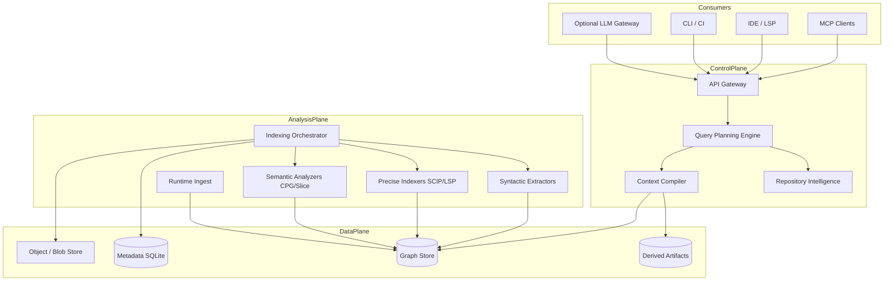
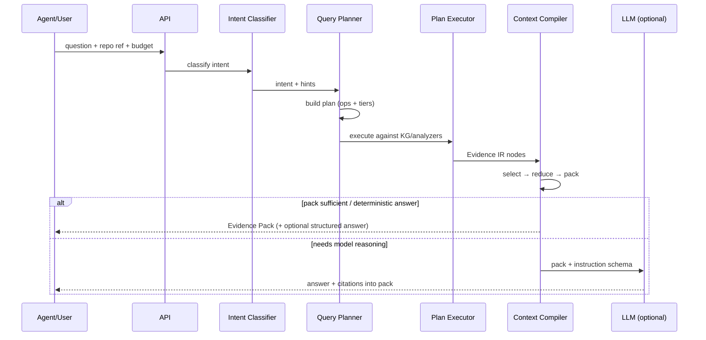
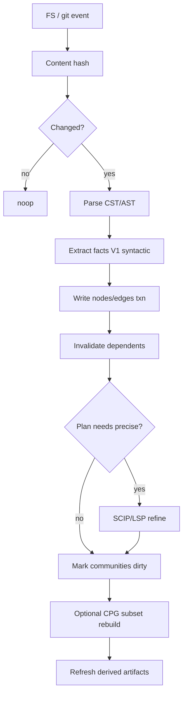
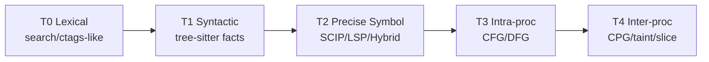

# Architecture Design Document (ADD)

**Project working name:** Prism — Repository Intelligence Platform  
**Document type:** Primary Architecture Design Document  
**Status:** Research-backed design (no implementation)  
**Date:** 2026-07-18  
**Audience:** Architects, implementers, researchers, open-source contributors  

**Related planning:** [`docs/planning/PLANNING-AND-IMPLEMENTATION.md`](../planning/PLANNING-AND-IMPLEMENTATION.md) — phase/stage execution plan (entry/exit criteria, deliverables, gates). Prior AOE gateway / cache-first notes are superseded where they conflict. This ADD re-centers the product on **pre-LLM repository understanding**. Caching remains an optional optimization, never the core architecture.

---

## Table of Contents

1. [Executive Summary](#1-executive-summary)
2. [Problem Statement](#2-problem-statement)
3. [Goals](#3-goals)
4. [Non-Goals](#4-non-goals)
5. [Functional Requirements](#5-functional-requirements)
6. [Non-Functional Requirements](#6-non-functional-requirements)
7. [Existing Solutions Analysis](#7-existing-solutions-analysis)
8. [High-Level Architecture](#8-high-level-architecture)
9. [Low-Level Architecture](#9-low-level-architecture)
10. [Core Components](#10-core-components)
11. [Data Model](#11-data-model)
12. [Repository Indexing Pipeline](#12-repository-indexing-pipeline)
13. [Static Analysis Pipeline](#13-static-analysis-pipeline)
14. [Runtime Analysis Pipeline](#14-runtime-analysis-pipeline)
15. [Knowledge Graph Design](#15-knowledge-graph-design)
16. [Context Engine](#16-context-engine)
17. [Context Selection Strategy](#17-context-selection-strategy)
18. [Context Reduction Strategy](#18-context-reduction-strategy)
19. [Query Planning Engine](#19-query-planning-engine)
20. [Repository Intelligence Pipeline](#20-repository-intelligence-pipeline)
21. [Storage Architecture](#21-storage-architecture)
22. [API Design](#22-api-design)
23. [Plugin System](#23-plugin-system)
24. [IDE Integration](#24-ide-integration)
25. [MCP Integration](#25-mcp-integration)
26. [Distributed System Design](#26-distributed-system-design)
27. [Performance Optimizations](#27-performance-optimizations)
28. [Scalability Strategy](#28-scalability-strategy)
29. [Security Considerations](#29-security-considerations)
30. [Observability](#30-observability)
31. [Testing Strategy](#31-testing-strategy)
32. [Evaluation Metrics](#32-evaluation-metrics)
33. [Risks](#33-risks)
34. [Trade-offs](#34-trade-offs)
35. [Future Enhancements](#35-future-enhancements)
36. [Phased Implementation Roadmap](#36-phased-implementation-roadmap)

---

## 1. Executive Summary

Prism is an open-source **developer intelligence platform** that understands a repository *before* an LLM sees it. It combines compiler-style indexing, multi-tier static analysis, an explicit software knowledge graph, and a **context compiler** that emits the minimum high-signal evidence a model needs to answer accurately.

**Core thesis:** Frontier-model accuracy on large codebases is mostly a *context quality* problem, not a *model size* problem. Small and medium models (local or low-cost hosted) can approach frontier performance when given compiler-accurate, task-scoped, hierarchically compressed evidence—and when the system refuses to dump the repo into the prompt.

**What Prism is not:** another code search engine, another vector RAG wrapper, or a cache-heavy LLM gateway. Search, embeddings, and caching appear only as supporting tools.

**Architectural wager:**

| Assumption we reject | Replacement |
|---|---|
| Larger context windows solve repo understanding | Structured retrieval + program slicing |
| Embeddings are the primary retrieval mechanism | Symbol/CFG/call-graph/dataflow queries first; embeddings last |
| Cache reuse of prior LLM answers is the main win | Deterministic intelligence that never needs re-derivation |
| Agents should explore via grep/read loops | Agents should query a precomputed intelligence IR |
| One graph format fits all | Precision ladder: syntactic → symbol → semantic (CPG) → behavioral |

**Differentiator vs. Graphify / GitNexus / Codebase-Memory:** those systems prove that tree-sitter graphs + MCP cut tokens dramatically. Prism goes further by treating **context assembly as compilation**—with query plans, typed evidence IR, confidence provenance, slice-based reduction, and an explicit path to *precise* (SCIP/LSP/compiler) and *semantic* (CPG/slicing) layers that syntactic graphs alone cannot provide.


---

## 2. Problem Statement

### 2.1 The operational problem

LLM coding assistants rediscover the same repository structure on every session:

1. They burn tokens on `grep` / `read` / glob loops.
2. They miss cross-file dependencies and ship blind edits.
3. They need frontier models largely because **the prompt is noisy**, not because the task requires frontier reasoning.
4. Generic RAG chunks destroy structure (call order, types, control predicates).
5. Exact/semantic answer caches help repeats but do not create understanding; they also risk stale false reuse on evolving code.

### 2.2 The technical problem

Human IDEs already solve much of this for humans: ASTs, symbol tables, go-to-definition, find-references, refactorings, inspections. That intelligence is rarely packaged as **LLM-facing evidence** with token budgets, provenance, and explainability.

Compiler and analysis ecosystems (Clang, Roslyn, Kythe, CodeQL, Joern) produce deep facts but:

- are hard to stand up across languages,
- are not designed to emit *token-optimal* context packs,
- lack a unified query→context compilation layer for agents.

### 2.3 Problem formulation

> Build a language-extensible, incrementally maintained, explainable repository intelligence substrate that compiles natural-language or agent intents into **minimum sufficient evidence packs**, enabling small/medium LLMs to reason about large codebases with near-frontier accuracy at a fraction of the token cost.

---

## 3. Goals

| ID | Goal | Success signal |
|---|---|---|
| G1 | **Accuracy parity** | On a fixed benchmark suite, medium model + Prism ≥ frontier model + naive explore within ≤3 pts answer quality |
| G2 | **Token reduction** | ≥10× fewer input tokens vs. file-explore baseline on structural tasks; ≥5× on debug/refactor tasks |
| G3 | **Context precision** | ≥70% of included fragments judged necessary by human/oracle labels |
| G4 | **Incremental freshness** | Typical edit re-index <2s for touched file + dependency invalidation; never require full rebuild for local edits |
| G5 | **Explainability** | Every evidence fragment carries provenance (source range, analysis tier, confidence) |
| G6 | **Language extensibility** | New language = grammar + extractor plugin; core engine unchanged |
| G7 | **Agent-native UX** | First-class MCP + LSP consumers; one-shot structural answers without multi-hop grep |
| G8 | **Local-first privacy** | Default: code never leaves machine for indexing |
| G9 | **Open-source maintainability** | Clear IR schemas, plugin contracts, reproducible eval harness |

---

## 4. Non-Goals

| Non-goal | Rationale |
|---|---|
| Replacing Sourcegraph/OpenGrok as general code search | Search is a capability, not the product |
| Training foundation models | We optimize *use* of existing models |
| Perfect whole-program verification | Soundness where cheap; graded confidence elsewhere |
| Enterprise multi-tenant SaaS in v1 | Local/single-team first |
| Cache-of-LLM-answers as primary architecture | Optional later; intelligence must stand alone |
| Embedding-only retrieval | Allowed as fallback, never as spine |
| Full Kythe-at-Google build integration in MVP | Too heavy; adopt ideas, not the ops burden |
| Automatic business-logic narrative generation as MVP core | Valuable later; must not block structural intelligence |

---

## 5. Functional Requirements

### 5.1 Indexing & analysis

| ID | Requirement |
|---|---|
| F1 | Index a git workspace into a durable store keyed by content hash + revision |
| F2 | Extract files, modules, symbols, imports, calls, inheritance, tests, routes (where detectable) |
| F3 | Support precision tiers: syntactic (tree-sitter), precise symbol (SCIP/LSP), semantic (CPG/slice) |
| F4 | Incremental update on file change / commit with dirty-set propagation |
| F5 | Detect and cluster architectural communities (modules/subsystems) |
| F6 | Optional runtime traces attach as first-class edges (call sites observed, coverage) |

### 5.2 Query & context

| ID | Requirement |
|---|---|
| F7 | Classify intent (repo-QA, debug, impact, refactor, generate, review, architecture) |
| F8 | Produce a **query plan** with analysis operators (resolve, expand, slice, rank, compress) |
| F9 | Emit an **Evidence Pack**: hierarchical context under a token budget |
| F10 | Support impact analysis (“blast radius”) with depth and confidence |
| F11 | Support program slicing around criteria (symbol, line, sink, stack frame) |
| F12 | Refuse unbounded dumps when scope cannot be resolved (ask for narrowing) |

### 5.3 Integration

| ID | Requirement |
|---|---|
| F13 | MCP server exposing structural tools + `compile_context` |
| F14 | LSP/IDE commands for peek-evidence, impact, slice |
| F15 | HTTP/CLI APIs for CI and offline batch |
| F16 | Language/plugin SDK for extractors and compressors |

### 5.4 Trust

| ID | Requirement |
|---|---|
| F17 | Provenance and confidence on all edges/fragments |
| F18 | Diff-aware invalidation of derived artifacts |
| F19 | Audit log of what was sent to any LLM (optional redaction) |

---

## 6. Non-Functional Requirements

| ID | Category | Requirement |
|---|---|---|
| N1 | Latency | Cold full index of 100k LOC syntactic tier <5 min on laptop CPU; hot incremental <2s |
| N2 | Query latency | Structural graph queries P95 <50ms local; context compile P95 <300ms excluding LLM |
| N3 | Footprint | Syntactic index ~3–10% of source size; precise indexes optional/on-demand |
| N4 | Reliability | Crash-safe writes (SQLite WAL / transactional graph updates) |
| N5 | Portability | macOS/Linux first; Windows second; single-binary or few-deps agent preferred |
| N6 | Privacy | Local default; network only for optional hosted models / optional remote index |
| N7 | Extensibility | Plugin ABI stable across minor versions |
| N8 | Observability | Metrics for tokens saved, precision tier used, miss reasons |
| N9 | Correctness bias | Prefer over-invalidate and under-include over stale or noisy context |

---

## 7. Existing Solutions Analysis

### 7.1 Comparison matrix

| System | Primary problem | Graph depth | LLM-facing? | Precision | Weakness for our goal |
|---|---|---|---|---|---|
| [Graphify](https://github.com/Graphify-Labs/graphify) | KG for coding assistants | AST calls/imports + communities | Skill + MCP | Syntactic + LLM for docs | Thin semantic analysis; NetworkX-scale; not a context compiler |
| [GitNexus](https://github.com/abhigyanpatwari/GitNexus) | Agent architectural awareness | Deps, flows, impact | Strong MCP | Mostly syntactic | Limited deep dataflow; browser/resource constraints at huge scale |
| Codebase-Memory | Replace grep loops | Tree-sitter KG | MCP tools | Hybrid LSP on some langs | Still not slice/CPG-first; quality gap vs explore on some tasks |
| Sourcegraph | Code search + nav + AI | SCIP symbol graph | Cody/agents | Precise nav | Product is search/platform; heavy infra |
| Kythe | Cross-lang semantic xref | Deep fact graph | No (serving layer) | Compiler-grade | Build-system integration is a platform program |
| SCIP / LSIF | Code navigation index | Symbol defs/refs | Indirect | Precise | Not behavior/slice/context packs |
| OpenGrok | Search + xref | Lucene + ctags | No | Lexical/semantic-lite | Search UX, not LLM evidence |
| Tree-sitter | Incremental parsing | CST/AST | No | Syntactic | Foundation, not product |
| Clang / LLVM | Compile + analyze | AST/CFG/IR | No | High (C/C++/ObjC) | Language-narrow; complex |
| Roslyn | .NET compiler platform | Red-green trees + semantics | No | High (C#/VB) | Language-narrow |
| JetBrains / Eclipse JDT | IDE intelligence | Full PSI/JDT model | No | High | Closed/heavy; not agent-pack oriented |
| CodeQL | QL-based semantic queries | DB of relations | Emerging (Slice etc.) | High | Query authoring burden; DB build cost |
| Joern | CPG + scripting | AST+CFG+PDG | MCP experiments | High for supported langs | Heavier; not all languages |
| Semgrep | Fast pattern/taint rules | AST patterns | Indirect | Medium | Rules ≠ general understanding |

### 7.2 Per-system notes (problem, architecture, strengths, weaknesses, lessons)

#### Graphify
- **Problem:** Multi-modal corpus → queryable KG for assistants ([graphify.net](https://graphify.net/), [ARCHITECTURE.md](https://github.com/safishamsi/graphify/blob/HEAD/ARCHITECTURE.md)).
- **Architecture:** `detect → extract → build → cluster (Leiden) → analyze → report → export`; tree-sitter for code; LLM for docs/media; NetworkX; MCP serve.
- **Strengths:** Local-first code parse; communities/god nodes; clear pipeline modules; token benchmark mindset.
- **Weaknesses:** Syntactic call resolution limits; in-memory graph; no deep dataflow/slicing; LLM still needed for non-code.
- **Adopt:** Stage isolation; community detection; confidence tags (`EXTRACTED`/`INFERRED`); MCP exposure.
- **Overcome:** Persistent incremental store; precision ladder; context compiler with budgets.

#### GitNexus
- **Problem:** Zero-server structural awareness for agents ([GitNexus](https://github.com/abhigyanpatwari/GitNexus)).
- **Architecture:** Multi-phase index (tree-sitter), graph DB (LadybugDB/Kuzu lineage), MCP tools (impact, process search, rename), optional Graph RAG.
- **Strengths:** Impact analysis with depth/confidence; precompute so one tool call returns complete context; multi-repo registry.
- **Weaknesses:** Static limits; runtime blind; large-repo resource pressure; Graph RAG can reintroduce embedding-centric habits.
- **Adopt:** Impact API shape; “precompute relational intelligence at index time”; MCP-first UX.
- **Overcome:** Typed evidence IR; slicing; precise SCIP overlay; refuse RAG-as-spine.

#### CodeGraph / Codebase-Memory / similar MCP graphs
- **Problem:** Agents waste tokens rediscovering structure ([arXiv:2603.27277](https://arxiv.org/html/2603.27277v1)).
- **Architecture:** Tree-sitter → SQLite KG → MCP tools; content-hash incremental; some Hybrid LSP.
- **Strengths:** Empirical token cuts (orders of magnitude); incremental XXH3/Merkle patterns; hybrid resolution insight.
- **Weaknesses:** Quality still trails full explore on some tasks (~83% vs ~92% in one study); limited semantic depth.
- **Adopt:** SQLite-local KG; hash incremental; hybrid syntactic+semantic resolution.
- **Overcome:** Close quality gap via slicing + precise tiers + better query planning (not more embeddings).

#### Sourcegraph + SCIP
- **Problem:** Code nav and search at org scale; SCIP fixes LSIF’s opaque graph IDs ([SCIP announcement](https://sourcegraph.com/blog/announcing-scip), [SCIP DESIGN](https://github.com/sourcegraph/scip/blob/main/docs/DESIGN.md)).
- **Architecture:** Indexers emit Protobuf symbol index; Zoekt for search; precise nav across repos.
- **Strengths:** Human-readable symbol IDs; incremental/file-level design goals; cross-repo story.
- **Weaknesses:** Navigation ≠ understanding; not token-budgeted evidence packs.
- **Adopt:** SCIP as **precise tier interchange**; readable symbol IDs; indexer parallelism lessons.
- **Overcome:** Build LLM context compiler on top of SCIP facts.

#### Kythe
- **Problem:** Uniform cross-language semantic graph via compiler instrumentation ([kythe.io](https://kythe.io/)).
- **Architecture:** Language indexers → entries → serving; build-system coupled.
- **Strengths:** Macro-aware, overload-precise xrefs; “same data the compiler used.”
- **Weaknesses:** Platform project to operate; weak out-of-box AI query surface ([enterprise KG analysis](https://corestory.ai/post/code-knowledge-graphs-why-open-source-stacks-stall-at-enterprise-scale)).
- **Adopt:** Fact/entry mindset; cross-language VName-like identity; build-integrated precision as optional advanced tier.
- **Overcome:** Usable without Bazel-scale investment; progressive precision.

#### LSIF
- **Problem:** Persist LSP-like nav offline.
- **Architecture:** Graph of vertices/edges with integer IDs (JSON).
- **Strengths:** Standard idea of dumping language-server knowledge.
- **Weaknesses:** Hard to debug/develop; superseded by SCIP for many.
- **Adopt:** Conceptual “index what LSP knows.”
- **Overcome:** Prefer SCIP; avoid opaque ID graphs in our IR.

#### OpenGrok
- **Problem:** Fast search + xref ([OpenGrok internals](https://github.com/oracle/opengrok/wiki/Internals)).
- **Architecture:** Analyzers + ctags + Lucene; incremental file updates; history integration.
- **Strengths:** Mature incremental indexing; history as first-class.
- **Weaknesses:** Lexical/crossref for humans, not agent evidence packs.
- **Adopt:** Incremental update discipline; history guru pattern for blame/diff intelligence.
- **Overcome:** Semantic graph + context compiler.

#### Tree-sitter
- **Problem:** Fast, error-tolerant, incremental parsing.
- **Architecture:** CSTs, query language, editor-oriented.
- **Strengths:** Multi-language pragmatics; resilient parses; incremental edits.
- **Weaknesses:** No real type resolution; calls are often textual.
- **Adopt:** Default syntactic front-end for all languages.
- **Overcome:** Always label edges as unresolved/heuristic unless refined.

#### Clang / LLVM
- **Problem:** Compile and analyze C-family.
- **Architecture:** AST, CFG, IR, clang-tidy, clangd.
- **Strengths:** Ground truth for C/C++; LibTooling.
- **Weaknesses:** Ecosystem-specific; build flags matter.
- **Adopt:** Optional precise plugin for C-family; CFG ideas.
- **Overcome:** Don’t require LLVM for every language.

#### Roslyn
- **Problem:** Expose .NET compiler as a platform.
- **Architecture:** Red/green immutable trees; incremental blender; full semantics ([Roslyn incremental parser](https://github.com/dotnet/roslyn/blob/main/docs/compilers/Design/Incremental%20Parser.md)).
- **Strengths:** Subtree reuse; IDE-grade models.
- **Weaknesses:** C#/VB-centric.
- **Adopt:** Immutable persistent IR nodes; edit→reuse philosophy for our stores.
- **Overcome:** Cross-language IR that is thinner than a full compiler API.

#### JetBrains Platform / Eclipse JDT
- **Problem:** Full IDE program models (PSI / JDT).
- **Architecture:** Language services, daemons, caches, CFA ([PSI overview](https://jetbrains.github.io/resharper-devguide/Architecture/PSI.html)).
- **Strengths:** Production-grade incremental analysis UX.
- **Weaknesses:** Closed or heavy; not designed as open LLM substrate.
- **Adopt:** Daemon stages; declared elements vs syntax; background analysis scheduling.
- **Overcome:** Open IR + MCP; lighter footprint.

#### CodeQL
- **Problem:** Variant analysis via QL over a relational DB of code.
- **Architecture:** Extractor → DB → queries; used in Slice pipelines with LLMs ([Slice](https://noperator.dev/posts/slice/)).
- **Strengths:** Expressive semantic queries; strong for security.
- **Weaknesses:** DB build cost; query skill barrier.
- **Adopt:** “Find candidates with analysis, triage with LLM on slices.”
- **Overcome:** Default path shouldn’t require users to write QL.

#### Joern
- **Problem:** Code Property Graphs for interprocedural analysis.
- **Architecture:** CPG = AST+CFG+PDG; CPGQL; MCP bridges like codebadger ([arxiv CPG+LLM](https://arxiv.org/html/2603.24837v1)).
- **Strengths:** Slicing/taint reduce context ~90% in studies; perfect fit for LLM evidence.
- **Weaknesses:** Language coverage/ops weight.
- **Adopt:** CPG as **semantic tier**; slice-as-context primitive.
- **Overcome:** Lazy/on-demand CPG for hot subsets, not always whole monorepo.

#### Semgrep
- **Problem:** Fast, accessible SAST patterns.
- **Architecture:** AST/pattern matching; optional taint.
- **Strengths:** Low friction; great for “interesting sinks” discovery.
- **Weaknesses:** Not a general architecture model.
- **Adopt:** Sink/source discovery feeding the slicer.
- **Overcome:** Don’t confuse rule hits with understanding.

### 7.3 Synthesis — what to build that is genuinely better

1. **Context compilation as the product** (not graph viz, not search UI).
2. **Precision ladder** with explicit confidence—not pretending tree-sitter is Kythe.
3. **Evidence IR** with provenance—agents and humans can audit why a token was included.
4. **Slicing + impact as first-class operators**, inspired by Joern/CodeQL+LLM pipelines.
5. **SCIP/LSP overlay** for languages where precision matters.
6. **Embeddings demoted** to last-resort scope seeding.
7. **Caching demoted** to memoization of deterministic artifacts (slices, summaries), not “reuse LLM answers” as the bet.

---

## 8. High-Level Architecture

### 8.1 Layered view



### 8.2 Design principles (ranked)

| Rank | Principle | Implication |
|---|---|---|
| P1 | **Never sacrifice correctness for tokens** | Quality gates can expand context or escalate tier |
| P2 | **Understand before prompting** | Analysis precedes any LLM call |
| P3 | **Structure before similarity** | Graph/slice operators beat embeddings |
| P4 | **Escalate context before model** | Bigger evidence pack before frontier model |
| P5 | **Provenance always** | No anonymous chunks |
| P6 | **Incremental by default** | Full rebuilds are failure modes |
| P7 | **Cache is memoization only** | Deterministic artifact cache; not answer oracle |
| P8 | **Progressive precision** | Pay for SCIP/CPG only when the plan needs it |

### 8.3 Challenge to common assumptions

| Common assumption | Prism position |
|---|---|
| “Just use a 1M context window” | Attention dilutes; cost scales; small models can’t follow | 
| “RAG over code chunks” | Destroys call/data dependencies |
| “Agentic explore is fine” | Token-expensive and incomplete |
| “Cache LLM answers” | Helps repeats; doesn’t create intelligence; staleness is hard |
| “One mega-graph DB” | Split hot syntactic facts from cold semantic overlays |
| “LLM summarizes the repo into a wiki first” | Useful later; expensive and drift-prone as foundation |

---

## 9. Low-Level Architecture

### 9.1 Request lifecycle (answer path)



### 9.2 Index lifecycle (write path)



### 9.3 Internal IR stacking

| IR layer | Contents | Producer | Consumer |
|---|---|---|---|
| L0 Source Blob | bytes + hash | Indexer | Parsers |
| L1 CST/AST | syntax nodes | tree-sitter / compiler | Extractors |
| L2 Fact Graph | symbols, edges, ranges | Extractors | Planner / Compiler |
| L3 Semantic Overlay | CFG/PDG/CPG subsets | Joern-like / custom | Slicer |
| L4 Evidence IR | ranked fragments + provenance | Context Compiler | LLM / UI |
| L5 Answer (optional) | model output bound to L4 IDs | LLM | User |

---

## 10. Core Components

| Component | Responsibility | Non-responsibility |
|---|---|---|
| **Workspace Manager** | roots, ignores, VCS identity | analysis algorithms |
| **Indexing Orchestrator** | schedule parse/extract, transactions | answering questions |
| **Language Plugins** | CST→facts | storage engine |
| **Precision Services** | SCIP import, LSP client, Hybrid resolve | UX |
| **Semantic Engine** | CFG/CPG/taint/slice | embeddings |
| **Knowledge Graph Service** | query API, indexes | prompt formatting |
| **Architecture Miner** | communities, hubs, layering heuristics | LLM prose |
| **Query Planner** | intent→operator plan | model calls |
| **Context Compiler** | select/reduce/pack under budget | indexing |
| **Artifact Memoizer** | cache deterministic derived bytes | semantic answer cache (v1 off) |
| **MCP/LSP Adapters** | protocol translation | business logic |
| **Eval Harness** | golden tasks, token/quality metrics | production serving |

---

## 11. Data Model

### 11.1 Identity

Every entity has a stable ID:

```
symbol_id = "scip-compatible" OR "prism:lang:module:kind:qualname:disambig"
node_id   = ulid / content-addressed where immutable
```

Prefer SCIP-style readable IDs when precise tier exists; otherwise deterministic syntactic IDs with `confidence=heuristic`.

### 11.2 Core node kinds

| Kind | Examples | Key attributes |
|---|---|---|
| `Repository` | root | remote, default branch |
| `Commit` / `Snapshot` | HEAD | tree hash |
| `File` | path | lang, hash, bytes |
| `Module` / `Package` | pkg | name |
| `Symbol` | fn/class/type/var | kind, signature, visibility |
| `Span` | range | file, start, end |
| `Community` | subsystem | label, algorithm |
| `Route` / `Endpoint` | HTTP handlers | method, path |
| `Test` | test fn | targets |
| `ConfigKey` | env/flag | |
| `Doc` / `ADR` | markdown | links |
| `RuntimeEvent` | span/trace | optional |

### 11.3 Core edge kinds

| Edge | Meaning | Typical confidence |
|---|---|---|
| `CONTAINS` | file→symbol | extracted |
| `IMPORTS` | module→module | extracted |
| `CALLS` | call site→callee | heuristic→precise |
| `IMPLEMENTS` / `EXTENDS` | type relations | heuristic→precise |
| `REFERENCES` | use→def | precise preferred |
| `DATA_FLOW` | def→use / taint | semantic |
| `CONTROL_DEP` | CFG dependency | semantic |
| `TESTED_BY` | symbol→test | inferred |
| `ROUTES_TO` | route→handler | extracted |
| `DOCUMENTS` | doc→symbol | inferred |
| `OBSERVED_CALL` | runtime | observed |
| `IMPACTS` | change→affected | derived |

### 11.4 Evidence fragment schema (L4)

| Field | Purpose |
|---|---|
| `id` | citeable |
| `kind` | `slice` / `signature` / `diff` / `cfg_summary` / `community` / `trace` |
| `text` | exact bytes to place in prompt |
| `token_estimate` | precomputed |
| `provenance` | node/edge IDs + analyzer + tier |
| `confidence` | 0–1 + enum |
| `why_included` | planner reason code |
| `drop_priority` | for budget eviction |

---

## 12. Repository Indexing Pipeline

### 12.1 Stages

1. **Discover** — walk tree; apply ignore rules (`.gitignore`, vendoring heuristics).
2. **Fingerprint** — content hash per file; Merkle for directories (skip unchanged subtrees).
3. **Language detect** — extension + content sniff.
4. **Parse** — tree-sitter CST (resilient); optional compiler parse.
5. **Extract** — symbols, imports, call sites, literals of interest (routes, SQL).
6. **Resolve (cheap)** — same-file and import-graph textual/heuristic resolution.
7. **Commit transaction** — replace file’s subgraph; write indexes.
8. **Propagate dirtiness** — callers, communities, memoized artifacts.
9. **Schedule upgrades** — precise/semantic jobs for hot or requested files.

### 12.2 Design decisions

| Decision | Choice | Trade-off |
|---|---|---|
| Default parser | tree-sitter | Broad coverage vs weak types |
| Store | SQLite + graph tables / embedded graph | Simple ops vs mega-scale limits |
| Unit of invalidation | file subgraph + reverse deps | Coarse but safe |
| Parallelism | process/thread pool by file | GIL/process concerns in Python; prefer Rust/Go workers later |

### 12.3 What we deliberately skip at index time

- Full monorepo CPG by default (too costly).
- LLM labeling of every file (cost/drift).
- Embedding every chunk (demoted).

---

## 13. Static Analysis Pipeline

### 13.1 Precision ladder



| Tier | When used | Cost | Benefit |
|---|---|---|---|
| T0 | fallback search | low | recall |
| T1 | always | low | structure |
| T2 | nav/refactor/impact high-stakes | medium | fewer wrong callees |
| T3 | debug local | medium | path sensitivity lite |
| T4 | security, hard bugs, cross-module “why” | high | minimal sufficient slices |

### 13.2 Analyses

| Analysis | Output | LLM use |
|---|---|---|
| Call graph | `CALLS` edges | expansion |
| Import/module graph | dependency layers | architecture |
| CFG | blocks/edges | explain control |
| DFG/PDG | data deps | slicing |
| Taint | source→sink paths | security/debug |
| Type hierarchy | implements/extends | refactor |
| Test linkage | TESTED_BY | generate/review |
| Route extraction | API map | service understanding |

### 13.3 Soundness policy

Mark each fact:

- `sound_under_assumptions` (compiler tier),
- `best_effort` (tree-sitter calls),
- `observed` (runtime).

The Context Compiler **prefers higher confidence** and can include a short “uncertainty note” rather than hallucinating resolution.

---

## 14. Runtime Analysis Pipeline

Static analysis misses dynamic dispatch, reflection, plugin loaders, and config-driven flow. Runtime is an **optional enrichment**, not a requirement for MVP.

### 14.1 Inputs

- OpenTelemetry / language spans
- Coverage (LLVM cov, pytest-cov, JaCoCo)
- Lightweight eBPF/off-CPU later (advanced)
- Test execution traces

### 14.2 Pipeline

1. Ingest normalized events (`ObservedCall`, `CoveredSpan`).
2. Map to symbol IDs via debug info / source maps / heuristics.
3. Raise confidence on matching static edges; add `OBSERVED_*` where static missed.
4. Feed slicer with “actually executed” weighting for debug intents.

### 14.3 Trade-offs

| Pro | Con |
|---|---|
| Grounds dynamic languages | Privacy, overhead, flaky mapping |
| Improves debug packs | Incomplete coverage biases |

**Policy:** runtime never deletes static edges; it only adds or upgrades confidence.

---

## 15. Knowledge Graph Design

### 15.1 Conceptual model

A **multi-layer property graph**:

- **Structural layer** (always hot)
- **Precise symbol layer** (optional)
- **Semantic layer** (lazy subgraphs)
- **Narrative layer** (docs/ADRs/communities)
- **Behavioral layer** (runtime)

### 15.2 Storage strategy

| Option | Use |
|---|---|
| SQLite relational + adjacency tables | Default local |
| Embedded graph (Kuzu/Ladybug-class) | Heavy graph traversals |
| Separate artifact store | Large CPG blobs, SCIP indexes |

**Decision:** **Polyglot persistence**—one logical KG API over specialized physical stores. Avoid forcing Neo4j ops for solo/dev use.

### 15.3 Partitioning

- By repository snapshot
- By file for syntactic facts
- By “semantic shard” (entrypoints, services) for CPG

### 15.4 Community & architecture views

Use Leiden/Louvain on import+call graphs to produce subsystems. Store as `Community` nodes with deterministic labels from path prefixes / folder taxonomy first; optional LLM naming later (cached artifact).

### 15.5 Cross-repo

Stable package identities (maven/npm/go modules) link `REFERENCES` across repos—SCIP cross-repo lessons apply. Multi-repo is Phase 3+.

---

## 16. Context Engine

The Context Engine is the **compiler backend** for prompts.

### 16.1 Responsibilities

1. Accept planner outputs (candidate nodes + operators results).
2. Materialize fragments (source slices, signatures, diffs, summaries).
3. Rank, budget, and assemble an Evidence Pack.
4. Attach citation map for the model (and for UI).
5. Run quality gates (must-include checks).

### 16.2 Output: Evidence Pack

```text
EvidencePack
  meta: intent, budget, repo, snapshot, plan_id
  hierarchy:
    L_arch: community map (tiny)
    L_mod: module signatures
    L_core: primary slices (full)
    L_nbr: neighbor signatures
    L_diff: relevant hunks
    L_run: optional traces
  citations: {C1 → span, C2 → span, ...}
  gaps: unresolved symbols / missing precise tier
```

### 16.3 Why this beats raw tool loops

Agents spend tokens *searching*. Prism spends CPU *once* at index time and returns a pack that is already the answer’s substrate. Empirically, structural MCP systems report order-of-magnitude token cuts versus explore ([Codebase-Memory evaluation](https://arxiv.org/html/2603.27277v1); Graphify benchmarks; GitNexus design notes).

---

## 17. Context Selection Strategy

### 17.1 Selection priority (deterministic)

1. Explicit anchors in the query (paths, symbols, errors, stack frames)
2. Working tree diff intersection
3. Precise resolve of anchors
4. Operator expansion:
   - repo-QA: def + 1-hop signatures
   - debug: frame bodies + backward slice
   - impact: forward cone depth 1–3
   - refactor: all refs (precise tier required)
   - generate: insertion neighborhood + type deps + one exemplar
5. Architecture neighborhood (same community)
6. **Only then** embedding/keyword fallback (flagged low confidence)

### 17.2 Intent → seed rules

| Intent | Seeds | Expand |
|---|---|---|
| repo-QA | named symbols | callees/callers signatures |
| debug | stack + error | backward slice + recent diff |
| impact | changed symbols | forward IMPACTS |
| refactor | target symbol | all REFERENCES (T2+) |
| generate | target file locus | types + exemplar |
| architecture | communities | hub nodes + boundaries |
| review | PR diff | impact cone + tests |

### 17.3 Anti-patterns

- Top-k similar chunks without graph binding
- Whole-file inclusion by default
- Multiple exemplars “just in case”
- Vendored code unless explicitly implicated

---

## 18. Context Reduction Strategy

Reduction is **lossy compilation** with named risk.

| Technique | Keeps | Drops | Risk if overused |
|---|---|---|---|
| Span slice | criterion + deps | unrelated fns | missing aliasing |
| Signature skeleton | API shape | bodies | misses impl bugs |
| Diff hunks | changes | unchanged | misses latent deps |
| CFG path summary | predicates on path | other branches | wrong branch focus |
| Dedup / canonicalize | one copy | repeats | — |
| Community one-liner | orientation | detail | over-abstract |

### 18.1 Drop order under budget pressure

1. Low-confidence embedding seeds  
2. Depth-3+ impact nodes  
3. Neighbor bodies (keep signatures)  
4. Secondary exemplars  
5. Architecture prose  
6. **Never drop** primary criterion slice or error/stack verbatim  

### 18.2 Compression vs summary

Prefer **extractive** slices over abstractive LLM summaries for code. Summaries are allowed for docs/ADR only, memoized as artifacts with source links.

---

## 19. Query Planning Engine

### 19.1 Role

Translate intent + hints into an **operator DAG**—analogous to a DB query planner.

### 19.2 Operator catalog

| Operator | Input | Output |
|---|---|---|
| `ResolveSymbol` | name/path | symbol IDs |
| `Expand` | nodes, edge types, depth | node set |
| `Slice` | criterion, direction | span set |
| `Impact` | symbols, depth | ranked affected |
| `DiffIntersect` | commit/worktree | nodes |
| `FindTests` | symbols | tests |
| `CommunityOf` | nodes | communities |
| `UpgradePrecision` | nodes, tier | refined edges |
| `Keyword/EmbedFallback` | text | candidates (low conf) |
| `BudgetPack` | fragments | EvidencePack |

### 19.3 Cost-based planning

Each operator has estimated latency/CPU. Planner chooses cheapest plan meeting confidence threshold; may insert `UpgradePrecision` only for ambiguous CALLS on the critical path.

### 19.4 Example plan (debug)

```text
Resolve stack frames → UpgradePrecision(frame0)
→ Slice(backward, depth=interproc limited)
→ DiffIntersect(since main)
→ Expand(callees signatures only)
→ BudgetPack(debug recipe)
```

---

## 20. Repository Intelligence Pipeline

Beyond raw facts, Prism derives **repo-level intelligence** used as tiny high-value context:

| Derived product | Method | Use |
|---|---|---|
| Subsystem map | community detection | orientation |
| Hub/god nodes | centrality | caution in refactors |
| Layering violations | import DAG vs folder rules | architecture QA |
| Entrypoints | main/routes/handlers | slicing roots |
| Change hotspots | git history frequency | review priority |
| Contract surfaces | public APIs | generate/refactor |
| Ambiguity index | unresolved call rate | when to require T2 |

These are refreshed incrementally and exposed via MCP (`repo_map`, `hubs`, `entrypoints`).

---

## 21. Storage Architecture

### 21.1 Layout (local default)

```text
.prism/
  meta.sqlite          # snapshots, files, hashes, jobs
  graph.sqlite         # nodes/edges/indexes  (or embedded graph)
  blobs/               # optional content-addressed sources
  scip/                # imported precise indexes
  semantic/            # CPG shards by entrypoint
  artifacts/           # memoized packs, community labels
  logs/                # audit
```

### 21.2 Consistency

- Per-file subgraph replace in a single transaction
- Snapshot isolation by `snapshot_id` (git commit or dirty worktree stamp)
- Derived artifacts keyed by `(snapshot_id, algorithm_version, params_hash)`

### 21.3 Scaling path

| Scale | Store |
|---|---|
| <1M LOC | SQLite all |
| multi-repo team | SQLite per repo + registry |
| monorepo huge | shard by project; object store for SCIP/CPG; optional server |

---

## 22. API Design

### 22.1 Principles

- Stable resource-oriented HTTP + CLI mirrors
- All answers cite Evidence Pack IDs
- Idempotent index operations

### 22.2 Core endpoints (conceptual)

| API | Purpose |
|---|---|
| `POST /v1/index` | index/refresh workspace |
| `GET /v1/symbols` | lookup |
| `POST /v1/query/plan` | return plan only |
| `POST /v1/context/compile` | Evidence Pack |
| `POST /v1/impact` | blast radius |
| `POST /v1/slice` | program slice |
| `GET /v1/repo/map` | architecture |
| `POST /v1/answer` | optional: pack + LLM call |

### 22.3 Error model

- `SCOPE_UNRESOLVED` — refuse dump; ask for anchors  
- `PRECISION_REQUIRED` — need SCIP/LSP for safe refactor  
- `BUDGET_EXCEEDED` — cannot meet must-include set  

---

## 23. Plugin System

### 23.1 Plugin kinds

| Kind | Contract |
|---|---|
| `LanguageExtractor` | bytes → facts |
| `Resolver` | heuristic/precise edge refinement |
| `SemanticBackend` | build CFG/CPG shard |
| `SinkProvider` | Semgrep-like interesting points |
| `Compressor` | custom fragment renderers |
| `IntentRecipe` | selection/reduction config |

### 23.2 Rules

- Pure transforms where possible; declare side effects
- Versioned schema for facts
- Conformance tests per language (parse golden files)

### 23.3 Why plugins beat hardcoding

Multi-language support is an ecosystem problem. The core remains: graph, planner, compiler, storage.

---

## 24. IDE Integration

### 24.1 LSP extensions / commands

- `prism.impact`
- `prism.slice`
- `prism.evidencePeek`
- `prism.compileContext`

Show Evidence Pack in a side panel with clickable provenance (IDE as debugger for context).

### 24.2 Sync with editing

Adopt Roslyn/JetBrains lessons: incremental reparse on edit; background daemon stages; never block typing on T4 analysis.

### 24.3 Relationship to native LSP

Prism **consumes** language servers for T2; it does not replace them for editing features.

---

## 25. MCP Integration

MCP is the primary agent interface (lessons from GitNexus, Graphify, Codebase-Memory).

### 25.1 Tool surface (recommended)

| Tool | Returns |
|---|---|
| `index_status` | freshness |
| `resolve_symbol` | IDs + locations |
| `neighbors` | edge-typed expansion |
| `impact` | depth-grouped affected symbols |
| `slice` | minimal spans |
| `repo_map` | communities/hubs |
| `compile_context` | Evidence Pack (preferred one-shot) |
| `detect_changes` | worktree impact |
| `find_tests` | related tests |

### 25.2 Agent guidance

Prefer **one** `compile_context` call over ten reads. Hooks (where supported) can redirect search tools toward Prism—GitNexus/Graphify pattern—without trapping users.

### 25.3 Safety

Tools return citations and confidence; write-actions (rename) require T2 precision or explicit override.

---

## 26. Distributed System Design

### 26.1 Deployment modes

| Mode | Description |
|---|---|
| **Solo local** | single process + `.prism/` |
| **Team shared index** | read-mostly index server; per-dev deltas |
| **CI workers** | shard index by project; publish SCIP/artifacts |

### 26.2 Distributed principles

- Indexes are **content-addressed** and mergeable by snapshot
- Workers execute language plugins sandboxed
- Planner/compiler can run near the agent (local) against remote read API
- No requirement for heavy always-on graph DB in mode 1

### 26.3 Consistency

- Git commit SHA is the global identity for published indexes
- Worktree mode is sticky to a client; not shared until commit

---

## 27. Performance Optimizations

| Optimization | Benefit |
|---|---|
| Merkle/hash skip of unchanged trees | Fast incremental |
| Persistent immutable fact nodes (Roslyn-like sharing) | Memory/CPU |
| Lazy T3/T4 | Avoid global CPG |
| Signature-first materialization | Tiny tokens |
| Artifact memoization of packs keyed by plan hash | Skip re-slice |
| Parallel file extractors | Throughput |
| Columnar/inverted indexes for symbol names | Lookup |
| Cap interproc slice depth with expandable residual | Latency bounds |

**Non-optimizations (explicit):** semantic answer caching as core; GPU embeddings on every file.

---

## 28. Scalability Strategy

| Dimension | Strategy |
|---|---|
| Languages | plugins; T1 everywhere, T2/T4 where invested |
| Repo size | shard; lazy semantic; community summaries |
| Query load | local compiler; read replicas of graph |
| Monorepo | project graph; index affected projects on change |
| Multi-repo | package-level linking via precise IDs |

**Vertical first, horizontal later:** get correctness and token metrics right on one large repo before distributed complexity.

---

## 29. Security Considerations

| Risk | Mitigation |
|---|---|
| Source exfiltration via MCP | local default; allowlist tools; audit log |
| Prompt injection via malicious comments/docs | separate untrusted doc channel; never execute doc text |
| Supply chain in plugins | signed plugins / review; sandbox extractors |
| Secrets in index | secret scanning; redact blobs; avoid storing `.env` |
| Unsafe rename/refactor tools | require precise tier + dry-run |
| Multi-user index leakage | path isolation; authz before team mode |

---

## 30. Observability

### 30.1 Metrics

- Index: files/s, incremental latency, unresolved call rate
- Query: plan time, operator times, pack tokens, drop counts
- Quality: context precision samples, answer acceptance
- Savings: tokens vs explore baseline (shadow metric)

### 30.2 Tracing

OpenTelemetry spans around plan → operators → pack.

### 30.3 Explain reports

`EXPLAIN CONTEXT` dumps why each fragment was included (planner reason codes)—critical for trust and debugging the compiler.

---

## 31. Testing Strategy

| Layer | Tests |
|---|---|
| Parsers/extractors | golden ASTs/facts per language |
| Resolution | precision/recall vs SCIP oracle on fixtures |
| Slicer | dependency closure properties; no crash on broken code |
| Planner | intent fixtures → expected operator shapes |
| Context compiler | budget never drops must-include; stable packing |
| End-to-end | repo tasks with frozen snapshots |
| Adversarial | ambiguous names, macros, generics, dynamic imports |
| Performance | incremental edit benchmarks in CI |

Property idea: **re-slice idempotence** and **pack stability** under whitespace-only changes.

---

## 32. Evaluation Metrics

### 32.1 Primary scorecard

| Metric | Definition | Target (12 months) |
|---|---|---|
| Answer quality | human/LLM-judge vs gold | ≥ frontier-explore − 3 pts with medium model |
| Tokens / task | input tokens to model | ≥10×↓ structural; ≥5×↓ debug |
| Tool calls / task | MCP/tool hops | ≥2×↓ |
| Context precision | necessary fragments / included | ≥70% |
| Unresolved edge rate | heuristic calls unresolved | tracked per language; improve with T2 |
| Incremental latency | edit→fresh | <2s P95 typical |
| Pack compile latency | exclude LLM | <300ms P95 |

### 32.2 Benchmark design

Curate tasks: symbol explain, impact, bug localization, refactor prep, architecture overview. Compare:

1. Frontier + explore  
2. Medium + explore  
3. Medium + Prism  
4. Frontier + Prism  

**Success:** (3) approaches (1); (4) is best but optional.

---

## 33. Risks

| Risk | Likelihood | Impact | Mitigation |
|---|---|---|---|
| Syntactic call graphs too wrong | High | High | Precision ladder; confidence; upgrade on demand |
| Scope creep into search SaaS | High | High | Guard non-goals; ship context compiler first |
| CPG cost explodes | Medium | High | Lazy shards; depth caps |
| Quality still needs frontier | Medium | Medium | Better recipes; escalate context; accept hybrid |
| Plugin ecosystem stagnation | Medium | High | Ship 3–5 languages excellently first |
| Overlap with GitNexus/Graphify reduces adoption | Medium | Medium | Differentiate on slicing + evidence IR + eval |
| Users bypass Prism for grep habits | Medium | High | One-shot `compile_context`; IDE UX |
| Prior AOE cache bet distracts | Medium | Medium | This ADD governs; cache optional Phase 4 |

---

## 34. Trade-offs

| Decision | We choose | We forgo |
|---|---|---|
| Analysis-first | Deterministic intelligence | Instant “wrap an LLM” demos |
| tree-sitter default | Coverage | Perfect resolution |
| Polyglot SQLite | Ops simplicity | Infinite scale out of box |
| Extractive context | Fidelity | Ultra-short abstract summaries |
| MCP one-shot packs | Token efficiency | Fully autonomous multi-step drama |
| Optional runtime | Simpler MVP | Dynamic completeness |
| No answer-cache core | Clear product identity | Easy repeat-question wins |

---

## 35. Future Enhancements

1. Learned ranking of fragments (from acceptance telemetry) — still features from graph, not raw RAG  
2. Cross-repo package intelligence  
3. Verified refactors using precise tier + tests  
4. Auto-generated living architecture docs bound to communities  
5. Collaborative team indexes with ACL  
6. Formal optional integration with CodeQL/Joern as semantic backends  
7. Lightweight answer memoization **with dependency certificates** (only after evidence packs are solid)  
8. Hardware-accelerated parsing workers  

---

## 36. Phased Implementation Roadmap


### Phase 0 — Foundations (2–3 weeks)

- Workspace manager, hash indexing, SQLite schema, plugin ABI draft
- Eval harness skeleton + 20 gold tasks on 1–2 repos
- **Gate:** can re-index incrementally; metrics pipeline exists

### Phase 1 — Syntactic KG + MCP (4–6 weeks)

- tree-sitter extractors for 2–3 languages (e.g., Python, TS/JS, Go)
- symbols, imports, heuristic calls, communities
- MCP: resolve, neighbors, impact (heuristic), repo_map
- **Gate:** ≥5× token reduction on structural tasks vs explore; quality within 10 pts of explore

### Phase 2 — Context Compiler (3–5 weeks)

- Intent recipes, planner v1, Evidence Pack, budgets, EXPLAIN
- `compile_context` becomes the primary tool
- **Gate:** context precision ≥60% on labeled sample; refuse unresolved scope dumps

### Phase 3 — Precise Tier (4–6 weeks)

- SCIP import and/or LSP/Hybrid resolvers for primary languages
- Refactor/impact paths require T2 when available
- **Gate:** call resolution precision materially↑ on fixtures; safe rename dry-run demo

### Phase 4 — Semantic Slicing (5–8 weeks)

- CFG/DFG and/or Joern-backed shards for hot languages
- Slice operator + debug recipes
- **Gate:** debug tasks token↓ ≥5× with quality within 5 pts of frontier-explore

### Phase 5 — Repository Intelligence + Hardening (4 weeks)

- entrypoints, hubs, layering, change hotspots
- Runtime ingest optional experimental
- Public eval report; docs; plugin SDK polished
- **Gate:** published benchmark; medium+Prism ≈ frontier+explore within 3 pts on suite

### Phase 6 — Team / Distributed (optional)

- shared index server, CI publishers, authz
- Optional deterministic artifact cache; optional answer cache with certificates
- **Gate:** two developers share index safely; CI freshness SLA

---

## Appendix A — Relationship to Prior AOE Planning Docs

| Prior AOE emphasis | Prism ADD position |
|---|---|
| Exact/semantic cache as core bet | Demoted; intelligence must work with cold LLM |
| Gateway router first | Optional consumer; not the product spine |
| Context Builder as prompt helper | Elevated to **Context Compiler** over a real KG |
| Embeddings for reuse detection | Last-resort retrieval only |
| Graphiti deferred behind cache gates | Graph is foundational *now*, but as analysis IR—not LLM episode memory |

Prior docs remain useful for: metrics discipline, intent recipes sketches, quality gates, and an optional later gateway.

## Appendix B — Glossary

| Term | Meaning |
|---|---|
| CST | Concrete Syntax Tree (full fidelity) |
| AST | Abstract Syntax Tree |
| CFG | Control Flow Graph |
| PDG | Program Dependence Graph |
| CPG | Code Property Graph (AST+CFG+PDG) |
| Slice | Subprogram relevant to a criterion |
| Evidence Pack | Budgeted, cited context artifact |
| Precision ladder | T0–T4 analysis tiers |
| SCIP | Symbol indexing format (Sourcegraph) |

## Appendix C — Sources (research)

- [Graphify](https://github.com/Graphify-Labs/graphify) / [Architecture](https://github.com/safishamsi/graphify/blob/HEAD/ARCHITECTURE.md) / [graphify.net](https://graphify.net/)
- [GitNexus](https://github.com/abhigyanpatwari/GitNexus) / [MarkTechPost overview](https://www.marktechpost.com/2026/04/24/meet-gitnexus-an-open-source-mcp-native-knowledge-graph-engine-that-gives-claude-code-and-cursor-full-codebase-structural-awareness/)
- [Codebase-Memory paper](https://arxiv.org/html/2603.27277v1) / [implementation](https://github.com/DeusData/codebase-memory-mcp)
- [SCIP announcement](https://sourcegraph.com/blog/announcing-scip) / [SCIP DESIGN.md](https://github.com/sourcegraph/scip/blob/main/docs/DESIGN.md)
- [Kythe](https://kythe.io/) / [enterprise KG limitations discussion](https://corestory.ai/post/code-knowledge-graphs-why-open-source-stacks-stall-at-enterprise-scale)
- [OpenGrok Internals](https://github.com/oracle/opengrok/wiki/Internals)
- [Roslyn Incremental Parser](https://github.com/dotnet/roslyn/blob/main/docs/compilers/Design/Incremental%20Parser.md) / [Red-Green Trees](https://github.com/dotnet/roslyn/blob/main/docs/compilers/Design/Red-Green%20Trees.md)
- [JetBrains PSI](https://jetbrains.github.io/resharper-devguide/Architecture/PSI.html)
- [Joern + LLM / codebadger](https://arxiv.org/html/2603.24837v1)
- [Slice: SAST + LLM](https://noperator.dev/posts/slice/)
- [Normsky / Sourcegraph Latent Space](https://www.latent.space/p/sourcegraph)

---

*End of Architecture Design Document.*
