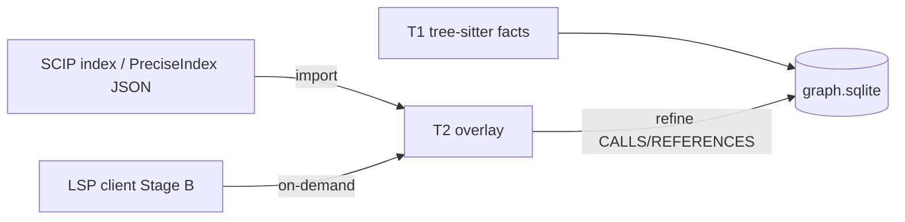

# Precise tier (T2) — SCIP vs LSP

**Phase:** P3 Stage A  
**Status:** Design locked for Stage A ingest  
**Companion:** [ID-MAPPING.md](./ID-MAPPING.md) · [SCIP-RUNBOOK.md](./SCIP-RUNBOOK.md)

---

## Purpose

Overlay **compiler-grade or LSP-grade** defs/refs onto the T1 syntactic KG so high-stakes impact/refactor paths stop trusting heuristic `CALLS` when better data exists.

T1 always remains available. Precise artifacts are **optional**.

---

## Responsibilities split

| Concern | SCIP import | LSP hybrid |
|---|---|---|
| **When** | Batch / CI / offline attach | Interactive / on-demand upgrade |
| **Artifact** | Index file under `.prism/scip/` | Live language-server session |
| **Identity** | Readable SCIP symbol strings → Prism IDs | Document URI + position → Prism IDs |
| **Freshness** | Tied to snapshot (`git_commit` / tree fingerprint) | Tied to open buffers + index SHA |
| **Best for** | Reproducible eval, CI gates, bulk edge upgrade | IDE rename dry-run, ambiguous edge upgrade |
| **Stage A** | ✅ Import path + fixtures | Design only (Stage B client) |
| **Stage B+** | Background refresh | `UpgradePrecision` planner operator |



---

## Non-goals (Stage A)

- Full protobuf SCIP codegen in-tree (JSON PreciseIndex is the interchange; SCIP maps into it — see runbook).
- Live LSP client or rename engine.
- Silently treating heuristic edges as precise without an overlay match.

---

## Confidence & tier rules

| Source | `tier` | `confidence` |
|---|---|---|
| tree-sitter extractors | `T1` | `extracted` / `heuristic` |
| PreciseIndex / SCIP import | `T2` | `precise` |
| LSP hybrid (later) | `T2` | `precise` |

Matching a heuristic `CALLS`/`REFERENCES` edge upgrades **that edge** to `confidence=precise`, `tier=T2`, and records `attrs.refined_from=heuristic` plus `attrs.precise_analyzer`. Heuristic-only edges that never match stay labeled `heuristic`.

---

## Failure mode: `PRECISION_REQUIRED`

When a product path (refactor claim, safe-rename dry-run, precision-gated impact) needs T2 and no precise overlay is attached for the seed symbol/file:

```json
{
  "code": "PRECISION_REQUIRED",
  "message": "No precise (T2) overlay for …",
  "hint": "Run an indexer (see SCIP-RUNBOOK) then `prism precise import`, or narrow to T1-labeled heuristic results."
}
```

T1 tools (`neighbors`, unlabeled `impact`) continue to work; they must keep advertising heuristic confidence.

---

## Storage layout

```text
.prism/
  graph.sqlite          # T1 + refined T2 edges
  scip/
    manifest.json       # last import: analyzer, language, snapshot, path
    <artifact>.json     # PreciseIndex copies (or future .scip.bin)
```

---

## Primary language (Stage A)

**Python** — already has T1 extractors + httpx pilot; SCIP/LSP ergonomics are good enough for fixtures. Rust remains T1-first; precise overlay for Rust can follow the same PreciseIndex shape.
