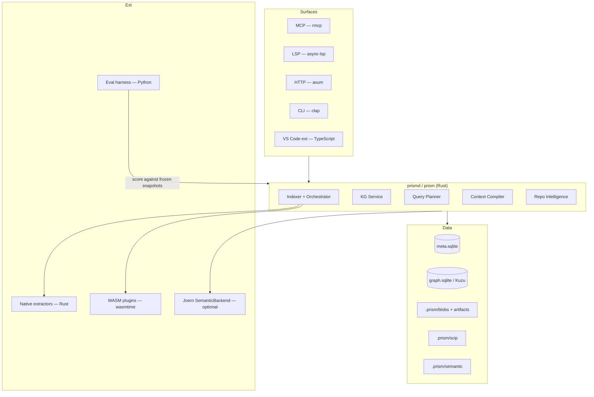

# Prism — Tech Stack & Project Structure

**Project working name:** Prism — Repository Intelligence Platform  
**Document type:** Technology decisions + repository layout by phase  
**Status:** Agreed for implementation kickoff  
**Date:** 2026-07-19  
**Decides:** Language, libraries, tooling, and how the monorepo grows across P0–P6  
**Governs alongside:** [Architecture Design Document](./ARCHITECTURE-DESIGN-DOCUMENT.md) · [Planning & Implementation](../planning/PLANNING-AND-IMPLEMENTATION.md)

---

## How to use this document

| Rule | Meaning |
|---|---|
| ADD wins on *what* to build | This doc does not invent new architecture |
| Planning wins on *when* and *gates* | Phase order and exit criteria stay in the planning doc |
| This doc wins on *how it is built* | Runtime, crates, libs, repo layout, growth rules |

**Primary product decisions locked at kickoff:**

1. **Core engine language:** Rust (performance / latency NFRs are the #1 priority)
2. **Eval harness language:** Python (decoupled from the engine)
3. **IDE extension language:** TypeScript (VS Code)
4. **Plugin ABI (contributed langs):** WASM Component Model via wasmtime
5. **First-party extractors (P1 langs):** Native Rust (no WASM on the hot path yet)

---

## Table of Contents

1. [Decision summary](#1-decision-summary)
2. [Complete tech stack](#2-complete-tech-stack)
3. [Monorepo layout (target end state)](#3-monorepo-layout-target-end-state)
4. [Growth rules](#4-growth-rules)
5. [Phase 0 — Foundations](#5-phase-0--foundations)
6. [Phase 1 — Syntactic KG + MCP](#6-phase-1--syntactic-kg--mcp)
7. [Phase 2 — Context Compiler](#7-phase-2--context-compiler)
8. [Phase 3 — Precise Tier](#8-phase-3--precise-tier)
9. [Phase 4 — Semantic Slicing](#9-phase-4--semantic-slicing)
10. [Phase 5 — Intelligence + Hardening](#10-phase-5--intelligence--hardening)
11. [Phase 6 — Team / Distributed (optional)](#11-phase-6--team--distributed-optional)
12. [Toolchain & CI baseline](#12-toolchain--ci-baseline)
13. [Dependency pin policy](#13-dependency-pin-policy)
14. [Appendix — Stack → ADD/Planning map](#14-appendix--stack--addplanning-map)

---

## 1. Decision summary

### 1.1 Why Rust for the core

| NFR / constraint (ADD) | Rust consequence |
|---|---|
| Structural queries P95 &lt;50ms (N2) | No GC pauses; predictable latency |
| Incremental re-index &lt;2s (N1/G4) | Rayon file fan-out + tree-sitter incremental |
| Cold index 100k LOC &lt;5 min (N1) | Parallel parse/extract without GIL |
| Single-binary / few-deps agent (N5) | Static-friendly binary, ship as one CLI daemon |
| tree-sitter default (§12) | First-class Rust bindings |
| WASM plugin sandbox (N7, §29) | wasmtime is mature in Rust |
| Explicit “prefer Rust/Go workers” (§12.2) | Aligns with ADD guidance |

**Ruled out for core:** Python (GIL + latency risk). Go is a valid alternative but was declined for this program in favor of max performance.

### 1.2 Stack topology



---

## 2. Complete tech stack

### 2.1 Languages & runtimes

| Layer | Language / runtime | Role |
|---|---|---|
| Core engine, CLI, daemon, MCP, LSP, HTTP | **Rust** (stable, edition 2021+) | Product spine |
| Language extractors (first-party) | **Rust** | Hot-path T1 facts |
| Contributed language plugins | **WASM Component Model** (WIT) | Sandboxed ABI |
| IDE extension | **TypeScript** (strict) | VS Code / Cursor UX |
| Eval harness, scorecards, LLM judges | **Python 3.12+** | W-EVAL only |
| Optional semantic backend | **Joern** (JVM, out-of-process) | T4 adapter, never required for solo MVP |

### 2.2 Core crates / libraries (Rust)

| Concern | Choice | Notes |
|---|---|---|
| Async I/O | **Tokio** (multi-thread) | MCP, LSP, HTTP, LSP client |
| CPU fan-out | **Rayon** | Parallel file parse/extract |
| Error handling | **anyhow** (apps) + **thiserror** (libs) | Standard split |
| Logging / spans | **tracing** + **tracing-subscriber** | Correlate with OTel |
| Observability | **opentelemetry** + OTLP exporter | ADD §30 |
| CLI | **clap** (derive) | `prism` binary |
| HTTP | **axum** + **tower** / **tower-http** | `/v1/*` APIs |
| MCP | **rmcp** (official Rust MCP SDK) | Primary agent surface |
| LSP server | **async-lsp** (or `tower-lsp`) | IDE commands |
| LSP client (T2) | **async-lsp** client / **lsp-types** | Hybrid resolve |
| Serialization | **serde**, **serde_json** | Plan IR, packs, APIs |
| Fast internal artifacts | **rkyv** or **bincode** | Memoized packs / shards |
| Protobuf (SCIP) | **prost** + **prost-build** | Precise tier ingest |
| Content hash (hot path) | **xxhash-rust** (XXH3) | Fingerprint / Merkle (§12.2) |
| Content-addressed blob hash | **blake3** | Blob identity |
| IDs | **ulid** / **uuid** | Node IDs where not SCIP |
| Config | **figment** or **clap` + env`** | Keep simple |
| Allocator (opt) | **mimalloc** or **tikv-jemallocator** | Parse-heavy churn |
| Benchmarks | **criterion** | Perf gates in CI |

### 2.3 Storage

| Store | Library | When |
|---|---|---|
| `meta.sqlite` | **rusqlite** + SQLite **WAL** | P0 onward (always) |
| `graph.sqlite` adjacency | **rusqlite** | Default P0–P2 |
| Embedded graph (traversals) | **Kuzu** (embedded) behind `KgStore` trait | Introduce when query P95 needs it (target: late P1 / P2) |
| Object / blob files | std + content-addressed paths | Always |
| SCIP artifacts | filesystem under `.prism/scip/` | P3 |
| Semantic shards | filesystem under `.prism/semantic/` | P4 |

**Hard rule:** All graph access goes through a `KgStore` trait so SQLite → Kuzu is a config switch, not a rewrite.

### 2.4 Parsing & analysis

| Tier | Stack |
|---|---|
| T0 lexical (fallback) | Optional later; not on critical path |
| T1 syntactic | **tree-sitter** + language grammars (Python, TS/JS, Go first) |
| T2 precise | SCIP ingest (`prost`) + LSP hybrid client |
| T3 CFG/DFG | Custom Rust per language / shared IR helpers |
| T4 CPG / slice | Plugin: Joern (or CodeQL-class) out-of-process; lazy shards + depth caps |

### 2.5 Community / architecture algorithms

| Need | Choice |
|---|---|
| Community detection | Leiden or Louvain implementation (Rust crate or thin wrapper) |
| Centrality / hubs | Graph algorithms over `KgStore` |
| Path-prefix labels | Deterministic first; LLM naming optional later |

### 2.6 Surfaces & clients

| Surface | Stack |
|---|---|
| MCP tools | Rust `rmcp` in-process with compiler |
| LSP / IDE commands | Rust LSP server |
| VS Code extension | TypeScript + VS Code Extension API |
| HTTP API | axum |
| CLI | clap (`prism index`, `prism query`, …) |

### 2.7 Plugin system

| Kind | Implementation |
|---|---|
| First-party `LanguageExtractor` | Native Rust crates under `crates/extractors-*` |
| Third-party extractors | **wasmtime** + **WIT** Component Model |
| `Resolver` / `SemanticBackend` / `SinkProvider` | Same ABI family; semantic backends may also be process adapters |
| Conformance | Golden fixtures per language |

### 2.8 Eval & research (Python)

| Need | Choice |
|---|---|
| Env / packaging | **uv** + `pyproject.toml` |
| Data / tables | **pandas** / **pyarrow** |
| HTTP to Prism | `httpx` or CLI subprocess |
| LLM judges | Provider SDKs as needed (pinned versions) |
| Scorecard export | Markdown + JSON / Parquet |

### 2.9 Explicitly demoted / deferred

| Tech | Status |
|---|---|
| Neo4j / hosted graph DBs | Not for solo mode |
| Embedding-centric vector DBs as spine | Forbidden as architecture; optional low-confidence fallback only |
| Answer-cache-as-product | Deferred to P6 Stage C |
| Python / Go core rewrite | Out of scope |
| Full-repo CPG at index time | Forbidden (lazy shards only) |

---

## 3. Monorepo layout (target end state)

End-state shape after P5 (+ optional P6). Earlier phases only materialize the crates they need — see phase sections.

```text
prism/
├── Cargo.toml                          # workspace root
├── Cargo.lock
├── rust-toolchain.toml                 # pin stable channel
├── clippy.toml
├── deny.toml                           # cargo-deny (licenses/advisories)
├── .gitignore
├── README.md
├── LICENSE
│
├── docs/
│   ├── architecture/
│   │   ├── ARCHITECTURE-DESIGN-DOCUMENT.md
│   │   └── TECH-STACK-AND-PROJECT-STRUCTURE.md   # this file
│   └── planning/
│       └── PLANNING-AND-IMPLEMENTATION.md
│
├── crates/
│   ├── prism-cli/                      # `prism` binary (clap)
│   ├── prism-daemon/                   # long-running local service (optional later)
│   ├── prism-core/                     # workspace, fingerprint, orchestration glue
│   ├── prism-store/                    # meta.sqlite, KgStore trait, SQLite + Kuzu adapters
│   ├── prism-graph/                    # node/edge types, query shapes, dirty-set
│   ├── prism-extract/                  # extractor ABI (native), indexing pipeline
│   ├── prism-extract-python/
│   ├── prism-extract-typescript/
│   ├── prism-extract-go/
│   ├── prism-plugin-host/              # wasmtime WIT host
│   ├── prism-precise/                  # SCIP ingest + LSP hybrid (P3)
│   ├── prism-semantic/                 # CFG/DFG + slice + Joern adapter (P4)
│   ├── prism-plan/                     # intent recipes + planner IR + cost model (P2)
│   ├── prism-compile/                  # selection, reduction, Evidence Pack, EXPLAIN (P2)
│   ├── prism-intel/                    # communities, hubs, entrypoints, hotspots (P1 partial → P5)
│   ├── prism-mcp/                      # MCP tool surface (rmcp)
│   ├── prism-lsp/                      # LSP server + IDE commands
│   ├── prism-api/                      # axum HTTP `/v1/*`
│   ├── prism-ir/                       # shared schemas: facts, packs, plans, provenance
│   └── prism-obs/                      # metrics, tracing helpers, event schema
│
├── plugins/                            # third-party / example WASM extractors
│   └── examples/
│       └── wit/                        # shared WIT contracts
│
├── extensions/
│   └── vscode/                         # TypeScript VS Code extension
│
├── eval/                               # Python W-EVAL
│   ├── pyproject.toml
│   ├── README.md
│   ├── harness/
│   ├── tasks/                          # gold tasks (versioned)
│   ├── baselines/
│   ├── scorecards/
│   └── reports/
│
├── schemas/                            # versioned JSON Schema / protobuf / WIT
│   ├── fact-schema/
│   ├── evidence-pack/
│   ├── plan-ir/
│   ├── scip/                           # vendored or generated protobuf
│   └── plugins/                        # WIT
│
├── fixtures/                           # golden repos, snippets, expected facts
│   ├── languages/
│   ├── repos/                          # small pinned snapshots
│   └── packs/                          # example Evidence Packs / EXPLAIN
│
├── benches/                            # criterion benches (or per-crate benches/)
├── scripts/                            # release, schema codegen, scip helpers
└── .github/
    └── workflows/
        ├── ci.yml
        ├── eval.yml
        └── release.yml
```

### 3.1 On-disk product layout (created by Prism at runtime)

Not source — written under the user's repo:

```text
.prism/
  meta.sqlite
  graph.sqlite            # or Kuzu files when enabled
  blobs/
  scip/                   # P3+
  semantic/               # P4+
  artifacts/
  logs/
```

---

## 4. Growth rules

1. **No application crates outside `crates/`.** Eval stays in `eval/`; IDE in `extensions/`.
2. **Schemas live in `schemas/` first.** Rust types in `prism-ir` are generated or hand-synced with a version bump rule.
3. **One crate ≈ one workstream ID** where practical (`W-STORE` → `prism-store`, `W-CC` → `prism-compile`, …).
4. **Do not create a crate until its phase needs it.** Empty scaffolding is allowed only for workspace wiring in P0.
5. **First-party extractors stay native Rust until WASM ABI is proven** (target: P5).
6. **Perf regressions fail CI** once criterion benches exist (from P0 Stage C / early P1).
7. **Breaking fact/pack/plan schema ⇒ major version bump** in `schemas/` and `prism-ir`.

---

## 5. Phase 0 — Foundations

**Planning ref:** P0 Stages A–C  
**Duration:** 2–3 weeks  
**Goal:** Workspace identity, hashing, durable schemas, plugin ABI draft, eval skeleton — *before* intelligence features.

### 5.1 Tech activated in P0

| Area | Activate |
|---|---|
| Language | Rust workspace |
| Store | rusqlite + WAL; `meta.sqlite` tables |
| Hash | XXH3 file hash + directory Merkle |
| Schema | Draft fact + meta schema under `schemas/` |
| OBS | `tracing` + event schema stub |
| Eval | Python `eval/` skeleton + ≥20 gold task stubs |
| CI | `cargo test`, `clippy`, `fmt`, basic `uv` check |

**Not in P0:** MCP product tools, Kuzu, SCIP, Joern, WASM host (ABI *documented* only), VS Code extension.

### 5.2 Repository structure at P0 exit

```text
prism/
├── Cargo.toml
├── rust-toolchain.toml
├── docs/… (existing)
├── crates/
│   ├── prism-cli/                 # stub: `prism --help`, `prism index --dry-run`
│   ├── prism-core/                # Workspace Manager, fingerprint, ignore rules
│   ├── prism-store/               # meta.sqlite; KgStore trait + SQLite stub
│   ├── prism-ir/                  # identity types, schema version constants
│   └── prism-obs/                 # counters: files discovered/skipped, wall time
├── schemas/
│   ├── meta/v0/
│   ├── fact-schema/v0/
│   └── events/v0/
├── fixtures/
│   └── repos/                     # pilot repo snapshot refs (SHAs documented)
├── eval/
│   ├── pyproject.toml
│   ├── harness/                   # design + skeleton runner
│   ├── tasks/                     # ≥20 gold task cards
│   └── scorecards/templates/
├── benches/
│   └── fingerprint_Incremental.rs # or crates/prism-core/benches/
└── .github/workflows/ci.yml
```

### 5.3 P0 deliverable crate map

| Crate / path | Owns (workstream) | Exit artifact |
|---|---|---|
| `prism-core` | W-STORE identity | Fingerprint algorithm + ignore policy |
| `prism-store` | W-STORE | `meta.sqlite` schema + WAL txn notes coded |
| `prism-ir` | W-PLUGIN / W-KG | IDs, confidence enums, IR cheat-sheet types |
| `prism-obs` | W-OBS | Named event schema |
| `eval/` | W-EVAL | Harness design + gold pack v0 |
| `schemas/` | cross-cutting | Schema v0 documents |

### 5.4 P0 gate (tech view)

- Incremental discover → hash → parse-hook stub → txn → invalidate path compiles and is tested against fixtures.
- Metrics events can be emitted (even to logs).
- Gold tasks versioned and tied to commit SHAs.

---

## 6. Phase 1 — Syntactic KG + MCP

**Planning ref:** P1 Stages A–D  
**Duration:** 4–6 weeks  
**Languages:** Python, TypeScript/JavaScript, Go (native extractors)

### 6.1 Tech activated in P1

| Area | Activate |
|---|---|
| Parsing | tree-sitter + 3 grammars |
| Graph | `graph.sqlite` adjacency; query API |
| Optional | Kuzu adapter behind `KgStore` if SQLite P95 slips |
| MCP | `rmcp` — `index_status`, `resolve_symbol`, `neighbors`, `impact`, `repo_map` stub |
| Intel | Leiden/Louvain communities (lightweight) |
| Eval | Token/quality scorecard vs explore |

### 6.2 Repository structure added/expanded in P1

```text
crates/
├── prism-graph/                   # NEW — nodes/edges, neighbors, impact query
├── prism-extract/                 # NEW — pipeline: parse → extract → write subgraph
├── prism-extract-python/          # NEW
├── prism-extract-typescript/      # NEW
├── prism-extract-go/              # NEW
├── prism-intel/                   # NEW — communities / hubs (partial)
├── prism-mcp/                     # NEW — MCP structural tools
├── prism-cli/                     # expand: `prism index`, `prism query`
fixtures/
├── languages/
│   ├── python/golden/
│   ├── typescript/golden/
│   └── go/golden/
schemas/
└── mcp-tools/v1/
```

### 6.3 P1 crate responsibilities

| Crate | Purpose |
|---|---|
| `prism-extract*` | T1 facts with honest `heuristic` / `extracted` confidence |
| `prism-graph` | Persist + query; file-subgraph replace; reverse dirty lists |
| `prism-mcp` | Agent tool catalog v1 |
| `prism-intel` | Community detection for `repo_map` |

### 6.4 P1 gate (tech view)

- ≥5× token reduction on structural gold tasks measurable via `eval/`.
- Single-file edit path does not full-rebuild (benchmarked).
- No WASM required yet; ABI remaining design-only.

---

## 7. Phase 2 — Context Compiler

**Planning ref:** P2 Stages A–C  
**Duration:** 3–5 weeks  
**Goal:** Intent → plan → Evidence Pack; `compile_context` primary MCP tool.

### 7.1 Tech activated in P2

| Area | Activate |
|---|---|
| Planner | Deterministic recipes + plan IR (JSON) |
| Compiler | Selection, reduction, budgets, EXPLAIN |
| MCP | Promote `compile_context` |
| HTTP | Optional early: `POST /v1/context/compile`, `POST /v1/query/plan` |
| Pack schema | `schemas/evidence-pack/v1` |

### 7.2 Repository structure added in P2

```text
crates/
├── prism-plan/                    # NEW — intent catalog, planner, cost model stub
├── prism-compile/                 # NEW — Evidence Pack builder + EXPLAIN
├── prism-api/                     # NEW (or expand if started) — axum routes
├── prism-mcp/                     # expand — compile_context primary guidance
schemas/
├── plan-ir/v1/
└── evidence-pack/v1/
fixtures/
└── packs/
    ├── explain-examples/
    └── refuse-dump/               # SCOPE_UNRESOLVED fixtures
eval/
└── labeling/                      # necessary-span labels process
```

### 7.3 P2 crate responsibilities

| Crate | Purpose |
|---|---|
| `prism-plan` | Recipes without LLM-by-default; `/query/plan` |
| `prism-compile` | Must-include invariant; drop order; provenance on every fragment |
| `prism-mcp` | Agent UX: one-shot pack over hop thrash |

### 7.4 P2 gate (tech view)

- Context precision ≥60% on labeled sample.
- Pack compile latency tracked toward &lt;300ms P95 (criterion / obs).
- Refuse unbounded dump fixtures green.

---

## 8. Phase 3 — Precise Tier

**Planning ref:** P3 Stages A–C  
**Duration:** 4–6 weeks

### 8.1 Tech activated in P3

| Area | Activate |
|---|---|
| SCIP | `prost` ingest → symbol ID mapping |
| LSP hybrid | Language server clients for primary langs |
| Planner | `UpgradePrecision` operator |
| Gating | `PRECISION_REQUIRED` for refactor/impact claims |
| Storage | `.prism/scip/` artifacts |

### 8.2 Repository structure added in P3

```text
crates/
├── prism-precise/                 # NEW — SCIP import, LSP hybrid, edge refine
schemas/
└── scip/                          # protobuf definitions / generated code hook
scripts/
└── scip/                          # runbooks: how to produce indexes per language
fixtures/
└── precise/
    └── oracle/                    # T1 vs T2 precision/recall fixtures
```

### 8.3 P3 notes

- Keep T1 always working when SCIP missing.
- Prefer Go/TS/Python first for SCIP/LSP ergonomics (per planning risk register).

### 8.4 P3 gate (tech view)

- Material precision↑ on oracle fixtures.
- Dry-run rename demo script under `scripts/` or `eval/`.
- Heuristic edges never silently upgraded.

---

## 9. Phase 4 — Semantic Slicing

**Planning ref:** P4 Stages A–C  
**Duration:** 5–8 weeks

### 9.1 Tech activated in P4

| Area | Activate |
|---|---|
| T3 | Intra-proc CFG/DFG in Rust |
| T4 | Slice operator; optional Joern process adapter |
| Storage | `.prism/semantic/` shards |
| Recipes | Debug / security intent packs |
| Memoization | Deterministic slice keys `(snapshot, algo, params)` |

### 9.2 Repository structure added in P4

```text
crates/
├── prism-semantic/                # NEW — CFG/DFG, slice, SemanticBackend trait
│   └── src/
│       ├── cfg/
│       ├── dfg/
│       ├── slice/
│       └── backends/
│           └── joern.rs           # optional out-of-process
fixtures/
└── slices/
    └── property/                  # criterion-in-slice, idempotence tests
schemas/
└── semantic-artifact/v1/
```

### 9.3 P4 gate (tech view)

- Debug suite ≥5× token↓; quality within ~5 pts of frontier-explore.
- No whole-repo CPG by default (enforced in orchestrator policy).
- Joern optional — local CFG path must work without JVM.

---

## 10. Phase 5 — Intelligence + Hardening

**Planning ref:** P5 Stages A–C  
**Duration:** ~4 weeks

### 10.1 Tech activated in P5

| Area | Activate |
|---|---|
| Intel | Entrypoints, hubs, layering, hotspots (git history) |
| Plugin SDK | Public docs + WASM host **proven** with one example plugin |
| IDE | VS Code extension (peek evidence, impact, slice, compile) |
| Security | Secret redaction, pack audit logs |
| Public eval | Four-arm scorecard published |

### 10.2 Repository structure added in P5

```text
crates/
├── prism-intel/                   # expand to full catalog
├── prism-plugin-host/             # NEW — wasmtime WIT host + conformance runner
├── prism-lsp/                     # NEW if not earlier — IDE commands
plugins/
└── examples/
    └── hello-extractor/           # WASM example implementing WIT
extensions/
└── vscode/                        # NEW — TypeScript extension
eval/
└── reports/
    └── public/                    # published benchmark report sources
docs/
├── contributing/
│   └── plugin-guide.md
└── security/
    └── release-checklist.md
```

### 10.3 P5 gate (tech view)

- External language path documented via ABI + golden fixtures.
- Medium + Prism ≈ frontier + explore within ≤3 pts on suite.
- Plugin SDK + security checklist ready.

---

## 11. Phase 6 — Team / Distributed (optional)

**Planning ref:** P6 Stages A–C  
**Duration:** TBD after P5

### 11.1 Tech activated in P6

| Area | Activate |
|---|---|
| Shared index | Read-mostly index server (likely axum service) |
| Authz | Path isolation + auth model |
| CI publishers | Workflows publishing SCIP / index artifacts by git SHA |
| Caches | Deterministic artifact memoization; optional certified answer cache |

### 11.2 Repository structure added in P6

```text
crates/
├── prism-server/                  # NEW — shared index / registry API
├── prism-authz/                   # NEW — authz primitives
deploy/
├── docker/
└── compose/                       # team mode reference deploy
.github/workflows/
└── publish-index.yml
```

### 11.3 P6 gate (tech view)

- Two developers read same commit index safely.
- Solo local mode still requires **no** always-on heavy graph DB.
- Answer cache — if any — cannot serve stale without certificate failure.

---

## 12. Toolchain & CI baseline

### 12.1 Developer toolchain

| Tool | Purpose |
|---|---|
| `rustup` + pinned `rust-toolchain.toml` | Reproducible compiler |
| `cargo fmt` / `clippy -D warnings` | Style + lints |
| `cargo deny` | Advisories / licenses |
| `cargo nextest` (optional) | Faster test runner |
| `criterion` | Perf benches |
| `uv` | Python eval env |
| `node` + `pnpm` or `npm` | VS Code extension (P5) |
| `protoc` | SCIP protobuf codegen (P3) |

### 12.2 CI matrix (minimum)

| Job | From phase |
|---|---|
| `cargo fmt --check` + `clippy` + `test` | P0 |
| Extractor golden fixtures | P1 |
| Incremental edit bench gate | P1 |
| Pack stability / must-include tests | P2 |
| Precise oracle P/R | P3 |
| Slice property tests | P4 |
| `uv run` eval smoke + scorecard export | P0 skeleton → P5 public |
| Extension lint/build | P5 |

### 12.3 Binary product names

| Binary | Role |
|---|---|
| `prism` | CLI (index, query, compile, doctor) |
| `prism-mcp` | MCP stdio server (or `prism mcp serve` subcommand) |
| `prism-lsp` | LSP server (or `prism lsp` subcommand) |

Prefer **subcommand-unified** early (`prism mcp serve`) to keep one binary for N5; split only if size/isolation demands it.

---

## 13. Dependency pin policy

1. **Workspace-level `[workspace.dependencies]`** for all shared crates — one version graph.
2. **Lockfile committed** (`Cargo.lock`) for the binary workspace.
3. **Upgrade policy:** security patches anytime; minor upgrades batched; major upgrades require a short ADR note under `docs/architecture/adr/` (create when first needed).
4. **No `git` dependencies** in release builds without an ADR.
5. **WASM WIT contracts versioned** like fact schema (breaking = major).

---

## 14. Appendix — Stack → ADD/Planning map

| Stack choice | ADD section | Planning workstream |
|---|---|---|
| Rust core + Rayon | §12.2, N1–N5 | W-STORE, W-KG |
| tree-sitter | §12, §13 T1 | W-PLUGIN |
| rusqlite + WAL / Kuzu | §15.2, §21, N4 | W-STORE |
| KgStore trait | §15 polyglot persistence | W-KG |
| rmcp MCP | §25 | W-MCP |
| axum / clap | §22 | W-MCP / CLI |
| async-lsp | §24 | W-IDE |
| SCIP + prost + LSP | §13 T2, §7 SCIP | W-PLUGIN |
| Joern adapter | §13 T4, §7 Joern | W-PLUGIN |
| wasmtime WIT | §23, §29 | W-PLUGIN |
| prism-plan / compile | §16–§19 | W-PLAN, W-CC |
| tracing + OTel | §30 | W-OBS |
| Python eval/ | §31–§32 | W-EVAL |
| VS Code extension | §24 | W-IDE |
| Shared server (P6) | §26 | P6 stages |

---

## Related documents

- [Architecture Design Document](./ARCHITECTURE-DESIGN-DOCUMENT.md) — design authority  
- [Planning & Implementation](../planning/PLANNING-AND-IMPLEMENTATION.md) — phase gates and stage packs  

---

*End of Tech Stack & Project Structure document.*
