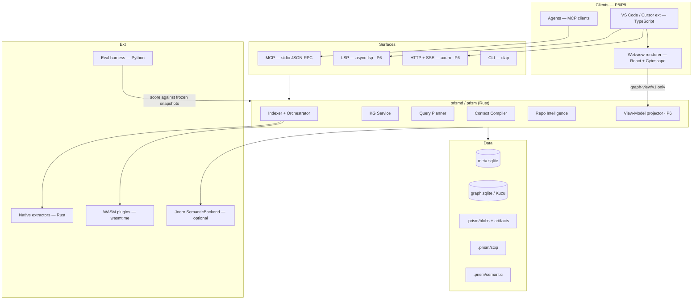

# Prism — Tech Stack & Project Structure

**Project working name:** Prism — Repository Intelligence Platform  
**Document type:** Technology decisions + repository layout by phase  
**Status:** Active — P0–P5 built; P6–P9 (interaction half) decided but unimplemented  
**Date:** 2026-07-19 · **Revised:** 2026-07-26 (as-built audit; visualization / extension / agent stack added)  
**Decides:** Language, libraries, tooling, and how the monorepo grows across P0–P10  
**Governs alongside:** [Architecture Design Document](./ARCHITECTURE-DESIGN-DOCUMENT.md) · [Planning & Implementation](../planning/PLANNING-AND-IMPLEMENTATION.md)

---

## How to use this document

| Rule | Meaning |
|---|---|
| ADD wins on *what* to build | This doc does not invent new architecture |
| Planning wins on *when* and *gates* | Phase order and exit criteria stay in the planning doc |
| This doc wins on *how it is built* | Runtime, crates, libs, repo layout, growth rules |

**Primary product decisions locked at kickoff:**

1. **Core engine language:** Rust (performance / latency NFRs are the #1 priority)
2. **Eval harness language:** Python (decoupled from the engine)
3. **IDE extension language:** TypeScript (VS Code)
4. **Plugin ABI (contributed langs):** WASM Component Model via wasmtime
5. **First-party extractors (P1 langs):** Native Rust (no WASM on the hot path yet)

**Decisions added for the interaction half (2026-07-26):**

6. **Local service:** `prismd` daemon — Tokio + axum + tower-http, SSE for progress, `notify` for file watching
7. **Graph rendering:** Cytoscape.js with ELK.js layered layout for determinism; Sigma.js/WebGL escape hatch above the LOD ceiling
8. **Webview UI:** React + Vite, TypeScript strict, VS Code theme CSS variables (no component-library lock-in)
9. **Extension packaging:** esbuild bundle + `@vscode/vsce`; published to VS Code Marketplace and Open VSX
10. **Renderer input:** a versioned **Graph View-Model** (`schemas/graph-view/v1`) — the renderer never touches the store

---

## Table of Contents

1. [Decision summary](#1-decision-summary)
2. [Complete tech stack](#2-complete-tech-stack)
3. [Monorepo layout (target end state)](#3-monorepo-layout-target-end-state)
4. [Growth rules](#4-growth-rules)
5. [Phase 0 — Foundations](#5-phase-0--foundations)
6. [Phase 1 — Syntactic KG + MCP](#6-phase-1--syntactic-kg--mcp)
7. [Phase 2 — Context Compiler](#7-phase-2--context-compiler)
8. [Phase 3 — Precise Tier](#8-phase-3--precise-tier)
9. [Phase 4 — Semantic Slicing](#9-phase-4--semantic-slicing)
10. [Phase 5 — Intelligence + Hardening](#10-phase-5--intelligence--hardening)
11. [Phase 6 — Consolidation & Interaction Substrate](#11-phase-6--consolidation--interaction-substrate)
12. [Phase 7 — Visual Repository Intelligence](#12-phase-7--visual-repository-intelligence)
13. [Phase 8 — IDE Extension (VS Code / Cursor)](#13-phase-8--ide-extension-vs-code--cursor)
14. [Phase 9 — Agent Experience & Workflows](#14-phase-9--agent-experience--workflows)
15. [Phase 10 — Team / Distributed (optional)](#15-phase-10--team--distributed-optional)
16. [Toolchain & CI baseline](#16-toolchain--ci-baseline)
17. [Dependency pin policy](#17-dependency-pin-policy)
18. [Appendix — Stack → ADD/Planning map](#18-appendix--stack--addplanning-map)

> **Phase renumbering (2026-07-26):** the former *Phase 6 — Team / Distributed* is now **Phase 10**. Phases 6–9 cover service surfaces, visualization, the IDE extension, and agent experience.

---

## 1. Decision summary

### 1.1 Why Rust for the core

| NFR / constraint (ADD) | Rust consequence |
|---|---|
| Structural queries P95 &lt;50ms (N2) | No GC pauses; predictable latency |
| Incremental re-index &lt;2s (N1/G4) | Rayon file fan-out + tree-sitter incremental |
| Cold index 100k LOC &lt;5 min (N1) | Parallel parse/extract without GIL |
| Single-binary / few-deps agent (N5) | Static-friendly binary, ship as one CLI daemon |
| tree-sitter default (§12) | First-class Rust bindings |
| WASM plugin sandbox (N7, §29) | wasmtime is mature in Rust |
| Explicit “prefer Rust/Go workers” (§12.2) | Aligns with ADD guidance |

**Ruled out for core:** Python (GIL + latency risk). Go is a valid alternative but was declined for this program in favor of max performance.

### 1.2 Stack topology



**Reading the diagram:** everything left of `Surfaces` is planned (P6–P9); everything inside `Core`, `Data`, and `Ext` exists today except the view-model projector, the LSP host, the HTTP surface, and the WASM host. See [§2.11](#211-as-built-vs-specified--post-p5-audit).

---

## 2. Complete tech stack

### 2.1 Languages & runtimes

| Layer | Language / runtime | Role |
|---|---|---|
| Core engine, CLI, daemon, MCP, LSP, HTTP | **Rust** (stable, edition 2021+) | Product spine |
| Language extractors (first-party) | **Rust** | Hot-path T1 facts |
| Contributed language plugins | **WASM Component Model** (WIT) | Sandboxed ABI |
| IDE extension | **TypeScript** (strict) | VS Code / Cursor UX |
| Eval harness, scorecards, LLM judges | **Python 3.12+** | W-EVAL only |
| Optional semantic backend | **Joern** (JVM, out-of-process) | T4 adapter, never required for solo MVP |

### 2.2 Core crates / libraries (Rust)

| Concern | Choice | Notes |
|---|---|---|
| Async I/O | **Tokio** (multi-thread) | MCP, LSP, HTTP, LSP client |
| CPU fan-out | **Rayon** | Parallel file parse/extract |
| Error handling | **anyhow** (apps) + **thiserror** (libs) | Standard split |
| Logging / spans | **tracing** + **tracing-subscriber** | Correlate with OTel |
| Observability | **opentelemetry** + OTLP exporter | ADD §30 |
| CLI | **clap** (derive) | `prism` binary |
| HTTP | **axum** + **tower** / **tower-http** | `/v1/*` APIs |
| MCP | **rmcp** (official Rust MCP SDK) | Primary agent surface |
| LSP server | **async-lsp** (or `tower-lsp`) | IDE commands |
| LSP client (T2) | **async-lsp** client / **lsp-types** | Hybrid resolve |
| Serialization | **serde**, **serde_json** | Plan IR, packs, APIs |
| Fast internal artifacts | **rkyv** or **bincode** | Memoized packs / shards |
| Protobuf (SCIP) | **prost** + **prost-build** | Precise tier ingest |
| Content hash (hot path) | **xxhash-rust** (XXH3) | Fingerprint / Merkle (§12.2) |
| Content-addressed blob hash | **blake3** | Blob identity |
| IDs | **ulid** / **uuid** | Node IDs where not SCIP |
| Config | **figment** or **clap` + env`** | Keep simple |
| Allocator (opt) | **mimalloc** or **tikv-jemallocator** | Parse-heavy churn |
| Benchmarks | **criterion** | Perf gates in CI |

### 2.3 Storage

| Store | Library | When |
|---|---|---|
| `meta.sqlite` | **rusqlite** + SQLite **WAL** | P0 onward (always) |
| `graph.sqlite` adjacency | **rusqlite** | Default P0–P2 |
| Embedded graph (traversals) | **Kuzu** (embedded) behind `KgStore` trait | Introduce when query P95 needs it (target: late P1 / P2) |
| Object / blob files | std + content-addressed paths | Always |
| SCIP artifacts | filesystem under `.prism/scip/` | P3 |
| Semantic shards | filesystem under `.prism/semantic/` | P4 |

**Hard rule:** All graph access goes through a `KgStore` trait so SQLite → Kuzu is a config switch, not a rewrite.

### 2.4 Parsing & analysis

| Tier | Stack |
|---|---|
| T0 lexical (fallback) | Optional later; not on critical path |
| T1 syntactic | **tree-sitter** + language grammars (Python, TS/JS, Go first) |
| T2 precise | SCIP ingest (`prost`) + LSP hybrid client |
| T3 CFG/DFG | Custom Rust per language / shared IR helpers |
| T4 CPG / slice | Plugin: Joern (or CodeQL-class) out-of-process; lazy shards + depth caps |

### 2.5 Community / architecture algorithms

| Need | Choice |
|---|---|
| Community detection | Leiden or Louvain implementation (Rust crate or thin wrapper) |
| Centrality / hubs | Graph algorithms over `KgStore` |
| Path-prefix labels | Deterministic first; LLM naming optional later |

### 2.6 Surfaces & clients

| Surface | Stack |
|---|---|
| MCP tools | Rust `rmcp` in-process with compiler |
| LSP / IDE commands | Rust LSP server |
| VS Code extension | TypeScript + VS Code Extension API |
| HTTP API | axum |
| CLI | clap (`prism index`, `prism query`, …) |

### 2.7 Plugin system

| Kind | Implementation |
|---|---|
| First-party `LanguageExtractor` | Native Rust crates under `crates/extractors-*` |
| Third-party extractors | **wasmtime** + **WIT** Component Model |
| `Resolver` / `SemanticBackend` / `SinkProvider` | Same ABI family; semantic backends may also be process adapters |
| Conformance | Golden fixtures per language |

### 2.8 Eval & research (Python)

| Need | Choice |
|---|---|
| Env / packaging | **uv** + `pyproject.toml` |
| Data / tables | **pandas** / **pyarrow** |
| HTTP to Prism | `httpx` or CLI subprocess |
| LLM judges | Provider SDKs as needed (pinned versions) |
| Scorecard export | Markdown + JSON / Parquet |

### 2.9 Explicitly demoted / deferred

| Tech | Status |
|---|---|
| Neo4j / hosted graph DBs | Not for solo mode |
| Embedding-centric vector DBs as spine | Forbidden as architecture; optional low-confidence fallback only |
| Answer-cache-as-product | Deferred to P10 Stage C |
| Python / Go core rewrite | Out of scope |
| Full-repo CPG at index time | Forbidden (lazy shards only) |
| Electron / standalone desktop app | Out of scope — the editor is the shell |
| Web-hosted graph explorer | Out of scope until P10; local-first stands |
| Heavy front-end frameworks (Angular/Next) in the webview | Rejected — a webview panel is not an application |
| 3D graph layouts | Rejected — impressive, unreadable, non-deterministic |

---

### 2.10 Interaction, visualization & agent-surface stack (P6–P9)

#### 2.10.1 Service layer (P6)

| Concern | Choice | Notes |
|---|---|---|
| Daemon runtime | **Tokio** multi-thread | First real use of async in the workspace |
| HTTP + middleware | **axum** + **tower-http** | `/v1/*` per ADD §22; loopback bind by default |
| Streaming | **SSE** over axum | Index progress, pack progress, view invalidation |
| File watching | **notify** + debounce | Drives incremental re-index and invalidation events |
| CPU fan-out | **Rayon** | Parallel parse/extract — the original Rust rationale, still unexercised |
| Cancellation | `tokio_util::sync::CancellationToken` | Superseded UI requests must actually stop |
| LSP server | **async-lsp** (fallback `tower-lsp`) | Hover, code lens, custom commands |
| Tracing export | **opentelemetry** + OTLP, opt-in | Turns `OTEL-SPANS.md` from design into signal |
| API contract | **utoipa** or hand-written OpenAPI | Must mirror the MCP error model exactly |

**Hard rule:** the CLI must keep working with **no daemon running**. `prismd` is an accelerator, never a dependency — N5 and local-first depend on it.

#### 2.10.2 Graph rendering (P7)

| Concern | Choice | Why |
|---|---|---|
| Graph engine (default) | **Cytoscape.js** | Mature, deterministic with fixed positions, good event model, works to ~5k elements |
| Layout (hierarchical) | **ELK.js** (`elkjs`) via layered algorithm | Best-in-class layered layout for dependency and layering views; deterministic given a seed and stable input order |
| Layout (radial / cone) | Cytoscape concentric with fixed ordering | Impact cones read naturally as hop rings |
| Layout (path) | Custom linear layout over slice order | Slices are sequences, not clouds |
| Escape hatch (>LOD ceiling) | **Sigma.js** + graphology (WebGL) | Only reachable after an explicit “render anyway” confirmation |
| Static export | SVG/PNG from the canvas; **Mermaid** text fallback | Docs, scorecards, and marketplace screenshots |
| Diffing / testing | Screenshot-diff over deterministic layouts | Same discipline as pack-stability tests |

**Rejected:** D3 force-directed as the *default* (non-deterministic, hairballs at scale), Graphviz/WASM (poor interactivity), 3D engines.

**Determinism requirement:** layout input must be sorted canonically and seeded, so `(snapshot_id, view_kind, params)` produces byte-identical coordinates. Without this, screenshot tests are impossible and users lose spatial memory between sessions.

#### 2.10.3 Webview & extension (P8)

| Concern | Choice | Notes |
|---|---|---|
| Language | **TypeScript** strict, `noUncheckedIndexedAccess` | |
| Webview UI | **React 18+** + **Vite** | Small surface; the daemon holds all state |
| Styling | VS Code theme CSS variables | Automatic light/dark/high-contrast |
| Extension bundling | **esbuild** | Fast, single-file `extension.js` |
| Packaging | **@vscode/vsce** → Marketplace + **Open VSX** | Open VSX matters for Cursor and forks |
| Unit tests | **vitest** | Renderer + view-model logic |
| Integration | **@vscode/test-electron** | Commands, activation, panels |
| End-to-end | **Playwright** against the webview | Interaction grammar coverage |
| Package manager | **pnpm** | Workspace for `extensions/vscode` + renderer package |
| Binary delivery | Platform-specific VSIX **or** verified download-on-demand | Decision recorded in P8 Stage A ADR |

**Hard rule:** thin extension, thick daemon. No analysis logic in TypeScript — the extension issues requests and renders view-models.

#### 2.10.4 Agent surfaces (P9)

| Concern | Choice | Notes |
|---|---|---|
| MCP transport | Current hand-rolled stdio JSON-RPC; **`rmcp` migration is an open ADR** | See G-05 in the planning gap register |
| Tool schemas | `schemas/mcp-tools/v1` as the contract of record | Rust surface validated against it in CI |
| Agent guidance assets | Generated `AGENTS.md` + host-specific rules from the workflow catalog | Never hand-maintained in two places |
| Workflow catalog | Declarative (TOML/JSON) → generates rules, docs, and fixtures | Prevents drift between engine recipes and agent instructions |
| Trace capture | Local JSONL under `.prism/logs/`, opt-in export | Tool sequence and outcomes only — never repository content |
| Streaming packs | SSE (HTTP) / incremental MCP results | Architecture layer first, so agents can start reasoning early |

---

### 2.11 As-built vs specified — post-P5 audit

**Audited 2026-07-26.** The planning document's [§12 gap register](../planning/PLANNING-AND-IMPLEMENTATION.md#12-post-phase-5-repository-re-analysis--gap-register) is the authoritative work list; this table is the stack-level view of the same finding.

| Specified here | Reality at P5 exit | Disposition |
|---|---|---|
| `prism-graph` crate | Merged into `prism-store` | Accept — ADR in P6 Stage A; this doc's §3 layout updated |
| `prism-intel` crate | Merged as `prism-store::intel` | Accept — same ADR |
| `prism-api` (axum `/v1/*`) | **Not built**; no axum dependency anywhere | Build in P6 Stage B |
| `prism-lsp` (lsp-server) | **Built** (P6 Stage C) | Augments; does not replace rust-analyzer/pylsp |
| `prism-daemon` | **Not built**; every call cold-opens SQLite | Build in P6 Stage B as `prismd` |
| `prism-plugin-host` (wasmtime + WIT) | **Not built**; the P5 tech-view claim of a *proven* WASM host is unmet | P6 Stage A: build it or amend the claim |
| MCP via `rmcp` | Hand-rolled stdio JSON-RPC | Open ADR in P6 Stage A |
| Extractors: Python, TypeScript, Go | Python + **Rust** | Re-baselined; TS/Go move to a language expansion track |
| Kuzu behind `KgStore` | Not introduced; SQLite only | Fine — but N2 was never measured, so the trigger condition is unknown |
| Tokio / Rayon | **Unused**; indexing is single-threaded | P6 Stage B |
| OpenTelemetry / OTLP | Design-only spans | P6 Stage B, opt-in |
| `criterion` perf gates | `benches/` holds only a README | P6 Stage A |
| `cargo deny` + `deny.toml` | CI job specified, files absent | P6 Stage A |
| `LICENSE` file | Absent despite `license = "MIT"` | P6 Stage A |
| `schemas/mcp-tools/v1` | Never created; schemas inline in Rust | P6 Stage A |
| `extensions/vscode`, `plugins/examples` | Directories do not exist | P8 / P6 Stage A |

**What is real:** 13 crates, Python + Rust tree-sitter extractors with golden fixtures, SQLite meta+graph store with WAL and file-subgraph replace, planner with intent recipes, Evidence Pack compiler with EXPLAIN and budget invariants, T2 precise overlay, T3/T4 semantic slicing, repo intelligence, 9 MCP tools, 66 passing tests, and CI running fmt/clippy/test/conformance/eval-smoke.

**Rule going forward (mirrors planning guardrail 7):** this document may not describe a crate, dependency, or capability that the repository does not contain. Intended-but-unbuilt items belong in a phase section marked *planned*, never in §2 or §3 as though they exist.

---

## 3. Monorepo layout (target end state)

End-state shape after P9 (+ optional P10). Earlier phases only materialize the crates they need — see phase sections. Entries marked `‹planned P#›` **do not exist yet**; see [§2.11](#211-as-built-vs-specified--post-p5-audit).

```text
prism/
├── Cargo.toml                          # workspace root
├── Cargo.lock
├── rust-toolchain.toml                 # pin stable channel
├── clippy.toml
├── deny.toml                           # cargo-deny (licenses/advisories)
├── .gitignore
├── README.md
├── LICENSE
│
├── docs/
│   ├── architecture/
│   │   ├── ARCHITECTURE-DESIGN-DOCUMENT.md
│   │   └── TECH-STACK-AND-PROJECT-STRUCTURE.md   # this file
│   └── planning/
│       └── PLANNING-AND-IMPLEMENTATION.md
│
├── crates/
│   ├── prism-cli/                      # `prism` binary (clap)
│   ├── prism-core/                     # workspace, fingerprint, orchestration glue
│   ├── prism-store/                    # meta.sqlite, KgStore, graph queries, intel
│   ├── prism-extract/                  # extractor ABI (native), indexing pipeline
│   ├── prism-extract-python/
│   ├── prism-extract-rust/
│   ├── prism-extract-typescript/       # ‹planned — language expansion track›
│   ├── prism-extract-go/               # ‹planned — language expansion track›
│   ├── prism-precise/                  # SCIP ingest + hybrid resolve (P3)
│   ├── prism-semantic/                 # CFG/DFG + slice + Joern adapter (P4)
│   ├── prism-plan/                     # intent recipes + planner IR + cost model (P2)
│   ├── prism-compile/                  # selection, reduction, Evidence Pack, EXPLAIN (P2)
│   ├── prism-mcp/                      # MCP tool surface (stdio JSON-RPC)
│   ├── prism-ir/                       # shared schemas: facts, packs, plans, provenance
│   ├── prism-obs/                      # metrics, tracing helpers, event schema
│   ├── prism-view/                     # KG → Graph View-Model projection, LOD, budgets (P6)
│   ├── prism-api/                      # axum HTTP + SSE `/v1/*` (P6)
│   ├── prism-daemon/                   # `prismd` — watcher, warm caches, sessions (P6)
│   ├── prism-lsp/                      # LSP server + IDE commands (P6)
│   ├── prism-plugin-host/              # ‹planned P6› wasmtime WIT host
│   └── prism-agent/                    # ‹planned P9› workflow catalog + rules/asset generation
│
├── plugins/                            # ‹planned P6› third-party / example WASM extractors
│   └── examples/
│       └── wit/                        # shared WIT contracts
│
├── packages/                           # TypeScript workspace (pnpm) — P7+
│   └── prism-graph-view/               # renderer: view-model → Cytoscape/SVG/Mermaid
│
├── extensions/                         # ‹planned P8›
│   └── vscode/
│       ├── src/                        # extension host: commands, transport, lifecycle
│       ├── webview/                    # React + Vite panels (evidence, graph)
│       └── media/                      # icons, static assets
│
├── eval/                               # Python W-EVAL
│   ├── pyproject.toml
│   ├── README.md
│   ├── harness/
│   ├── tasks/                          # gold tasks (versioned)
│   ├── baselines/
│   ├── labeling/
│   ├── scorecards/
│   └── reports/
│
├── schemas/                            # versioned JSON Schema / protobuf / WIT
│   ├── meta/ · fact-schema/ · events/
│   ├── plan/ · evidence-pack/
│   ├── precise-index/ · semantic-artifact/
│   ├── mcp-tools/                      # ‹planned P6› tool contract of record
│   ├── graph-view/                     # view-model schema — renderer input (P6 frozen)
│   ├── agent-workflow/                 # ‹planned P9› workflow catalog schema
│   ├── scip/                           # vendored or generated protobuf
│   └── plugins/                        # ABI cards + WIT
│
├── fixtures/                           # golden repos, snippets, expected facts
│   ├── languages/ · repos/ · packs/
│   ├── plans/ · precise/ · slices/
│   ├── views/                          # ‹planned P6/P7› golden view-models + screenshots
│   └── workflows/                      # ‹planned P9› expected agent traces
│
├── benches/                            # criterion benches (P6 Stage A makes these real)
├── scripts/                            # release, schema codegen, scip, plugin conformance
└── .github/
    └── workflows/
        ├── ci.yml
        ├── eval.yml                    # ‹planned› split out of ci.yml
        ├── extension.yml               # ‹planned P8› lint/build/e2e/VSIX
        └── release.yml                 # ‹planned›
```

### 3.1 On-disk product layout (created by Prism at runtime)

Not source — written under the user's repo:

```text
.prism/
  meta.sqlite
  graph.sqlite            # or Kuzu files when enabled
  blobs/
  scip/                   # P3+
  semantic/               # P4+
  views/                  # P7  — memoized view-models + layout coordinates
  artifacts/
  logs/                   # P9  — local agent traces (opt-in export)
  daemon.sock / daemon.json  # P6 — endpoint + token, gitignored
```

---

## 4. Growth rules

1. **No application crates outside `crates/`.** Eval stays in `eval/`; TypeScript in `packages/` and `extensions/`.
2. **Schemas live in `schemas/` first.** Rust types in `prism-ir` are generated or hand-synced with a version bump rule. This now includes `mcp-tools`, `graph-view`, and `agent-workflow`.
3. **One crate ≈ one workstream ID** where practical (`W-STORE` → `prism-store`, `W-CC` → `prism-compile`, `W-VIZ` → `prism-view`, `W-SVC` → `prism-daemon`/`prism-api`, `W-AX` → `prism-agent`).
4. **Do not create a crate until its phase needs it.** Empty scaffolding is allowed only for workspace wiring in P0.
5. **First-party extractors stay native Rust until the WASM ABI is proven.** *(Original target P5 — not met; see §2.11 and P6 Stage A.)*
6. **Perf regressions fail CI** once criterion benches exist. *(Unenforced through P5; becomes real in P6 Stage A.)*
7. **Breaking fact/pack/plan/view schema ⇒ major version bump** in `schemas/` and `prism-ir`.
8. **Thin extension, thick daemon.** No analysis logic in TypeScript; the extension issues requests and renders view-models.
9. **The renderer's only input is `schemas/graph-view/v#`.** No direct store, CLI, or MCP access from rendering code.
10. **A doc claim requires a repository artifact.** If this document says a thing is built, `ls` must agree; otherwise it is marked `‹planned P#›`.

---

## 5. Phase 0 — Foundations

**Planning ref:** P0 Stages A–C  
**Duration:** 2–3 weeks  
**Goal:** Workspace identity, hashing, durable schemas, plugin ABI draft, eval skeleton — *before* intelligence features.

### 5.1 Tech activated in P0

| Area | Activate |
|---|---|
| Language | Rust workspace |
| Store | rusqlite + WAL; `meta.sqlite` tables |
| Hash | XXH3 file hash + directory Merkle |
| Schema | Draft fact + meta schema under `schemas/` |
| OBS | `tracing` + event schema stub |
| Eval | Python `eval/` skeleton + ≥20 gold task stubs |
| CI | `cargo test`, `clippy`, `fmt`, basic `uv` check |

**Not in P0:** MCP product tools, Kuzu, SCIP, Joern, WASM host (ABI *documented* only), VS Code extension.

### 5.2 Repository structure at P0 exit

```text
prism/
├── Cargo.toml
├── rust-toolchain.toml
├── docs/… (existing)
├── crates/
│   ├── prism-cli/                 # stub: `prism --help`, `prism index --dry-run`
│   ├── prism-core/                # Workspace Manager, fingerprint, ignore rules
│   ├── prism-store/               # meta.sqlite; KgStore trait + SQLite stub
│   ├── prism-ir/                  # identity types, schema version constants
│   └── prism-obs/                 # counters: files discovered/skipped, wall time
├── schemas/
│   ├── meta/v0/
│   ├── fact-schema/v0/
│   └── events/v0/
├── fixtures/
│   └── repos/                     # pilot repo snapshot refs (SHAs documented)
├── eval/
│   ├── pyproject.toml
│   ├── harness/                   # design + skeleton runner
│   ├── tasks/                     # ≥20 gold task cards
│   └── scorecards/templates/
├── benches/
│   └── fingerprint_Incremental.rs # or crates/prism-core/benches/
└── .github/workflows/ci.yml
```

### 5.3 P0 deliverable crate map

| Crate / path | Owns (workstream) | Exit artifact |
|---|---|---|
| `prism-core` | W-STORE identity | Fingerprint algorithm + ignore policy |
| `prism-store` | W-STORE | `meta.sqlite` schema + WAL txn notes coded |
| `prism-ir` | W-PLUGIN / W-KG | IDs, confidence enums, IR cheat-sheet types |
| `prism-obs` | W-OBS | Named event schema |
| `eval/` | W-EVAL | Harness design + gold pack v0 |
| `schemas/` | cross-cutting | Schema v0 documents |

### 5.4 P0 gate (tech view)

- Incremental discover → hash → parse-hook stub → txn → invalidate path compiles and is tested against fixtures.
- Metrics events can be emitted (even to logs).
- Gold tasks versioned and tied to commit SHAs.

---

## 6. Phase 1 — Syntactic KG + MCP

**Planning ref:** P1 Stages A–D  
**Duration:** 4–6 weeks  
**Languages:** Python, TypeScript/JavaScript, Go (native extractors)

### 6.1 Tech activated in P1

| Area | Activate |
|---|---|
| Parsing | tree-sitter + 3 grammars |
| Graph | `graph.sqlite` adjacency; query API |
| Optional | Kuzu adapter behind `KgStore` if SQLite P95 slips |
| MCP | `rmcp` — `index_status`, `resolve_symbol`, `neighbors`, `impact`, `repo_map` stub |
| Intel | Leiden/Louvain communities (lightweight) |
| Eval | Token/quality scorecard vs explore |

### 6.2 Repository structure added/expanded in P1

```text
crates/
├── prism-graph/                   # NEW — nodes/edges, neighbors, impact query
├── prism-extract/                 # NEW — pipeline: parse → extract → write subgraph
├── prism-extract-python/          # NEW
├── prism-extract-typescript/      # NEW
├── prism-extract-go/              # NEW
├── prism-intel/                   # NEW — communities / hubs (partial)
├── prism-mcp/                     # NEW — MCP structural tools
├── prism-cli/                     # expand: `prism index`, `prism query`
fixtures/
├── languages/
│   ├── python/golden/
│   ├── typescript/golden/
│   └── go/golden/
schemas/
└── mcp-tools/v1/
```

### 6.3 P1 crate responsibilities

| Crate | Purpose |
|---|---|
| `prism-extract*` | T1 facts with honest `heuristic` / `extracted` confidence |
| `prism-graph` | Persist + query; file-subgraph replace; reverse dirty lists |
| `prism-mcp` | Agent tool catalog v1 |
| `prism-intel` | Community detection for `repo_map` |

### 6.4 P1 gate (tech view)

- ≥5× token reduction on structural gold tasks measurable via `eval/`.
- Single-file edit path does not full-rebuild (benchmarked).
- No WASM required yet; ABI remaining design-only.

---

## 7. Phase 2 — Context Compiler

**Planning ref:** P2 Stages A–C  
**Duration:** 3–5 weeks  
**Goal:** Intent → plan → Evidence Pack; `compile_context` primary MCP tool.

### 7.1 Tech activated in P2

| Area | Activate |
|---|---|
| Planner | Deterministic recipes + plan IR (JSON) |
| Compiler | Selection, reduction, budgets, EXPLAIN |
| MCP | Promote `compile_context` |
| HTTP | Optional early: `POST /v1/context/compile`, `POST /v1/query/plan` |
| Pack schema | `schemas/evidence-pack/v1` |

### 7.2 Repository structure added in P2

```text
crates/
├── prism-plan/                    # NEW — intent catalog, planner, cost model stub
├── prism-compile/                 # NEW — Evidence Pack builder + EXPLAIN
├── prism-api/                     # NEW (or expand if started) — axum routes
├── prism-mcp/                     # expand — compile_context primary guidance
schemas/
├── plan-ir/v1/
└── evidence-pack/v1/
fixtures/
└── packs/
    ├── explain-examples/
    └── refuse-dump/               # SCOPE_UNRESOLVED fixtures
eval/
└── labeling/                      # necessary-span labels process
```

### 7.3 P2 crate responsibilities

| Crate | Purpose |
|---|---|
| `prism-plan` | Recipes without LLM-by-default; `/query/plan` |
| `prism-compile` | Must-include invariant; drop order; provenance on every fragment |
| `prism-mcp` | Agent UX: one-shot pack over hop thrash |

### 7.4 P2 gate (tech view)

- Context precision ≥60% on labeled sample.
- Pack compile latency tracked toward &lt;300ms P95 (criterion / obs).
- Refuse unbounded dump fixtures green.

---

## 8. Phase 3 — Precise Tier

**Planning ref:** P3 Stages A–C  
**Duration:** 4–6 weeks

### 8.1 Tech activated in P3

| Area | Activate |
|---|---|
| SCIP | `prost` ingest → symbol ID mapping |
| LSP hybrid | Language server clients for primary langs |
| Planner | `UpgradePrecision` operator |
| Gating | `PRECISION_REQUIRED` for refactor/impact claims |
| Storage | `.prism/scip/` artifacts |

### 8.2 Repository structure added in P3

```text
crates/
├── prism-precise/                 # NEW — SCIP import, LSP hybrid, edge refine
schemas/
└── scip/                          # protobuf definitions / generated code hook
scripts/
└── scip/                          # runbooks: how to produce indexes per language
fixtures/
└── precise/
    └── oracle/                    # T1 vs T2 precision/recall fixtures
```

### 8.3 P3 notes

- Keep T1 always working when SCIP missing.
- Prefer Go/TS/Python first for SCIP/LSP ergonomics (per planning risk register).

### 8.4 P3 gate (tech view)

- Material precision↑ on oracle fixtures.
- Dry-run rename demo script under `scripts/` or `eval/`.
- Heuristic edges never silently upgraded.

---

## 9. Phase 4 — Semantic Slicing

**Planning ref:** P4 Stages A–C  
**Duration:** 5–8 weeks

### 9.1 Tech activated in P4

| Area | Activate |
|---|---|
| T3 | Intra-proc CFG/DFG in Rust |
| T4 | Slice operator; optional Joern process adapter |
| Storage | `.prism/semantic/` shards |
| Recipes | Debug / security intent packs |
| Memoization | Deterministic slice keys `(snapshot, algo, params)` |

### 9.2 Repository structure added in P4

```text
crates/
├── prism-semantic/                # NEW — CFG/DFG, slice, SemanticBackend trait
│   └── src/
│       ├── cfg/
│       ├── dfg/
│       ├── slice/
│       └── backends/
│           └── joern.rs           # optional out-of-process
fixtures/
└── slices/
    └── property/                  # criterion-in-slice, idempotence tests
schemas/
└── semantic-artifact/v1/
```

### 9.3 P4 gate (tech view)

- Debug suite ≥5× token↓; quality within ~5 pts of frontier-explore.
- No whole-repo CPG by default (enforced in orchestrator policy).
- Joern optional — local CFG path must work without JVM.

---

## 10. Phase 5 — Intelligence + Hardening

**Planning ref:** P5 Stages A–C  
**Duration:** ~4 weeks

### 10.1 Tech activated in P5

| Area | Activate | Outcome |
|---|---|---|
| Intel | Entrypoints, hubs, layering, hotspots (git history) | ✅ shipped in `prism-store::intel` |
| Plugin SDK | Public docs + native ABI conformance; WASM host **deferred** (not proven) | ⚠️ claim amended — [ADR-0001](./adr/0001-wasm-plugin-host-deferred.md) |
| IDE | VS Code extension (peek evidence, impact, slice, compile) | ✅ `extensions/vscode` (P8) |
| Security | Secret redaction, pack audit logs | ✅ policies written |
| Public eval | Four-arm scorecard published | ⚠️ **proxy metrics only**; real four-arm run moves to P9 Stage C |

### 10.2 Repository structure added in P5 — planned vs actual

```text
crates/
├── prism-store/src/intel.rs       # ✅ actual — intel landed here, not in prism-intel/
├── prism-plugin-host/             # ❌ not built — deferred to P6 Stage A
├── prism-lsp/                     # ✅ P6 Stage C — stdio LSP (hover/symbols/codelens/commands)
plugins/examples/hello-extractor/  # ❌ not built
extensions/vscode/                 # ✅ P8 — thin host, thick daemon
eval/reports/                      # ✅ p1…p5 scorecard JSON
docs/
├── contributing/plugin-guide.md   # ✅
├── security/RELEASE-CHECKLIST.md  # ✅
└── eval/PUBLIC-BENCHMARK-REPORT.md, RELEASE-READINESS.md, PROGRAM-RESIDUAL-RISKS.md  # ✅
```

### 10.3 P5 gate (tech view) — as achieved

- ✅ External language path documented via ABI + golden fixtures (native Rust ABI; **WASM host deferred per ADR-0001**).
- ⚠️ Medium + Prism ≈ frontier + explore within ≤3 pts — **interim**; structural token proxies only. Real comparison in P9.
- ⚠️ Plugin SDK ready as documentation; WASM host + example plugin explicitly deferred (not claimed proven).
- ✅ Security checklist, audit/redaction policy, pack-stability test.

---

## 11. Phase 6 — Consolidation & Interaction Substrate

**Planning ref:** P6 Stages A–C  
**Duration:** 3–5 weeks  
**Goal:** Close the §2.11 drift, then build the machine-side surfaces every UI needs. **No rendering code in this phase.**

### 11.1 Tech activated in P6

| Area | Activate |
|---|---|
| Debt | `LICENSE`, `deny.toml` + `cargo deny` job, criterion benches wired as CI gates |
| ADRs | `docs/architecture/adr/` — MCP transport, crate consolidation, language re-baseline, WASM host decision |
| Async runtime | **Tokio** multi-thread (first real use in the workspace) |
| Parallelism | **Rayon** fan-out in the indexing pipeline |
| HTTP | **axum** + **tower-http** + **SSE** — `prism-api` |
| Daemon | `prism-daemon` (`prismd`): **notify** file watcher, debounce, warm caches, session + cancellation |
| LSP | **lsp-server** — `prism-lsp` hover, code lens, custom commands |
| View model | `prism-view` — projection, LOD, render budgets → `schemas/graph-view/v1` |
| Observability | **opentelemetry** + OTLP exporter, opt-in |
| Contracts | `schemas/mcp-tools/v1`, `schemas/graph-view/v1` |
| Optional | Kuzu adapter **only if** the new N2 benchmark shows SQLite missing P95 |

### 11.2 Repository structure added in P6

```text
crates/
├── prism-view/                    # NEW — KG → view-model projection, LOD, budgets
│   └── src/{project,lod,layout_hints,budget}.rs
├── prism-api/                     # NEW — axum routes + SSE streams
├── prism-daemon/                  # NEW — prismd lifecycle, watcher, sessions, cancellation
├── prism-lsp/                     # ✅ — lsp-server stdio LSP
├── prism-plugin-host/             # NEW (or formally deferred by ADR)
schemas/
├── mcp-tools/v1/                  # NEW — tool contract of record
└── graph-view/v1/                 # NEW — renderer input schema
fixtures/
└── views/                         # NEW — golden view-models
benches/                           # criterion: cold index, incremental edit, query P95
docs/architecture/adr/             # NEW — accepted divergences
deny.toml · LICENSE                # NEW
```

### 11.3 P6 crate responsibilities

| Crate | Purpose |
|---|---|
| `prism-view` | The only place that decides what appears in a view and at which LOD |
| `prism-api` | HTTP/SSE transport; mirrors the MCP error model exactly, adds nothing semantic |
| `prism-daemon` | Warm state and invalidation; must be optional at all times |
| `prism-lsp` | Editor-native entry points; augments, never replaces, rust-analyzer/pylsp |

### 11.4 P6 gate (tech view)

- Every §2.11 row is built, waived with an expiry, or deprecated.
- N1/N2 have recorded numbers and CI regression gates.
- `curl` drives status → view-model → pack over HTTP.
- `schemas/graph-view/v1` frozen and fixture-backed; oversized scope returns `VIEW_TOO_LARGE`.
- `prism` CLI still works with `prismd` stopped.

---

## 12. Phase 7 — Visual Repository Intelligence

**Planning ref:** P7 Stages A–C  
**Duration:** 4–6 weeks  
**Goal:** Render the graph, packs, slices, and impact cones — budgeted, deterministic, and provenance-bearing.

### 12.1 Tech activated in P7

| Area | Activate |
|---|---|
| TS workspace | **pnpm** workspace at `packages/`; TypeScript strict |
| Graph engine | **Cytoscape.js** (default), **Sigma.js** + graphology (WebGL escape hatch) |
| Layout | **ELK.js** layered (dependency/layering), concentric (impact cone), custom linear (slice path) |
| Determinism | Canonical input ordering + seeded layout; memoized coordinates under `.prism/views/` |
| Build | **Vite** library build for the renderer package |
| Testing | **vitest** unit; screenshot-diff over deterministic layouts |
| Export | SVG/PNG; **Mermaid** text fallback for docs and scorecards |
| Accessibility | Colorblind-safe palette, keyboard navigation, ARIA labels on nodes |

### 12.2 Repository structure added in P7

```text
packages/
└── prism-graph-view/              # NEW — framework-agnostic renderer package
    ├── src/
    │   ├── model/                 # graph-view/v1 types (generated from schema)
    │   ├── layout/                # elk-layered, concentric, slice-path adapters
    │   ├── encode/                # tier/confidence → shape, stroke, color
    │   ├── interact/              # focus, expand, filter, path-between, why-here
    │   └── export/                # svg, png, mermaid
    ├── package.json
    └── vitest.config.ts
fixtures/views/
├── golden/                        # view-model JSON
└── screenshots/                   # deterministic render baselines
```

### 12.3 Visual encoding contract

| Signal | Encoding |
|---|---|
| Tier (T1/T2/T3/T4) | Node badge + border weight |
| Confidence `heuristic` | **Dashed** edge |
| Confidence `precise` | **Solid** edge |
| Confidence `observed` | **Dotted** edge |
| Aggregated/collapsed edge | Thickness by member count, confidence = **weakest** member |
| Stale vs current snapshot | Desaturated fill + explicit staleness banner |
| Truncated by budget | Ghost node with a count and an “expand” affordance |

A legend is mandatory in every view. Confidence must never be conveyed by color alone.

### 12.4 P7 gate (tech view)

- Renderer consumes only `schemas/graph-view/v1`.
- Node/edge budgets enforced per LOD; overflow refuses with anchors.
- Screenshot-diff suite green; layout stable across whitespace-only edits.
- Frame budget met at each LOD ceiling; WebGL path only behind explicit confirmation.

---

## 13. Phase 8 — IDE Extension (VS Code / Cursor)

**Planning ref:** P8 Stages A–C  
**Duration:** 4–5 weeks  
**Goal:** Ship the editor surface — commands, evidence panel, graph panel, decorations, and automatic Cursor MCP registration.

### 13.1 Tech activated in P8

| Area | Activate |
|---|---|
| Extension host | TypeScript strict + **VS Code Extension API**, **esbuild** bundle |
| Webview | **React 18+** + **Vite**, VS Code theme CSS variables |
| Transport | Daemon HTTP/SSE first → CLI fallback → MCP for agent paths |
| Binary delivery | Platform-specific VSIX **or** verified download-on-demand (ADR in Stage A) |
| Testing | **vitest**, **@vscode/test-electron**, **Playwright** for the webview |
| Packaging | **@vscode/vsce** → VS Code Marketplace + **Open VSX** |
| CI | `extension.yml`: lint, typecheck, unit, e2e, VSIX artifact |

### 13.2 Repository structure added in P8

```text
extensions/vscode/
├── src/
│   ├── extension.ts               # activation, command registration
│   ├── transport/                 # daemon client, CLI fallback, version handshake
│   ├── lifecycle/                 # binary resolution, spawn, health, upgrade prompts
│   ├── panels/                    # evidence panel, graph panel hosts
│   ├── decorations/               # ambiguity, hotspot, slice highlighting
│   └── agent/                     # MCP auto-registration, AGENTS.md/rules generation
├── webview/                       # React app consuming prism-graph-view
├── media/
├── package.json                   # contributes: commands, views, settings, keybindings
└── tsconfig.json
.github/workflows/extension.yml    # NEW
```

### 13.3 Command surface (implements IDE-INTEGRATION.md)

| Command | Backed by |
|---|---|
| `prism.compileContext` | `POST /v1/context/compile` |
| `prism.evidencePeek` | pack citations → file spans |
| `prism.impact` | `/v1/query/impact` (`require_precise` optional) |
| `prism.slice` | `/v1/semantic/slice` |
| `prism.explain` | EXPLAIN payload of the last pack |
| `prism.repoMap` / `prism.entrypoints` | `/v1/intel/*` → graph panel |

### 13.4 P8 gate (tech view)

- Clean install works on macOS, Linux, Windows; activation within the stated budget.
- Cold repo → index → orientation → cited pack with zero terminal commands.
- Cursor MCP registration is automatic, visible, and disableable.
- Extension CI green, including end-to-end against a pinned fixture repo.

---

## 14. Phase 9 — Agent Experience & Workflows

**Planning ref:** P9 Stages A–C  
**Duration:** ~4 weeks  
**Goal:** Make Prism the default agent path, package workflows as first-class assets, and finish the four-arm benchmark.

### 14.1 Tech activated in P9

| Area | Activate |
|---|---|
| MCP | Resolve the `rmcp` migration ADR; tool descriptions validated against `schemas/mcp-tools/v1` |
| Workflows | `prism-agent` crate: declarative catalog → executable workflows |
| Asset generation | Catalog → `AGENTS.md`, host rules, docs, fixtures (single source, generated adapters) |
| Streaming | Progressive packs — architecture layer first — over SSE and MCP |
| Traces | Local JSONL under `.prism/logs/`; opt-in export; tool sequences only, never content |
| Eval | Provider SDKs for the four-arm run (pinned); dual-review labeling tooling in `eval/labeling/` |

### 14.2 Repository structure added in P9

```text
crates/prism-agent/
├── src/
│   ├── catalog/                   # onboarding, review, debug, refactor-prep
│   ├── repair/                    # refusal → actionable next step
│   └── generate/                  # AGENTS.md + host rule emitters
schemas/agent-workflow/v1/         # NEW — workflow catalog schema
fixtures/workflows/                # NEW — expected tool traces per workflow
eval/
├── baselines/                     # four-arm run configs + outputs
└── labeling/                      # dual-review tooling + agreement stats
```

### 14.3 Workflow catalog (initial four)

| Workflow | Chain |
|---|---|
| **Onboarding** | `repo_map` → entrypoints → contracts → hotspots → orientation pack |
| **Review** | changed paths → impact → optional `UpgradePrecision` → review pack |
| **Debug** | stack/error → slice → diff intersect → debug pack (wraps the P4 recipe) |
| **Refactor-prep** | T2 gate → precise references → rename dry-run → blast radius |

### 14.4 P9 gate (tech view)

- Four-arm benchmark executed and published; G1 evidenced or withdrawn.
- Precision measured by dual review against the ≥70% target, with inter-rater agreement reported.
- First-tool-choice and refusal-repair rates reported from traces.
- Agent assets regenerate from the catalog; no hand-edited duplicates.

---

## 15. Phase 10 — Team / Distributed (optional)

*(Formerly Phase 6; renumbered 2026-07-26. Remains deferred.)*

**Planning ref:** P10 Stages A–C  
**Duration:** TBD after P9

### 15.1 Tech activated in P10

| Area | Activate |
|---|---|
| Shared index | Read-mostly index server (likely axum service) |
| Authz | Path isolation + auth model |
| CI publishers | Workflows publishing SCIP / index artifacts by git SHA |
| Caches | Deterministic artifact memoization; optional certified answer cache |

### 15.2 Repository structure added in P10

```text
crates/
├── prism-server/                  # NEW — shared index / registry API
├── prism-authz/                   # NEW — authz primitives
deploy/
├── docker/
└── compose/                       # team mode reference deploy
.github/workflows/
└── publish-index.yml
```

### 15.3 P10 gate (tech view)

- Two developers read same commit index safely.
- Solo local mode still requires **no** always-on heavy graph DB.
- Answer cache — if any — cannot serve stale without certificate failure.

---

## 16. Toolchain & CI baseline

### 16.1 Developer toolchain

| Tool | Purpose | Status |
|---|---|---|
| `rustup` + pinned `rust-toolchain.toml` | Reproducible compiler | ✅ |
| `cargo fmt` / `clippy -D warnings` | Style + lints | ✅ |
| `cargo deny` | Advisories / licenses | ✅ `deny.toml` + CI job (P6 Stage A) |
| `cargo nextest` (optional) | Faster test runner | optional |
| `criterion` | Perf benches | ✅ `crates/prism-bench` (P6 Stage A) |
| `uv` | Python eval env | ✅ |
| `protoc` | SCIP protobuf codegen | P3 (as needed) |
| `node` ≥20 + **pnpm** | TS workspace: renderer + extension | P7/P8 |
| `@vscode/vsce` | VSIX packaging | P8 |
| `playwright` | Webview end-to-end | P8 |

### 16.2 CI matrix

| Job | From phase | Status |
|---|---|---|
| `cargo fmt --check` + `clippy` + `test` | P0 | ✅ |
| Extractor golden fixtures | P1 | ✅ |
| Plugin conformance script | P5 | ✅ |
| `uv run` eval smoke | P0 → P5 | ✅ |
| Pack stability / must-include tests | P2 | ✅ (in `cargo test`) |
| Precise oracle P/R · slice property tests | P3/P4 | ✅ (in `cargo test`) |
| **`cargo deny`** | P6 | ✅ Stage A |
| **Incremental edit + query P95 bench gate** | P6 | ✅ smoke job (numeric fail thresholds TBD) |
| **View-model golden fixtures** | P6 | ⬜ planned |
| **Screenshot-diff render suite** | P7 | ⬜ planned |
| **Extension lint / unit / e2e / VSIX** | P8 (was P5) | ✅ `extension.yml` (vitest; electron e2e deferred) |
| **Workflow trace conformance** | P9 | ⬜ planned |
| **Four-arm eval run** (scheduled, not per-PR) | P9 | ⬜ planned |

### 16.3 Binary product names

| Binary | Role | Status |
|---|---|---|
| `prism` | CLI (index, query, compile, doctor, precise, semantic) | ✅ |
| `prism mcp` | MCP stdio server (subcommand) | ✅ |
| `prismd` | Local daemon: watcher, HTTP/SSE, warm caches | ⬜ P6 |
| `prism lsp` | LSP server (subcommand) | ⬜ P6 |

Prefer **subcommand-unified** (`prism mcp`, `prism lsp`) to keep one binary for N5. `prismd` may stay a subcommand (`prism daemon`) unless supervision needs argue otherwise — decide in P6 Stage B.

---

## 17. Dependency pin policy

1. **Workspace-level `[workspace.dependencies]`** for all shared crates — one version graph.
2. **Lockfile committed** (`Cargo.lock`) for the binary workspace; `pnpm-lock.yaml` committed for the TS workspace from P7.
3. **Upgrade policy:** security patches anytime; minor upgrades batched; major upgrades require a short ADR note under `docs/architecture/adr/`. See [UPGRADE-POLICY.md](./UPGRADE-POLICY.md).
4. **No `git` dependencies** in release builds without an ADR.
5. **WASM WIT contracts versioned** like fact schema (breaking = major).
6. **TypeScript dependencies stay minimal and pinned.** A new runtime dependency in the renderer or extension needs the same justification as a new Rust crate; the webview is not a place to accumulate a framework ecosystem.
7. **Extension version tracks the engine major.** A mismatched pair must refuse at the handshake rather than misbehave.

---

## 18. Appendix — Stack → ADD/Planning map

| Stack choice | ADD section | Planning workstream | Phase |
|---|---|---|---|
| Rust core + Rayon | §12.2, N1–N5 | W-STORE, W-KG | P0 (Rayon: P6) |
| tree-sitter | §12, §13 T1 | W-PLUGIN | P1 |
| rusqlite + WAL / Kuzu | §15.2, §21, N4 | W-STORE | P0 (Kuzu: conditional) |
| KgStore trait | §15 polyglot persistence | W-KG | P0 |
| MCP (stdio; `rmcp` ADR open) | §25 | W-MCP | P1 |
| clap CLI | §22 | CLI | P0 |
| SCIP + prost + LSP client | §13 T2, §7 SCIP | W-PLUGIN | P3 |
| Joern adapter | §13 T4, §7 Joern | W-PLUGIN | P4 |
| wasmtime WIT | §23, §29 | W-PLUGIN | P6 (deferred from P5) |
| prism-plan / compile | §16–§19 | W-PLAN, W-CC | P2 |
| tracing (+ OTel exporter) | §30 | W-OBS | P0 / P6 |
| Python eval/ | §31–§32 | W-EVAL | P0 |
| **axum + SSE, Tokio, notify** | §22, §26 | **W-SVC** | **P6** |
| **async-lsp server** | §24 | W-IDE | **P6** |
| **Graph View-Model schema** | §11, §18 (budget discipline) | **W-VIZ** | **P6** |
| **Cytoscape + ELK renderer** | §24 | **W-VIZ** | **P7** |
| **VS Code / Cursor extension** | §24 | W-IDE | **P8** |
| **Workflow catalog + agent assets** | §25 | **W-AX** | **P9** |
| Shared server | §26 | P10 stages | P10 |

---

## Related documents

- [Architecture Design Document](./ARCHITECTURE-DESIGN-DOCUMENT.md) — design authority  
- [Planning & Implementation](../planning/PLANNING-AND-IMPLEMENTATION.md) — phase gates, stage packs, and the §12 gap register  
- [IDE Integration](./IDE-INTEGRATION.md) — command surface implemented in P8  
- [Tasks & Progress](../planning/TASKS-AND-PROGRESS.md) — living phase state  

---

*End of Tech Stack & Project Structure document. Sections marked `‹planned P#›` or ⬜ describe decisions, not existing code.*
