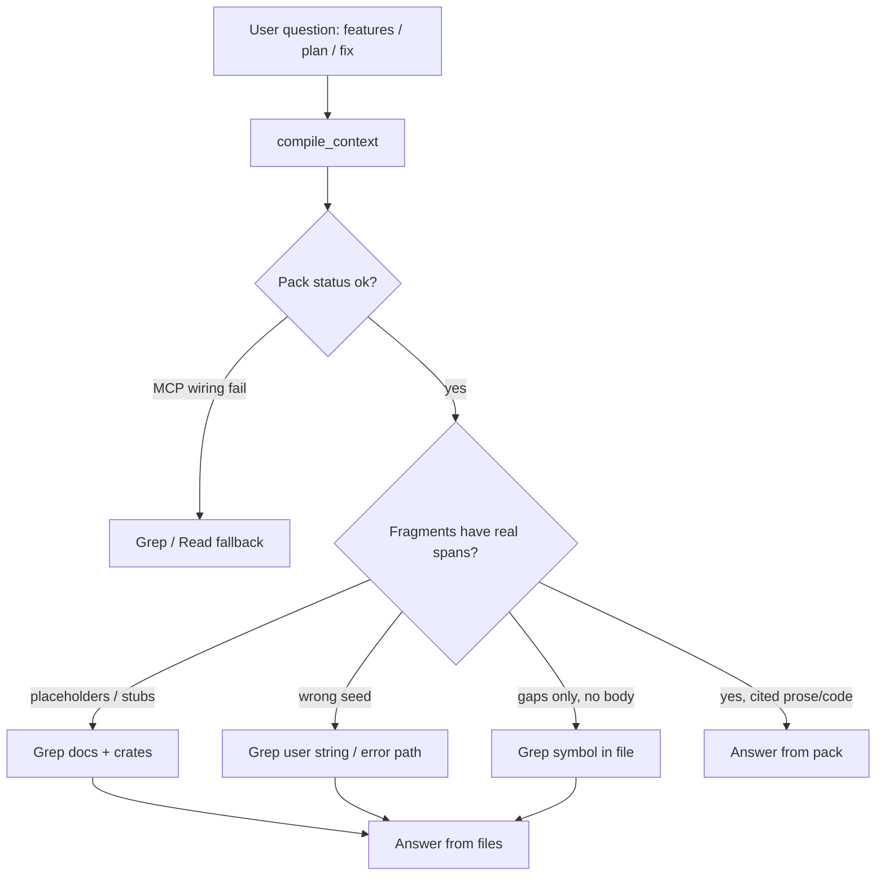

# Why Agents Grepped Instead of Using Prism

**Document type:** Post-mortem / behavioral analysis  
**Date:** 2026-07-27  
**Scope:** Cursor agent sessions on this monorepo while `AGENTS.md` and `.cursor/rules/prism-compile-first.mdc` already said *prefer `compile_context` before explore loops*  
**Related:** [`REPO-FEATURE-SUMMARY-AND-TOKEN-COMPARISON.md`](../REPO-FEATURE-SUMMARY-AND-TOKEN-COMPARISON.md) · [Phase 12 in PLANNING-AND-IMPLEMENTATION.md](../planning/PLANNING-AND-IMPLEMENTATION.md) · [`AGENT-USAGE.md`](../architecture/AGENT-USAGE.md)

---

## 1. One-line verdict

Agents did not ignore Prism because the rule was missing — they **started with Prism**, got **cheap but empty packs** (or thin debug packs), then **fell back to Grep/Read** to finish the job the Evidence Pack failed to supply.

That is a **sufficiency failure**, not a “forgot AGENTS.md” failure.

---

## 2. What the rules already said

| Source | Instruction |
|---|---|
| `AGENTS.md` | Prefer `compile_context` (or a named workflow) before explore loops |
| `.cursor/rules/prism-compile-first.mdc` | Call `compile_context` first; micro-tools only for targeted follow-ups |
| `AGENT-USAGE.md` | Anti-pattern: “Ten reads / greps to explore” → one `compile_context` instead |
| Hop budget | Prefer **1** pack hop; micro-tool chains stay in **1–4** calls |

So the policy was clear. Grep volume means the **primary path returned something agents could not answer from**.

---

## 3. What actually happened in these sessions

### 3.1 Feature / use-case summary (2026-07-26)

| Step | Tool | Outcome |
|---|---|---|
| 1 | MCP `compile_context` (`architecture`) | Pack ~**279** tokens — mostly community/hub stubs |
| 2 | MCP `compile_context` (`repo_qa`) | Pack ~**149** tokens — **placeholder text**, not README prose |
| 3 | CLI `prism compile` | Pack ~**92** tokens — same thin stubs |
| 4 | `repo_map` / `index_status` | Orientation only (useful structure, no product narrative) |
| 5 | Graphify query | ~1.5k tokens of **real** ADD/README concept nodes |
| 6 | **Grep + Read** | README, ADD, MCP catalog, eval reports — ~7.5k tokens gap-fill |

**Agent logic:** Prism “succeeded” (status ok, citations present) but fragments looked like:

```text
// must-include `primary_symbol_definition` locus near README.md
[optional:architecture_prose] related context for README.md
signature: README.md
```

That is not evidence an LLM can quote. Grep/Read was the only way to write a truthful product summary.

### 3.2 Accuracy brainstorm / planning edit (same chat)

| Step | Tool | Outcome |
|---|---|---|
| 1 | `compile_context` on select/plan/store | Architecture pack still stub-heavy for “where does prose plug in?” |
| 2 | **Read** planning doc header/tail | Needed for phase conventions (legitimate micro-follow-up) |
| 3 | **Grep** for `markdown`, `role_template`, `Leiden`, `NodeKind` | To **prove** root causes in code before writing P12 |

Here Grep was partly justified: after Prism pointed at crates, verifying `detect_language("readme.md") == None` and `role_template()` required exact string/symbol search — a targeted follow-up. The volume grew because packs did not already cite those loci with real spans.

### 3.3 Later debug / clippy turns (other transcripts)

Even when `compile_context` was called with `intent=debug`:

- MCP call sometimes **failed first** (`Invalid arguments: server/toolName Required`) — agent wiring, not Prism index failure
- Successful debug packs kept `error_or_stack_verbatim` but left **gaps** for `criterion_slice` / `primary_frame_body` when seeds did not resolve
- Agents then Grep’d `return 3;` / `collapsible_if` in `select.rs` to apply the one-line fix

**Pattern:** Prism for protocol/orientation → Grep for the exact edit site when the pack lacks a resolvable body slice.

---

## 4. Root causes (ranked)

### R1 — Packs looked successful but contained **placeholders** (highest impact)

**Where:** `crates/prism-compile/src/select.rs` → `role_template()` filled unfillable roles with synthetic text; provenance stamped `synthetic:<label>`.

**Why agents grepped:** The tool returned `status: ok` and `tokens_used` low. Agents (and humans) treat that as “Prism answered.” When the answer text is filler, the only recovery path is open the files yourself → Grep/Read.

**Product framing:** Token metrics rewarded this failure (149-token “win”). Phase 12 ACC-2: *zero placeholder fragments*; unfilled roles must become `gaps[]` with repair actions.

### R2 — **Markdown was not in the knowledge graph**

**Where (pre–doc layer):** `detect_language("readme.md") == None`; `NodeKind` was only `File | Symbol | Module | Package`.

**Why agents grepped:** Product/feature/use-case questions live in README/ADD/MCP docs. With no `Doc`/`Section` nodes, `compile_context` had nothing extractive to pack for prose roles (`architecture_prose`, product thesis, workflows).

**After P12 Stage A work (2026-07-27 re-run):** index grew (1,629 → 3,351 nodes); architecture/repo_qa packs carried real asserted markdown slices and **doc gap-fill dropped to ~0**. That proves R2 was causal.

### R3 — **Wrong or weak seed grounding**

**Observed:** README-anchored prose question resolving primary symbol toward irrelevant modules (e.g. `module:json`); debug questions failing to resolve `collapsible_if` / path fragments → `seed_unresolved` gaps.

**Why agents grepped:** A pack about the wrong symbol is worse than a refusal. Agents abandon the pack and search the string they already have from the user or the error log.

### R4 — Orientation packs described **directories and noise hubs**, not subsystems

**Observed:** path-prefix communities; hubs dominated by `into`, `clone`, `Some`, `unwrap`.

**Why agents grepped:** `repo_map` did not answer “what are the features?” so agents opened README/ADD anyway. Grep for “feature|workflow|MCP” in docs was the shortest path to narrative facts.

### R5 — **Fixture / vendored corpora** polluted structural ranking

Large trees under `fixtures/repos/snapshots/` competed with first-party crates in naive file-size rankings and index noise.

**Why agents grepped:** When explore started, largest files were ripgrep/httpx fixtures — agents either wasted hops there or used Grep with path filters to stay in `docs/` / `crates/`. Prism first-party scoping (P12 ACC-6) is the structural fix.

### R6 — Agent / host **tooling friction** (not a KG bug)

| Friction | Effect |
|---|---|
| Malformed MCP calls (`server`/`toolName` missing) | First Prism attempt fails → immediate Grep fallback |
| Stale PATH binary vs rebuilt `target/release/prism` | CLI packs lag MCP; agent distrusts Prism and re-reads sources |
| `prism workflow` missing on older CLI | Documented workflow path fails; agent improvises with Grep |
| Cursor Grep is always available and fast | Default explore tool when pack feels “thin” |
| Graphify skill already on disk | Competing “graph query” path for the same question |

### R7 — Task shape sometimes **requires** string search

Legitimate Grep uses (should stay rare):

| Task | Why Grep/Read is OK after Prism |
|---|---|
| Edit a known line from a compiler/clippy message | Exact string replace; pack may only have error text |
| Verify a planning-doc heading number / TOC anchor | Doc surgery; not a KG question |
| Count occurrences / rename preview outside T2 | Micro-tool after pack names the symbol |
| Compare two markdown versions | Diff content not in graph |

Abuse is when Grep becomes the **primary** exploration loop without a prior `compile_context`.

---

## 5. Causal chain (how “Prism first” still became “Grep a lot”)



**Key insight:** Agents followed the letter of “call Prism first.” They violated the spirit of “answer from the pack” because the pack was not answerable.

---

## 6. Why this looked like “too many Greps” in the UI

Cursor surfaces every `Grep` / `Read` as a tool chip. One failed pack can trigger:

1. Grep for a keyword in `docs/eval/`
2. Grep for `role_template` in `crates/prism-compile`
3. Grep for `detect_language` in extractors
4. Read README / ADD / planning sections
5. Grep TOC / section numbers while editing markdown

That is **5–15 Grep chips** for a single “Prism didn’t give me prose” failure — even if `compile_context` was called 2–3 times first. The timeline is Prism-first; the **chip count** is Grep-heavy.

---

## 7. What is *not* the reason

| Incorrect explanation | Why it’s wrong |
|---|---|
| “AGENTS.md missing” | It was present and applied |
| “Agents hate MCP” | Sessions consistently called `compile_context` first |
| “Prism index was empty” | Index had hundreds of files / thousands of nodes — just **code-only** at T1 |
| “Grep is always wrong” | Targeted Grep after a gap/refusal is allowed by AGENT-USAGE |
| “Token reduction failed” | Tokens were low; **answerability** failed |

---

## 8. Mapping to Phase 12 fixes

| Root cause | P12 target / stage | Expected effect on Grep rate |
|---|---|---|
| Placeholders | ACC-2 · Stage B | Agents stop treating empty packs as success; gaps force repair instead of silent Grep |
| No markdown nodes | ACC-1 · Stage A | Prose questions answerable from pack (2026-07-27 re-run already shows gap-fill ≈ 0) |
| Wrong seeds | ACC-3 · Stage B | Refusal + candidates > confident wrong pack > Grep |
| Path communities / noisy hubs | ACC-4 · Stage C | Orientation packs usable without README Grep |
| Fixture leakage | ACC-6 · Stage B | Less noise; fewer defensive path-filtered Greps |
| Eval without answerability | §20.4 labeling rule | Dashboards stop celebrating 149-token stub packs |

---

## 9. Remaining reasons Grep will still appear (even after P12)

Honest residual list — do not pretend Grep goes to zero:

1. **Apply-patch / exact string edit** after a good pack still needs the file open (Read), sometimes Grep for uniqueness  
2. **MCP call bugs** in the host agent (argument shape)  
3. **Stale binary / stale index** until `doctor --ready` + reindex are automatic  
4. **Questions outside the graph** (CI YAML typos, workflow file not indexed, secrets, generated assets)  
5. **Agent habit:** models are pretrained on Grep-heavy coding workflows; rules reduce but don’t eliminate the prior  
6. **Parallel tools:** agents batch Grep with `compile_context` “just in case” — policy should say: *do not parallelize Grep with the first pack call*

---

## 10. Recommendations (behavior + product)

### For agents / host rules

1. After `compile_context`, **if any fragment text matches placeholder patterns** (`related context for`, `must-include \`…\` locus`, `synthetic:`), treat the pack as **failed sufficiency** and either repair via `gaps[]` or re-ask with better anchors — do not celebrate low `tokens_used`.  
2. **Never open a Grep explore loop in the same turn as the first `compile_context`.** Wait for the pack; then at most 1–4 micro-tools.  
3. Prefer `gaps` / `SCOPE_UNRESOLVED` candidates over inventing search queries.  
4. For product/narrative questions, pass doc anchors (`README.md`, ADD) and `intent=architecture` / `repo_qa` after markdown indexing is on.

### For Prism product

1. Ship ACC-2 (no placeholders) before more token-reduction marketing.  
2. Surface a pack-level flag: `sufficiency: insufficient` when must-include roles were synthesized.  
3. Keep publishing **answerability beside tokens** (planning §20.4).  
4. Ensure MCP and CLI use the same binary generation so agents don’t distrust packs.

---

## 11. Summary table

| Question | Answer |
|---|---|
| Did agents skip Prism? | **No** — they called it first |
| Why so much Grep? | Packs were **token-cheap but content-empty** (placeholders + no docs), so Grep filled the gap |
| Primary bug class | **Sufficiency / honesty**, not install or indexing emptiness |
| Proof | 2026-07-26: ~7.5k doc Grep/Read; 2026-07-27 after doc packs: **0** gap-fill for the same task |
| Policy gap | Rules ban Grep loops but don’t define “pack is non-answerable → refuse/repair” |
| Planning home | Phase 12 Accuracy & Grounding |

---

## 12. Sources

- Session transcripts under this workspace’s agent-transcripts (feature summary + P12 planning + debug/clippy turns)  
- Measured packs in [`REPO-FEATURE-SUMMARY-AND-TOKEN-COMPARISON.md`](../REPO-FEATURE-SUMMARY-AND-TOKEN-COMPARISON.md) (2026-07-26 vs 2026-07-27)  
- Code loci: `role_template` / fragment synthesis in `prism-compile`; language detect excluding `.md` (pre–doc extractor); `communities.rs` “not Leiden yet” note  
- Policy: `AGENTS.md`, `AGENT-USAGE.md`, `prism-compile-first.mdc`  
- Plan: Phase 12 baseline table in `PLANNING-AND-IMPLEMENTATION.md` §19.1

---

*End. This document explains Grep volume; it does not change product code.*
