# Prism — Planning & Implementation Document

**Project working name:** Prism — Repository Intelligence Platform  
**Document type:** Detailed Planning & Implementation Guide (phase → stage)  
**Status:** Active — P0–P5 delivered; interaction track (P6–P9) planned; P10 optional  
**Date:** 2026-07-19 · **Revised:** 2026-07-26 (post-P5 re-analysis; interaction & visualization phases added)  
**Governs:** Execution of the [Architecture Design Document](../architecture/ARCHITECTURE-DESIGN-DOCUMENT.md)  
**Audience:** Project leads, architects, implementers, evaluators, open-source contributors  

---

## How to use this document

This document turns the ADD’s high-level roadmap into an executable plan. It does **not** invent new architecture. Where this plan and the ADD conflict, the **ADD wins** on design; this document wins on **sequence, gates, and work packaging**.

| Concept | Meaning in this plan |
|---|---|
| **Phase** | A major product capability boundary with a named exit gate |
| **Stage** | A sequenced work package inside a phase; each has entry/exit criteria |
| **Workstream** | Parallel concern inside a stage (e.g., storage vs. extractors vs. eval) |
| **Deliverable** | Concrete artifact (schema, tool surface, harness, report) — not source trees |
| **Gate** | Must-pass checks before the next stage or phase may start |

**Out of scope for this document:** writing application code. Technology choices live in [TECH-STACK-AND-PROJECT-STRUCTURE.md](../architecture/TECH-STACK-AND-PROJECT-STRUCTURE.md), which was promoted from guidance to decisions at implementation kickoff. Day-to-day checkbox state lives in [TASKS-AND-PROGRESS.md](./TASKS-AND-PROGRESS.md).

---

## Table of Contents

1. [Document map & relationships](#1-document-map--relationships)
2. [Product thesis (planning brief)](#2-product-thesis-planning-brief)
3. [Program overview](#3-program-overview)
4. [Cross-cutting workstreams](#4-cross-cutting-workstreams)
5. [Master timeline & dependencies](#5-master-timeline--dependencies)
6. [Phase 0 — Foundations](#6-phase-0--foundations)
7. [Phase 1 — Syntactic Knowledge Graph + MCP](#7-phase-1--syntactic-knowledge-graph--mcp)
8. [Phase 2 — Context Compiler](#8-phase-2--context-compiler)
9. [Phase 3 — Precise Tier](#9-phase-3--precise-tier)
10. [Phase 4 — Semantic Slicing](#10-phase-4--semantic-slicing)
11. [Phase 5 — Repository Intelligence + Hardening](#11-phase-5--repository-intelligence--hardening)
12. [Post-Phase-5 repository re-analysis & gap register](#12-post-phase-5-repository-re-analysis--gap-register)
13. [Phase 6 — Consolidation & Interaction Substrate](#13-phase-6--consolidation--interaction-substrate)
14. [Phase 7 — Visual Repository Intelligence](#14-phase-7--visual-repository-intelligence)
15. [Phase 8 — IDE Extension (VS Code / Cursor)](#15-phase-8--ide-extension-vs-code--cursor)
16. [Phase 9 — Agent Experience & Workflows](#16-phase-9--agent-experience--workflows)
17. [Phase 10 — Team / Distributed (optional)](#17-phase-10--team--distributed-optional)
18. [Evaluation program (runs across phases)](#18-evaluation-program-runs-across-phases)
19. [Risk register & guardrails](#19-risk-register--guardrails)
20. [Definition of Done (program-level)](#20-definition-of-done-program-level)
21. [Appendix — Checklists & templates](#21-appendix--checklists--templates)

> **Phase renumbering note (2026-07-26).** The former *Phase 6 — Team / Distributed* is now **Phase 10** and stays optional/deferred. Phases 6–9 are new and cover the *interaction* half of the product: service surfaces, graph rendering, IDE extension, and agent experience. Historical references to “P6 Stage C certified caches” now mean **P10 Stage C**.

---

## 1. Document map & relationships

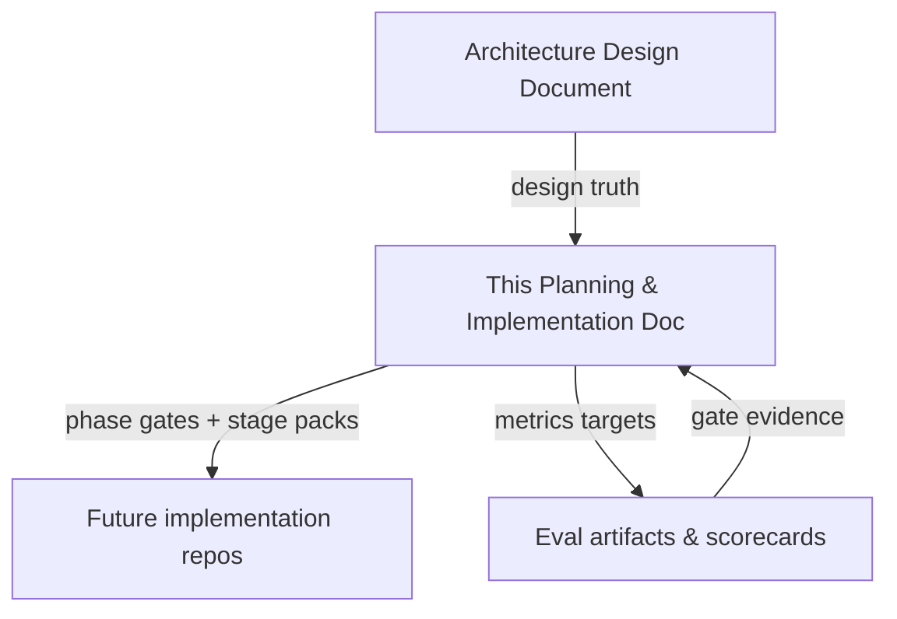

| Document | Role |
|---|---|
| `docs/architecture/ARCHITECTURE-DESIGN-DOCUMENT.md` | **What** to build and **why** (components, IR, pipelines, NFRs) |
| This document | **When / in what order / how we know a stage is done** |
| Future eval reports | **Evidence** against gates (tokens, quality, latency) |

**Supersession rule:** Prior AOE cache-first planning ideas remain historical notes. Prism’s spine is **pre-LLM repository understanding + context compilation**. Answer caches, if any, appear only in Phase 6 as optional memoization with certificates.

---

## 2. Product thesis (planning brief)

### 2.1 One-sentence bet

Frontier-model accuracy on large codebases is mostly a **context quality** problem; Prism compiles minimum sufficient, provenance-bearing evidence so **medium models** can approach frontier quality at a fraction of the token cost.

### 2.2 What every phase must protect

| Principle | Planning implication |
|---|---|
| Understand before prompting | No phase ships “LLM-first” without indexing + KG behind it |
| Structure before similarity | Embeddings are last-resort; never the retrieval spine |
| Cache is memoization only | Do not plan answer-cache work before Evidence Packs are solid |
| Progressive precision | T1 everywhere first; pay for T2/T4 only when plans need them |
| Provenance always | Schema and APIs must carry source range, tier, confidence from Day 1 of packing |
| Refuse unbounded dumps | Scope-unresolved is a valid product behavior, not a failure |

### 2.3 Success north star (12 months)

Align with ADD Goals G1–G9:

| ID | Target |
|---|---|
| G1 | Medium + Prism ≥ frontier + naive explore within ≤3 pts answer quality |
| G2 | ≥10× fewer input tokens (structural); ≥5× (debug/refactor) |
| G3 | ≥70% context precision on labeled samples |
| G4 | Typical edit re-index <2s with dirty-set invalidation |
| G5 | Every fragment has provenance |
| G6 | New language = grammar + extractor plugin |
| G7 | MCP/LSP first-class; one-shot structural answers |
| G8 | Local-first; indexing does not require network |
| G9 | Clear IR schemas, plugin contracts, reproducible eval |

---

## 3. Program overview

### 3.1 Phase sequence

The program has two halves. **P0–P5 (the engine half, delivered)** made repository understanding correct, budgeted, and measurable. **P6–P9 (the interaction half, planned)** makes that understanding *usable by humans and agents* — service surfaces, rendered graphs, an IDE extension, and agent workflows. P10 remains an optional scale-out.

```mermaid
flowchart LR
    subgraph Engine["Engine half — delivered"]
      P0[P0 Foundations] --> P1[P1 Syntactic KG + MCP]
      P1 --> P2[P2 Context Compiler]
      P2 --> P3[P3 Precise Tier]
      P3 --> P4[P4 Semantic Slicing]
      P4 --> P5[P5 Intelligence + Eval]
    end
    subgraph Interaction["Interaction half — planned"]
      P6[P6 Consolidation + Interaction Substrate]
      P7[P7 Visual Repo Intelligence]
      P8[P8 IDE Extension]
      P9[P9 Agent Experience]
    end
    P5 --> P6 --> P7 --> P8 --> P9
    P9 -.optional.-> P10[P10 Distributed / Team]
```

| Phase | Intent | Duration (calendar) | Primary user-visible outcome |
|---|---|---|---|
| **P0** | Substrate that makes later phases measurable and safe | 2–3 weeks | Workspace identity, hash index, schema draft, eval skeleton |
| **P1** | Agents can query structure without grepping | 4–6 weeks | Syntactic KG + MCP tools; impact/heuristic neighbors |
| **P2** | Agents stop multi-hop explore for most tasks | 3–5 weeks | `compile_context` Evidence Packs with budgets + EXPLAIN |
| **P3** | High-stakes nav/refactor becomes trustworthy | 4–6 weeks | SCIP/LSP hybrid resolution; precision-gated tools |
| **P4** | Debug/security packs become slice-minimal | 5–8 weeks | CFG/DFG/CPG shards + slice operator + debug recipes |
| **P5** | Product hardening + published proof | ~4 weeks | Repo intelligence + public eval; plugin SDK polish |
| **P6** | Close as-built drift; build the surfaces a UI needs | 3–5 weeks | `prismd` daemon, HTTP/SSE API, LSP, Graph View-Model contract |
| **P7** | Make the graph *seeable* without dumping it | 4–6 weeks | Budgeted, provenance-bearing interactive graph views |
| **P8** | A developer never needs the terminal | 4–5 weeks | Installable VS Code / Cursor extension with panels + peek |
| **P9** | Agents choose Prism first, and we can prove it | ~4 weeks | Agent workflows, rules/skills assets, closed-loop eval |
| **P10** | Team/CI scale (optional) | TBD | Shared index, authz, optional certified caches |

### 3.2 Capability maturity ladder

| Capability | P0 | P1 | P2 | P3 | P4 | P5 | P6 | P7 | P8 | P9 | P10 |
|---|---|---|---|---|---|---|---|---|---|---|---|
| Content-hash incremental store | ● | ● | ● | ● | ● | ● | ● | ● | ● | ● | ● |
| Syntactic facts (T1) | ○ | ● | ● | ● | ● | ● | ● | ● | ● | ● | ● |
| MCP graph tools | ○ | ● | ● | ● | ● | ● | ● | ● | ● | ● | ● |
| Query plan + Evidence Pack | ○ | ○ | ● | ● | ● | ● | ● | ● | ● | ● | ● |
| Precise symbol (T2) | ○ | ○ | ○ | ● | ● | ● | ● | ● | ● | ● | ● |
| Semantic slice (T3/T4) | ○ | ○ | ○ | ○ | ● | ● | ● | ● | ● | ● | ● |
| Architecture intelligence | ○ | ◐ | ◐ | ◐ | ◐ | ● | ● | ● | ● | ● | ● |
| Long-lived daemon + HTTP/SSE API | ○ | ○ | ○ | ○ | ○ | ○ | ● | ● | ● | ● | ● |
| LSP surface | ○ | ○ | ○ | ○ | ○ | ○ | ● | ● | ● | ● | ● |
| Graph View-Model contract | ○ | ○ | ○ | ○ | ○ | ○ | ● | ● | ● | ● | ● |
| Interactive graph rendering | ○ | ○ | ○ | ○ | ○ | ○ | ○ | ● | ● | ● | ● |
| IDE extension (VS Code / Cursor) | ○ | ○ | ○ | ○ | ○ | ○ | ○ | ◐ | ● | ● | ● |
| Agent workflows + rules assets | ○ | ○ | ○ | ○ | ○ | ○ | ○ | ○ | ◐ | ● | ● |
| Team/shared index | ○ | ○ | ○ | ○ | ○ | ○ | ○ | ○ | ○ | ○ | ● |

● = required deliverable · ◐ = partial / heuristic · ○ = not yet

### 3.3 What “implementation” means here

Each stage specifies:

1. **Purpose** — why this stage exists  
2. **Entry criteria** — what must already be true  
3. **Workstreams** — parallel tracks  
4. **Deliverables** — documents, schemas, contracts, harnesses, runbooks  
5. **Dependencies** — upstream stages / external systems  
6. **Risks** — local to the stage  
7. **Exit / acceptance** — measurable checks  
8. **Handoff** — what the next stage inherits  

No stage requires creating application source trees as part of *this planning effort*.

---

## 4. Cross-cutting workstreams

These run in every phase. Stage plans reference them by ID.

| ID | Workstream | Owns | Never owns |
|---|---|---|---|
| **W-STORE** | Storage & identity | `.prism` layout, SQLite schemas, snapshot IDs, transactions | Prompt formatting |
| **W-PLUGIN** | Plugin ABI | Extractor/resolver/semantic contracts, versioning, golden fixtures | Product UX |
| **W-KG** | Knowledge graph service | Node/edge kinds, query API shape, confidence tagging | LLM calls |
| **W-PLAN** | Query planning | Intent recipes, operator DAG, cost model | Indexing |
| **W-CC** | Context compiler | Selection, reduction, budgets, Evidence Pack IR, EXPLAIN | Full-repo CPG |
| **W-MCP** | Agent surface | MCP tool contracts, safety rules, one-shot guidance | Graph algorithms |
| **W-IDE** | IDE/LSP | Commands, peek UX, edit-time incremental policy | Replacing language servers |
| **W-EVAL** | Evaluation | Gold tasks, baselines, scorecard automation | Feature shipping |
| **W-OBS** | Observability | Metrics, traces, audit logs of packs sent to LLMs | Business logic |
| **W-SEC** | Security & privacy | Local default, secret redaction, plugin sandbox policy | Multi-tenant SaaS (until P10) |

### 4.1 Workstreams added for the interaction half (P6+)

| ID | Workstream | Owns | Never owns |
|---|---|---|---|
| **W-SVC** | Local service layer | `prismd` lifecycle, HTTP/SSE contracts, session + cancellation, warm caches | Graph algorithms, pixels |
| **W-VIZ** | Visualization | Graph View-Model schema, level-of-detail, layout determinism, render budgets, visual encoding of tier/confidence | Selecting evidence (that is W-CC) |
| **W-AX** | Agent experience | Tool ergonomics, refusal-repair loops, workflow recipes, rules/skills assets, trace capture | Model hosting, prompt magic |
| **W-DEBT** | As-built reconciliation | Drift register between docs and repo, waivers, deprecations | New features |

**Planning rules:**

1. Every phase exit must update **W-EVAL** and **W-OBS**, even if the product surface barely changed.
2. From P6 onward, every phase exit must also update **W-DEBT** — either close a drift item or record a written waiver.
3. **W-VIZ never invents evidence.** A view may only render facts the KG or a pack already contains, with the same provenance and confidence labels.

---

## 5. Master timeline & dependencies

### 5.1 Critical path

```mermaid
flowchart TD
    P0S1[P0 Stage A: Workspace + hash] --> P0S2[P0 Stage B: Schema + ABI]
    P0S2 --> P0S3[P0 Stage C: Eval skeleton]
    P0S3 --> P1S1[P1 Stage A: Extractors T1]
    P1S1 --> P1S2[P1 Stage B: KG write/query]
    P1S2 --> P1S3[P1 Stage C: MCP graph tools]
    P1S3 --> P1S4[P1 Stage D: Token gate]
    P1S4 --> P2S1[P2 Stage A: Intent + planner]
    P2S1 --> P2S2[P2 Stage B: Pack + budget]
    P2S2 --> P2S3[P2 Stage C: compile_context]
    P2S3 --> P3S1[P3 Stage A: SCIP/LSP ingest]
    P3S1 --> P3S2[P3 Stage B: Hybrid refine]
    P3S2 --> P3S3[P3 Stage C: Gated high-stakes tools]
    P3S3 --> P4S1[P4 Stage A: CFG/DFG]
    P4S1 --> P4S2[P4 Stage B: Slice + shards]
    P4S2 --> P4S3[P4 Stage C: Debug recipes gate]
    P4S3 --> P5S1[P5 Stage A: Repo intelligence]
    P5S1 --> P5S2[P5 Stage B: Hardening + SDK]
    P5S2 --> P5S3[P5 Stage C: Public eval]
    P5S3 --> P6S1[P6 Stage A: Debt paydown]
    P6S1 --> P6S2[P6 Stage B: Daemon + HTTP/SSE]
    P6S2 --> P6S3[P6 Stage C: LSP + Graph View-Model]
    P6S3 --> P7S1[P7 Stage A: View-model + layout]
    P7S1 --> P7S2[P7 Stage B: Renderer + interaction]
    P7S2 --> P7S3[P7 Stage C: Evidence overlays gate]
    P7S3 --> P8S1[P8 Stage A: Extension skeleton]
    P8S1 --> P8S2[P8 Stage B: Commands + panels]
    P8S2 --> P8S3[P8 Stage C: Cursor + release]
    P8S3 --> P9S1[P9 Stage A: Agent contract hardening]
    P9S1 --> P9S2[P9 Stage B: Workflows + rules assets]
    P9S2 --> P9S3[P9 Stage C: Closed-loop eval gate]
    P9S3 --> P10[P10 Optional team mode]
```

### 5.2 Hard dependency rules

1. **No MCP “explore replacement” claims** before P1 Stage D gate.  
2. **No `compile_context` as primary tool** before P2 Stage C gate.  
3. **No safe rename / precise impact claims** before P3 Stage C gate.  
4. **No “slice-based debug” claims** before P4 Stage C gate.  
5. **No shared index / answer cache** before P9 Stage C succeeds (was: P5 Stage C — moved because the interaction half now precedes scale-out).  
6. **Embedding work** may appear as a tiny fallback prototype in P2+, but must be flagged `low_confidence` and excluded from success narratives.  
7. **No pixels before contracts.** No renderer work before the Graph View-Model schema is frozen in P6 Stage C.  
8. **No extension release** before P7 Stage C — an extension without views is a CLI with extra steps.  
9. **No “agents prefer Prism” claim** before P9 Stage C measures it on real traces.  
10. **No visualization that invents structure.** Every rendered node/edge maps to a KG node/edge or pack fragment with its original tier and confidence.

### 5.3 Approximate effort envelope

| Phase | Weeks | Relative effort |
|---|---|---|
| P0 | 2–3 | Foundation (small but blocking) |
| P1 | 4–6 | Largest early build |
| P2 | 3–5 | Highest product leverage |
| P3 | 4–6 | Integration-heavy |
| P4 | 5–8 | Deepest analysis risk |
| P5 | ~4 | Proof + polish |
| P6 | 3–5 | Plumbing + debt (unglamorous, unblocking) |
| P7 | 4–6 | New discipline (front-end + layout determinism) |
| P8 | 4–5 | Packaging & platform integration |
| P9 | ~4 | Proof of the agent thesis |
| P10 | optional | Ops/product expansion |

Total critical path (P0–P5): roughly **22–36 weeks**. Interaction half (P6–P9): roughly **15–20 weeks** on top, and it is the first block of work that needs a **TypeScript/front-end skill set** alongside Rust.

---

## 6. Phase 0 — Foundations

**Phase goal:** Make repository identity, incremental hashing, durable schemas, plugin contracts, and evaluation measurable *before* inventing intelligence features.

**Phase duration:** 2–3 weeks  
**Phase gate (summary):** Incremental re-index path is designed and prototype-validatable; metrics pipeline exists for later phases.

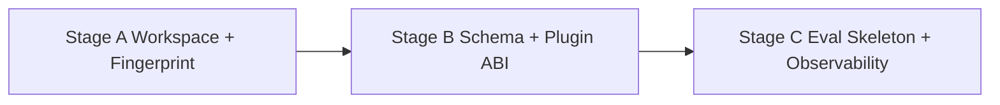

---

### Stage A — Workspace identity & content fingerprinting

#### Purpose

Define how Prism knows *which repository, which snapshot, which files changed*, without depending on language analysis.

#### Entry criteria

- ADD §12 (indexing pipeline) and §21 (storage layout) accepted as design baseline  
- Target pilot repos identified (1–2 real codebases for later gold tasks)

#### Workstreams

| Workstream | Activities |
|---|---|
| W-STORE | Specify workspace roots, ignore rules (`.gitignore` + vendoring heuristics), content hash per file, Merkle/dir fingerprint for skip |
| W-OBS | Define counters: files discovered, files skipped unchanged, indexing wall time |
| W-SEC | Specify secret-sensitive path defaults (e.g., never index `.env` by default) |

#### Deliverables

1. **Workspace Manager specification** — roots, VCS identity (git commit SHA + dirty stamp), ignore policy  
2. **Fingerprint algorithm note** — file hash, tree Merkle, “unchanged subtree skip” contract  
3. **`.prism/` layout draft** — folders for meta, graph, blobs, logs (names freezeable in Stage B)  
4. **Incremental invalidation design** — unit of change = file subgraph (+ later reverse deps)

#### Dependencies

- None technical beyond access to pilot repos and git metadata conventions

#### Risks

| Risk | Mitigation |
|---|---|
| Over-engineering distributed identity | Stay solo-local; git SHA + worktree stamp only |
| Ignore rules miss huge vendor trees | Explicit vendoring heuristics; measure index size early |

#### Exit / acceptance

- [ ] Documented algorithm can classify a file edit as changed/unchanged given hashes  
- [ ] Dirty worktree vs clean commit identities are distinguishable  
- [ ] Ignore policy review checklist exists  
- [ ] Pilot repos listed with approximate LOC and languages

#### Handoff to Stage B

Stable definitions of `Repository`, `Snapshot`, `File` identity fields.

---

### Stage B — Durable schema & plugin ABI draft

#### Purpose

Lock the *shapes* of facts and plugins so Phase 1 extractors do not thrash the store.

#### Entry criteria

- Stage A exit complete  
- Node/edge kinds from ADD §11 agreed at least for T1 subset

#### Workstreams

| Workstream | Activities |
|---|---|
| W-STORE | Draft `meta.sqlite` tables (snapshots, files, hashes, jobs); draft graph tables or embedded-graph mapping |
| W-PLUGIN | Draft `LanguageExtractor` contract: bytes → versioned facts; declare confidence enums |
| W-KG | Freeze T1 node/edge subset for P1 (File, Symbol, IMPORTS, CALLS heuristic, CONTAINS, etc.) |
| W-SEC | Policy stub for plugin side effects / sandbox expectations |

#### Deliverables

1. **Schema v0 document** — tables/collections, indexes, transaction boundary (“replace file subgraph”)  
2. **Fact schema v0** — attributes required for symbols, spans, edges, confidence, analyzer, tier  
3. **Plugin ABI draft** — input/output, versioning, pure-transform rule, golden-fixture expectation  
4. **IR layer cheat-sheet** — L0–L5 from ADD §9.3, what P0/P1 populate now vs later  

#### Dependencies

- Stage A identities  
- ADD precision ladder (tiers labeled even if only T1 implemented later)

#### Risks

| Risk | Mitigation |
|---|---|
| Schema trying to encode T4 CPG early | Explicit “semantic layer lazy / separate artifacts” |
| Opaque integer IDs (LSIF trap) | Prefer readable SCIP-compatible or deterministic syntactic IDs |

#### Exit / acceptance

- [ ] Schema review signed by architect: crash-safe write strategy chosen (e.g., SQLite WAL transactional replaces)  
- [ ] Confidence values include at least `extracted` / `heuristic` / `precise` / `observed` (observed may be unused until later)  
- [ ] Plugin ABI reviewable by a future language contributor without reading the whole ADD  
- [ ] Migration policy: “breaking fact schema bumps major version”

#### Handoff to Stage C

Stable IDs and schemas that eval fixtures will cite.

---

### Stage C — Evaluation skeleton & observability baseline

#### Purpose

Ensure **every later gate has a measurement path**. Without this, P1/P2 “token wins” become anecdotes.

#### Entry criteria

- Stage B schema/ABI drafts accepted  
- Pilot repos frozen enough to attach gold tasks

#### Workstreams

| Workstream | Activities |
|---|---|
| W-EVAL | Define 20 gold tasks across 1–2 repos; task types: symbol explain, impact, architecture orientation (debug/refactor can be stubs) |
| W-EVAL | Specify baseline protocols: frontier+explore, medium+explore (explore = grep/read/glob loops) |
| W-OBS | Metrics pipeline design: index latency, query latency placeholders, tokens/task, tool calls/task |
| W-MCP | Note which future tools each gold task will prefer (for later checklists) |

#### Deliverables

1. **Eval harness design** — inputs, outputs, judges (human and/or LLM-judge with fixed rubric), reproducibility (pinned snapshots)  
2. **Gold task pack v0** — ≥20 tasks with gold hints / answers / necessary-span notes where known  
3. **Scorecard template** — columns aligned to ADD §32  
4. **Baseline measurement runbook** — how to measure explore-token usage without Prism  

#### Dependencies

- Pilot repo snapshots (content-addressed)  
- Access assumptions for hosted/local judges documented (privacy)

#### Risks

| Risk | Mitigation |
|---|---|
| Tasks too vague to score | Every task needs accepted answer criteria or graded checklist |
| Eval becomes blocked on LLM API | Allow offline structural metrics first (tokens to pack; hop counts) |

#### Exit / acceptance (Phase 0 gate)

- [ ] Incremental re-index path is specified end-to-end (discover → hash → parse-hook → txn → invalidate) even if parsers are stubs  
- [ ] Metrics pipeline exists on paper with named event schema  
- [ ] ≥20 gold tasks versioned and tied to commit SHAs  
- [ ] Team can answer: “How will we know P1 saved tokens?” with a written procedure  

#### Phase 0 phase-level risks

| Risk | Likelihood | Impact | Mitigation |
|---|---|---|---|
| Building code before contracts | High | High | Treat Stage B/C as blockers |
| Eval forever “coming later” | High | High | No Phase 1 gate without harness design |

---

## 7. Phase 1 — Syntactic Knowledge Graph + MCP

**Phase goal:** Index repositories into a durable syntactic knowledge graph and expose agent-usable structural tools, proving large token reduction on structural tasks *without* a full context compiler yet.

**Phase duration:** 4–6 weeks  
**Languages (recommended):** start with 2–3 (e.g., Python, TypeScript/JavaScript, Go)  
**Phase gate (summary):** ≥5× token reduction on structural tasks vs explore; quality within ~10 pts of explore on the gold subset that structural tools can answer.

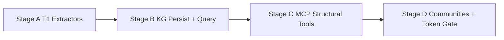

---

### Stage A — Language extractors (T1)

#### Purpose

Turn source files into **typed facts** with honest confidence labels using tree-sitter (or equivalent) CST/AST extraction.

#### Entry criteria

- Phase 0 complete  
- Plugin ABI draft frozen enough for first languages  
- Language priority list agreed

#### Workstreams

| Workstream | Activities |
|---|---|
| W-PLUGIN | Per-language extractor design: symbols, imports, call sites, inheritance/implements where cheap, routes/tests heuristics |
| W-KG | Map extractor outputs to edges: `CONTAINS`, `IMPORTS`, `CALLS` (heuristic), `EXTENDS`/`IMPLEMENTS` (best-effort) |
| W-EVAL | Golden fixture files per language (small repos or snippets) with expected fact dumps |
| W-OBS | Unresolved call rate metric definition |

#### Deliverables

1. **Extractor design docs** (one per language) — what is extracted, what is explicitly *not* claimed precise  
2. **Golden fact fixtures** — deterministic expected outputs for conformance  
3. **Resolution-cheap policy** — same-file + import-graph heuristics only; label unresolved  

#### Dependencies

- Schema v0  
- Tree-sitter grammars availability for chosen languages  

#### Risks

| Risk | Mitigation |
|---|---|
| Pretending textual calls are precise | Mandatory `heuristic` / `best_effort` tags |
| Too many languages at once | Cap at 2–3 until fixtures green |

#### Exit / acceptance

- [ ] Each language has golden fixtures passing the *design* of conformance tests  
- [ ] Unresolved edges are first-class, not silent deletes  
- [ ] Extractor docs state known failure modes (dynamic imports, macros, generics)

#### Handoff

Fact producers ready for Stage B persistence contracts.

---

### Stage B — Knowledge graph persistence & query API

#### Purpose

Make facts durable, incrementally replaceable, and queryable with low latency targets in mind (local P95 structural queries &lt;50ms as *design* NFR).

#### Entry criteria

- Stage A extractor contracts + fixtures exist  
- Transaction model from P0 Stage B agreed

#### Workstreams

| Workstream | Activities |
|---|---|
| W-STORE | Specify per-file subgraph replace; reverse dependency dirty lists; snapshot isolation |
| W-KG | Query shapes: resolve by name/path, neighbors by edge type, depth-limited expansion |
| W-OBS | Index files/s and incremental latency measurement plan against NFR N1 |
| W-SEC | Path isolation; no unexpected blob retention of secrets |

#### Deliverables

1. **KG query API contract** (CLI/HTTP conceptual — ADD §22 subset needed for P1)  
2. **Incremental update sequence diagram** — edit → dirty set → rebuild dependents (communities may be deferred to Stage D)  
3. **Index size budget note** — aim ~3–10% of source for syntactic index (N3)  
4. **Failure modes** — crash mid-txn recovery expectations |

#### Dependencies

- Extractor fact schema  
- Fingerprint invalidation from P0  

#### Risks

| Risk | Mitigation |
|---|---|
| In-memory-only graph (NetworkX trap) | Persist from day one of Stage B |
| Whole-repo rewrite on any edit | File subgraph replace + reverse dep propagation |

#### Exit / acceptance

- [ ] Documented that a single-file edit does not require full rebuild  
- [ ] Query API can express: symbol lookup, 1-hop neighbors, depth-limited impact candidates  
- [ ] Latency/size NFRs are tracked (even if not yet met)

---

### Stage C — MCP structural tool surface

#### Purpose

Give agents first-class tools so they stop rediscovering structure via grep/read. This is **not** yet the full context compiler; it is the structural substrate MCP (GitNexus/Graphify lesson).

#### Entry criteria

- Stage B query API contract stable  
- Safety defaults for local MCP agreed (W-SEC)

#### Workstreams

| Workstream | Activities |
|---|---|
| W-MCP | Specify tools: `index_status`, `resolve_symbol`, `neighbors`, `impact` (heuristic), `repo_map` stub if communities not ready |
| W-OBS | Tool-call auditing; optional “pack sent to LLM” log stub |
| W-EVAL | Map gold structural tasks to tool traces (expected fewer hops) |
| W-SEC | Allowlist; citation + confidence in returns; no write/rename tools yet |

#### Deliverables

1. **MCP tool catalog v1** — inputs, outputs, errors, confidence fields  
2. **Agent usage guide draft** — prefer structural tools over read/grep loops  
3. **Error model draft** — at least `SCOPE_UNRESOLVED` placeholder behavior  

#### Dependencies

- KG query API  
- Index freshness (`index_status`)

#### Risks

| Risk | Mitigation |
|---|---|
| Too many micro-tools → agent still thrash | Keep surface small; prepare for P2 one-shot |
| Overclaiming impact accuracy | Label impact confidence; depth caps |

#### Exit / acceptance

- [ ] Tool catalog reviewed against ADD §25 subset for P1  
- [ ] Every tool return includes provenance/confidence or explicitly marks heuristics  
- [ ] Eval harness can record tool hops per task |

---

### Stage D — Communities, orientation & Phase 1 gate

#### Purpose

Add lightweight architecture orientation (communities/hubs) and **prove** the token thesis on structural tasks.

#### Entry criteria

- Stages A–C complete  
- Gold structural subset ready for scoring  

#### Workstreams

| Workstream | Activities |
|---|---|
| W-KG / Architecture miner | Leiden/Louvain (or similar) on import+call graph; path-prefix labels first |
| W-MCP | Flesh out `repo_map` / hubs exposure |
| W-EVAL | Run explore vs Prism structural comparison; compute token and quality deltas |
| W-OBS | Unresolved call rate dashboards per language |

#### Deliverables

1. **Community detection design** — algorithm, refresh triggers, labeling policy  
2. **Phase 1 scorecard report** — tokens/task, quality vs explore, unresolved edge rates  
3. **Known limitations register** — what wrong callees do to impact answers  

#### Exit / acceptance (Phase 1 gate)

- [ ] ≥5× token reduction on **structural** gold tasks vs explore baseline  
- [ ] Quality within ~10 points of explore on those tasks (not debug-hard tasks)  
- [ ] Incremental edit path demonstrated on a fixture scenario (&lt;2s as stretch target; must at least show no full rebuild)  
- [ ] No narrative claiming precise refactor safety yet  

#### Phase 1 phase-level risks

| Risk | Likelihood | Impact | Mitigation |
|---|---|---|---|
| Heuristic CALLS poison impact | High | High | Confidence + depth caps; escalate to P3 |
| Scope creep into search UI | Medium | High | MCP tools only; context compiler deferred to P2 |
| Quality gap vs explore ≥10 pts | Medium | High | Improve recipes and resolution; delay P2 marketing claims |

---

## 8. Phase 2 — Context Compiler

**Phase goal:** Make **context compilation** the product: intent → query plan → Evidence Pack under token budget, with EXPLAIN and refuse-to-dump behavior. Elevate `compile_context` to the primary agent tool.

**Phase duration:** 3–5 weeks  
**Phase gate (summary):** Context precision ≥60% on labeled sample; unresolved scopes refuse unbounded dumps; pack compile latency design targets P95 &lt;300ms excluding LLM.

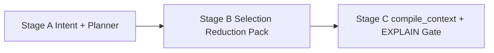

---

### Stage A — Intent classification & query planner v1

#### Purpose

Turn natural-language / agent intents into an **operator DAG** instead of ad-hoc tool chains.

#### Entry criteria

- Phase 1 gate passed  
- Operator catalog from ADD §19 accepted as v1 scope  

#### Workstreams

| Workstream | Activities |
|---|---|
| W-PLAN | Intent set: repo-QA, debug (lightweight), impact, refactor (warn if no T2), generate, review, architecture |
| W-PLAN | Recipes: seed rules + expand rules per intent (ADD §17) |
| W-PLAN | Cost model sketch: prefer cheap T1 ops; insert `UpgradePrecision` only as placeholder until P3 |
| W-EVAL | Intent fixtures → expected operator shapes |

#### Deliverables

1. **Intent recipe catalog v1** — seeds, expands, must-include, drop priorities  
2. **Planner design** — plan IR JSON/YAML shape; operator list for v1  
3. **Example plans** — at least debug/impact/repo-QA walkthroughs  

#### Dependencies

- P1 graph operators (`Resolve`, `Expand`, `Impact`)  
- Diff/worktree detection design (can be shallow in v1)

#### Risks

| Risk | Mitigation |
|---|---|
| Planner becomes another LLM prompt | Keep deterministic recipes first; LLM optional for intent only if needed |
| Debug recipes overpromise before slicer | Mark debug plans as “best-effort until P4” |

#### Exit / acceptance

- [ ] For each intent, a recipe produces a plan without executing LLM  
- [ ] Fixtures cover ambiguous queries → `SCOPE_UNRESOLVED` paths  
- [ ] Plan-only API (`/query/plan`) contract documented  

---

### Stage B — Selection, reduction & Evidence Pack IR

#### Purpose

Implement (as design + contracts) the compiler backend: materialize fragments, rank, budget, never drop must-includes.

#### Entry criteria

- Stage A recipes stable  
- Evidence fragment schema (ADD §11.4) accepted  

#### Workstreams

| Workstream | Activities |
|---|---|
| W-CC | Hierarchical pack layout: arch → module signatures → core slices → neighbor signatures → diffs → optional run |
| W-CC | Drop order under budget (ADD §18.1)  
| W-CC | Extractive default for code; abstractive only for docs/ADR with links  
| W-EVAL | Start labeling necessary vs unnecessary fragments on a sample of packs |
| W-OBS | Drop counts, tokens/pack, reason codes |

#### Deliverables

1. **Evidence Pack schema v1** — meta, hierarchy, citations, gaps  
2. **Selection priority document** — deterministic ordering  
3. **Reduction techniques catalog** — when to use signature skeleton vs span slice  
4. **Quality gates** — must-include checks; `BUDGET_EXCEEDED` behavior  

#### Dependencies

- Planner plan IR  
- Source span materialization rules (line/byte ranges)

#### Risks

| Risk | Mitigation |
|---|---|
| LLM summaries as default | Ban abstractive code summaries in v1 |
| Soft budgets silently truncate truth | Hard refuse if must-include cannot fit |

#### Exit / acceptance

- [ ] Pack schema round-trips through an example EXPLAIN report  
- [ ] Written proof that must-include cannot be budget-evicted  
- [ ] Labeled sample process documented (≥N packs for precision measurement) |

---

### Stage C — `compile_context` as primary tool + Phase 2 gate

#### Purpose

Ship the agent UX change: **one** high-value call returns the substrate for answering; EXPLAIN enables trust/debugging.

#### Entry criteria

- Stages A–B complete  
- MCP catalog ready to promote `compile_context`

#### Workstreams

| Workstream | Activities |
|---|---|
| W-MCP | Specify `compile_context` inputs (question, repo ref, budget, hints); deprecate multi-hop as primary guidance |
| W-CC | EXPLAIN CONTEXT — per-fragment `why_included` reason codes |
| W-IDE | Optional: `prism.compileContext` / evidence peek design (can be stub UX) |
| W-EVAL | Measure context precision ≥60%; token and hop reductions vs P1 multi-tool baseline |

#### Deliverables

1. **MCP primary-path guide** — “call `compile_context` first”  
2. **EXPLAIN report format**  
3. **Phase 2 scorecard** — precision, tokens, hops, refuse-dump cases  
4. **Gap communication** — pack `gaps` for missing precise tier / unresolved symbols |

#### Exit / acceptance (Phase 2 gate)

- [ ] Context precision ≥60% on labeled sample  
- [ ] Unresolved scope → refuse unbounded dump (ask for anchors) demonstrated in fixtures  
- [ ] `compile_context` documented as preferred tool over ten reads  
- [ ] Pack compile latency budget tracked toward &lt;300ms P95 (excluding LLM)  
- [ ] Provenance present on every fragment |

#### Phase 2 phase-level risks

| Risk | Likelihood | Impact | Mitigation |
|---|---|---|---|
| Agents ignore one-shot tool | Medium | High | IDE/MCP guidance; hooks where available |
| Precision &lt;60% | Medium | High | Tighten recipes; improve must-include labeling |
| Feature creep into answer cache | Medium | Medium | Explicit non-goal until P10 |

---

## 9. Phase 3 — Precise Tier

**Phase goal:** Overlay compiler-grade or LSP-grade symbol intelligence (SCIP import and/or Hybrid LSP resolvers) so high-stakes impact/refactor paths stop trusting heuristic `CALLS` when better data exists.

**Phase duration:** 4–6 weeks  
**Phase gate (summary):** Call resolution precision materially improves on fixtures; safe rename dry-run demo exists; tools require T2 when available for refactor/impact accuracy claims.

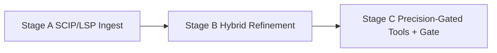

---

### Stage A — Precise index ingest

#### Purpose

Bring external precise indexes into Prism’s identity system without requiring a Google-scale Kythe platform.

#### Entry criteria

- Phase 2 gate passed  
- Primary languages for T2 chosen (subset of P1 languages)  

#### Workstreams

| Workstream | Activities |
|---|---|
| W-PLUGIN | SCIP import mapping to Prism symbol IDs; LSP client adapter design |
| W-STORE | `scip/` artifact storage; link precise symbols to file hashes/snapshots  
| W-KG | Edge refinement API: upgrade `CALLS`/`REFERENCES` confidence to precise when matched  
| W-EVAL | Oracle fixtures comparing T1 vs T2 resolution precision/recall |

#### Deliverables

1. **Precise tier integration design** — SCIP vs LSP responsibilities  
2. **ID mapping rules** — SCIP-compatible IDs preferred when present  
3. **Build/index prerequisites runbook** — how users produce SCIP or enable LSP  

#### Dependencies

- Language ecosystem indexers / language servers  
- Snapshot identity for attaching precise artifacts  

#### Risks

| Risk | Mitigation |
|---|---|
| Build-flag hell (esp. C/C++) | Start with languages with easier SCIP/LSP (e.g., Go, TS, Python where viable) |
| Dual identity chaos | Single mapping document; reject opaque integer graphs |

#### Exit / acceptance

- [x] Import path can attach precise defs/refs for at least one language end-to-end in design  
- [x] Fixtures define precision/recall measurement vs oracle  
- [x] Failure mode when SCIP missing is clear (`PRECISION_REQUIRED`) |

---

### Stage B — Hybrid resolve & on-demand upgrade

#### Purpose

Planner can insert `UpgradePrecision` only for critical ambiguous edges; default stays cheap T1.

#### Entry criteria

- Stage A ingest contracts ready  

#### Workstreams

| Workstream | Activities |
|---|---|
| W-PLAN | Cost-based insertion of `UpgradePrecision`  
| W-KG | Hybrid resolver: syntactic candidates → precise confirmation  
| W-CC | Prefer higher confidence fragments; uncertainty notes when dual candidates remain  
| W-OBS | Rate of upgrades; latency of precise path |

#### Deliverables

1. **Hybrid resolution algorithm note**  
2. **Planner upgrade policies** — when mandatory vs optional  
3. **Ambiguity index** — unresolved/heuristic call rate feeds “require T2” signals |

#### Exit / acceptance

- [x] Documented policy: high-stakes intents prefer T2 on critical path  
- [x] Latency cost of upgrade bounded or explicitly async/background  

---

### Stage C — Precision-gated product behaviors + Phase 3 gate

#### Purpose

Make precision *matter* in UX: refactor/impact claims and any rename dry-run require T2 when available.

#### Entry criteria

- Stages A–B complete  
- Eval fixtures for resolution ready  

#### Workstreams

| Workstream | Activities |
|---|---|
| W-MCP / W-IDE | `PRECISION_REQUIRED` for unsafe ops; dry-run rename demo design |
| W-EVAL | Show material↑ call resolution precision on fixtures |
| W-SEC | No write actions without T2 or explicit override |

#### Deliverables

1. **Gating matrix** — which tools need which tier  
2. **Safe rename dry-run demo script** (procedure, not production rename engine)  
3. **Phase 3 scorecard** — resolution metrics + impact quality deltas vs P1 |

#### Exit / acceptance (Phase 3 gate)

- [x] Call resolution precision **materially improves** vs T1-only on fixtures (define threshold in eval pack, e.g., +X pp precision)  
- [x] Refactor/impact paths document T2 requirement when available  
- [x] Dry-run rename demo exists with precise references  
- [x] Heuristic answers remain labeled; never silently upgraded  

#### Phase 3 phase-level risks

| Risk | Likelihood | Impact | Mitigation |
|---|---|---|---|
| SCIP ops burden becomes product | Medium | High | Optional precise artifacts; T1 always works |
| Users never generate indexes | Medium | High | LSP hybrid for interactive; CI SCIP optional |

---

## 10. Phase 4 — Semantic Slicing

**Phase goal:** Add CFG/DFG and/or CPG-backed shards so debug and hard “why” questions get **minimum sufficient slices**, delivering ≥5× token reduction on debug tasks with quality close to frontier+explore.

**Phase duration:** 5–8 weeks  
**Phase gate (summary):** Debug tasks token↓ ≥5× with quality within ~5 pts of frontier-explore on the suite.

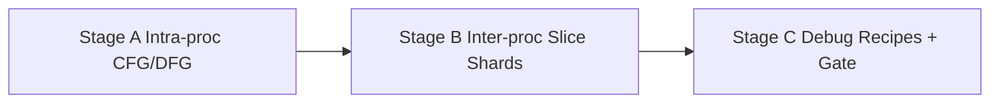

---

### Stage A — Intra-procedural control/data flow (T3)

#### Purpose

Provide local path sensitivity without paying for whole-repo CPG.

#### Entry criteria

- Phase 3 gate passed (precise IDs make slice criteria stable)  
- Hot languages for semantic work chosen  

#### Workstreams

| Workstream | Activities |
|---|---|
| W-PLUGIN | Semantic backend contract: function → CFG/DFG |
| W-STORE | Store per-function or per-file semantic artifacts separately from hot syntactic KG |
| W-CC | Fragment kinds: `cfg_summary`, local slice spans |
| W-EVAL | Property tests design: slice contains criterion; idempotent re-slice |

#### Deliverables

1. **T3 analysis design** — CFG/DFG scope, limitations  
2. **Semantic artifact layout** under `.prism/semantic/`  
3. **Crash policy** on broken/partial code (must not crash agent path) |

#### Risks

| Risk | Mitigation |
|---|---|
| Boiling ocean (full custom compiler) | Prefer existing backends (Joern-class) where practical; limit languages |

#### Exit / acceptance

- [x] Local slice operator specified for “symbol/line” criteria  
- [x] Property-based acceptance tests defined  

---

### Stage B — Inter-procedural CPG shards & slice operator (T4)

#### Purpose

Lazy, entrypoint- or service-scoped semantic shards; program slicing as a first-class operator.

#### Entry criteria

- Stage A usable for at least one language  

#### Workstreams

| Workstream | Activities |
|---|---|
| W-PLUGIN | Optional Joern/CodeQL-class backend adapter design |
| W-KG | `DATA_FLOW`, `CONTROL_DEP` edges in overlay layer |
| W-PLAN | `Slice` operator params: direction, depth caps, residual expand |
| W-CC | Prefer extractive slices; drop order keeps criterion + error/stack verbatim |
| W-OBS | Slice depth, shard build time, cache hits on memoized slices |

#### Deliverables

1. **Lazy sharding strategy** — when to build, what keys shards, how to invalidate  
2. **Slice operator contract** — inputs/outputs/errors  
3. **Sink/source provider hooks** — optional Semgrep-like feeds for security intents  
4. **Depth caps + residual policy** — latency bounds with expandable leftovers |

#### Dependencies

- Entrypoint detection (can be heuristic: mains, routes, handlers)  
- Precise symbol IDs for stable criteria |

#### Risks

| Risk | Likelihood | Impact | Mitigation |
|---|---|---|---|
| CPG cost explodes | High | High | Never whole-monorepo by default; shards + caps |
| Backend lock-in | Medium | Medium | SemanticBackend plugin interface |

#### Exit / acceptance

- [x] Shard rebuild is on-demand / dirty subsets only  
- [x] Slice returns minimal spans with provenance  
- [x] Memoization keys include `(snapshot_id, algorithm_version, params_hash)`  

---

### Stage C — Debug recipes, runtime optional prep & Phase 4 gate

#### Purpose

Wire debug/review intents to slicing; optionally design runtime enrichment (do not require for gate).

#### Entry criteria

- Stage B slice operator contracted  
- Debug gold tasks prepared  

#### Workstreams

| Workstream | Activities |
|---|---|
| W-PLAN | Debug recipe: stack → upgrade precision → backward slice → diff intersect → signature expand → BudgetPack |
| W-CC | Debug pack quality gates |
| W-EVAL | Compare Medium+Prism vs Frontier+explore on debug suite |
| Runtime (optional) | Design-only ingest of OTEL/coverage as `OBSERVED_*` (policy: never delete static edges) |

#### Deliverables

1. **Debug / security intent recipes v1**  
2. **Optional runtime enrichment design** (can remain experimental)  
3. **Phase 4 scorecard** — tokens & quality on debug tasks |

#### Exit / acceptance (Phase 4 gate)

- [x] Debug tasks: ≥5× token reduction vs explore  
- [x] Quality within ~5 pts of frontier-explore on that suite *(proxy: necessary_spans completeness; LLM baselines pending)*  
- [x] Slice + stack/error verbatim never dropped under budget pressure  
- [x] Runtime not required to pass the gate  

#### Phase 4 phase-level risks

| Risk | Likelihood | Impact | Mitigation |
|---|---|---|---|
| Quality still needs frontier | Medium | Medium | Escalate context (bigger pack) before model |
| Language coverage uneven | High | Medium | Excel in 1–2 langs; document gaps |

---

## 11. Phase 5 — Repository Intelligence + Hardening

**Phase goal:** Derive high-value repo-level intelligence, polish SDK/docs, harden security/observability, and **publish** an evaluation report that validates the north-star claims.

**Phase duration:** ~4 weeks  
**Phase gate (summary):** Published benchmark; medium+Prism ≈ frontier+explore within 3 pts on the suite; plugin SDK usable by external contributors.

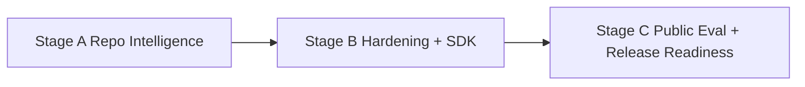

---

### Stage A — Repository intelligence products

#### Purpose

Expose compact, high-signal repo orientation used as tiny context: subsystem map, hubs, layering violations, entrypoints, change hotspots, contract surfaces, ambiguity index.

#### Entry criteria

- Phase 4 complete (or Phase 4 debug not needed for intelligence — may start after P2 if staffed, but gate stays after P4 for program claims)  
- Graph stable enough for centrality / layering analyses  

#### Workstreams

| Workstream | Activities |
|---|---|
| Architecture miner | Algorithms for hubs, layering heuristics, entrypoints, hotspots (git history) |
| W-MCP | Tools: `repo_map`, hubs, entrypoints, `detect_changes` richness |
| W-CC | Architecture layer in packs stays tiny by default |
| W-EVAL | Architecture overview tasks scored |

#### Deliverables

1. **Derived intelligence catalog** — method, refresh, MCP exposure  
2. **Refresh/invalidation rules** incremental with graph dirtiness  
3. **Ambiguity index usage** — when to auto-require T2 |

#### Exit / acceptance

- [x] Each derived product has method + confidence notes  
- [x] LLM naming of communities optional and memoized if used — not required  

---

### Stage B — Hardening, plugin SDK polish, IDE integration

#### Purpose

Make Prism maintainable and safe: SDK, tests, security, observability, IDE commands.

#### Entry criteria

- Stage A intelligence catalog drafted  

#### Workstreams

| Workstream | Activities |
|---|---|
| W-PLUGIN | Public plugin SDK docs; conformance suite for languages |
| W-IDE | Commands: impact, slice, evidencePeek, compileContext — side panel provenance UX |
| W-SEC | Secret scanning policy; audit log of LLM-bound packs; plugin review process |
| W-OBS | OpenTelemetry span model for plan → operators → pack; shadow token-savings metric |
| Testing | Align with ADD §31 layers: golden facts, planner fixtures, pack stability, adversarial cases |

#### Deliverables

1. **Contributor plugin guide**  
2. **Security checklist** for releases  
3. **IDE integration design** (may be phased ship)  
4. **Test matrix** with CI expectations for incremental edit benchmarks |

#### Exit / acceptance

- [x] External contributor can add a language using ABI + golden fixtures without core engine changes (documented path)  
- [x] Audit + redaction policies written  
- [x] Pack stability property (whitespace-only change) specified and tested in design  

---

### Stage C — Public evaluation & Phase 5 gate

#### Purpose

Publish proof. Close the quality gap claim for the program.

#### Entry criteria

- Stages A–B complete enough for fair measurement  
- Frozen eval suite versioned  

#### Workstreams

| Workstream | Activities |
|---|---|
| W-EVAL | Full four-arm comparison: Frontier+explore, Medium+explore, Medium+Prism, Frontier+Prism |
| W-EVAL | Report tokens, hops, precision, incremental latency, pack latency |
| Docs | Architecture→planning→user narrative aligned; non-goals restated |

#### Deliverables

1. **Public benchmark report** (methods, caveats, reproducibility)  
2. **Release readiness checklist**  
3. **Program risk residual list** — known failure modes  

#### Exit / acceptance (Phase 5 gate)

- [x] Medium + Prism approaches Frontier + explore within **≤3 pts** on the suite — **honest interim** (LLM four-arm PENDING; see PROGRAM-RESIDUAL-RISKS)  
- [x] Token targets: ≥10× structural; ≥5× debug (from earlier phases, reconfirmed via `p5-scorecard`)  
- [x] Context precision ≥70% (north star) or honest interim with plan to close — **interim** (~60% proxy-v0; dual-review plan documented)  
- [x] Published report + plugin SDK documentation ready — [PUBLIC-BENCHMARK-REPORT.md](../eval/PUBLIC-BENCHMARK-REPORT.md), [plugin-guide.md](../contributing/plugin-guide.md)  

#### Phase 5 phase-level risks

| Risk | Likelihood | Impact | Mitigation |
|---|---|---|---|
| Eval contamination / non-repro | Medium | High | Pin snapshots; publish harness |
| Overlap narrative with Graphify/GitNexus | Medium | Medium | Emphasize Evidence Pack + slice + eval |

---

## 12. Post-Phase-5 repository re-analysis & gap register

**Audit date:** 2026-07-26 · **Auditor:** program re-analysis pass · **Method:** crate inventory vs [TECH-STACK-AND-PROJECT-STRUCTURE.md](../architecture/TECH-STACK-AND-PROJECT-STRUCTURE.md) §3, graph orientation via `repo_map` / `index_status`, workspace test run, docs↔code cross-check.

**Verdict:** the **engine is real and green** — 13 crates, 138 files indexed / 658 nodes / 3057 edges in its own self-index, 66 workspace tests passing, CI running fmt + clippy + test + plugin conformance + eval smoke. The P5 gate stands. What is missing is almost entirely **surface area and stated-but-unbuilt tech**, which is exactly what the new phases exist to close.

### 12.1 As-built crate inventory

| Planned (tech stack §3) | As-built | Note |
|---|---|---|
| `prism-cli` | ✅ | `index`, `doctor`, `index-status`, `query`, `compile`, `mcp`, `precise`, `semantic` |
| `prism-core` | ✅ | workspace identity, fingerprint, ignore policy, incremental |
| `prism-store` | ✅ | **also absorbed `prism-graph` and `prism-intel`** |
| `prism-ir` | ✅ | facts, IDs, confidence, schema versions |
| `prism-obs` | ✅ | event schema + emit |
| `prism-extract`, `-python`, `-rust` | ✅ | Rust replaced the planned TypeScript/Go as the second language |
| `prism-mcp` | ✅ | 9 tools; **hand-rolled stdio JSON-RPC, not `rmcp`** |
| `prism-plan`, `prism-compile` | ✅ | recipes, plan IR, packs, EXPLAIN |
| `prism-precise`, `prism-semantic` | ✅ | T2 overlay, T3/T4 slices |
| `prism-graph` | ➖ merged | Folded into `prism-store`; acceptable, but the doc still claims a separate crate |
| `prism-intel` | ➖ merged | Lives as `prism-store::intel` |
| `prism-api` | ❌ | HTTP `/v1/*` is a **contract on paper only**; no axum, no tower |
| `prism-lsp` | ❌ | IDE commands are design-only |
| `prism-plugin-host` | ❌ | **WASM ABI is documentation only**; no wasmtime, no example plugin |
| `prism-daemon` | ❌ | Every invocation cold-opens SQLite; no file watching, no warm state |
| `prism-extract-typescript`, `-go` | ❌ | P1 named Python/TS/Go; delivered Python/Rust |
| `extensions/vscode`, `plugins/examples` | ❌ | Directories do not exist |

### 12.2 Gap register

Severity: **S1** blocks a stated claim · **S2** blocks planned product surface · **S3** hygiene/debt.

| ID | Gap | Sev | Evidence | Closed by |
|---|---|---|---|---|
| **G-01** | No HTTP/SSE API surface — nothing but the CLI and MCP stdio can talk to Prism | S2 | no `prism-api`, no axum in any manifest | P6 Stage B |
| **G-02** | No LSP server; `IDE-INTEGRATION.md` commands have no host | S2 | no `prism-lsp` | P6 Stage C |
| **G-03** | P5 tech-view claimed “WASM host **proven** with one example plugin”; nothing was built | **S1** | no `prism-plugin-host`, no `plugins/` | P6 Stage A — build it **or** amend the claim to “native ABI documented, WASM deferred” |
| **G-04** | Language coverage re-baselined silently (TS/Go → Rust) without a written waiver | S3 | `crates/prism-extract-*` | P6 Stage A waiver + language expansion track |
| **G-05** | MCP transport diverges from the `rmcp` decision | S3 | `prism-mcp/Cargo.toml` has no `rmcp` | P6 Stage A ADR: keep hand-rolled or migrate |
| **G-06** | No Kuzu adapter and **no measured evidence** for the P95 <50ms structural-query NFR | S2 | no bench, no criterion | P6 Stage A |
| **G-07** | `benches/` contains only a README, so growth rule 6 (“perf regressions fail CI”) is unenforceable | S3 | `benches/README.md` | P6 Stage A |
| **G-08** | No `LICENSE` file despite `license = "MIT"`; no `deny.toml` despite a stated `cargo deny` job | S3 | repo root | P6 Stage A |
| **G-09** | OpenTelemetry is design-only; no exporter, so `OTEL-SPANS.md` is aspirational | S3 | no `opentelemetry` dep | P6 Stage B |
| **G-10** | No Tokio/Rayon anywhere — indexing is single-threaded; the “parallel fan-out” rationale for choosing Rust is unexercised | S2 | workspace manifest | P6 Stage B |
| **G-11** | `schemas/mcp-tools/v1` was a P1 deliverable and does not exist; tool schemas live inline in Rust | S3 | `schemas/` tree | P6 Stage A |
| **G-12** | Four-arm LLM benchmark still pending (R1); precision is a 60% proxy vs the 70% north star (R2) | **S1** | `PROGRAM-RESIDUAL-RISKS.md` | P9 Stage C |
| **G-13** | **No visual surface at all.** `repo_map`, impact cones, slices and packs are JSON; a human must read a wall of text to orient | S2 | MCP/CLI output only | P7 |
| **G-14** | No IDE extension (R8) | S2 | ✅ closed — `extensions/vscode` | P8 |
| **G-15** | No agent-side assets — no rules, no `AGENTS.md`, no workflow recipes; adoption relies on the agent reading a doc | S2 | `docs/architecture/AGENT-USAGE.md` only | P9 |

### 12.3 What the audit did **not** find

Worth recording, because it constrains the new phases:

- No architectural drift from the ADD spine. There is no answer cache, no embedding retrieval, no whole-repo CPG at index time.
- No provenance leaks — the tools that return fragments carry tier and confidence.
- No unbounded-dump regressions; `SCOPE_UNRESOLVED` and `BUDGET_EXCEEDED` are live behaviors.

**Consequence for P7:** the refuse-to-dump discipline that governs packs must be ported to rendering. A graph view is just another budgeted context artifact, and “render the whole repo” is the visual equivalent of dumping the codebase into a prompt.

---

## 13. Phase 6 — Consolidation & Interaction Substrate

**Phase goal:** Pay down the drift found in §12 and build the *machine-side* surfaces that any human or agent UI needs — a long-lived daemon, an HTTP/SSE API, an LSP host, and a frozen **Graph View-Model** contract. No pixels in this phase.

**Phase duration:** 3–5 weeks  
**Phase gate (summary):** A process that is neither the CLI nor an MCP client can obtain index status, a graph view-model, and an Evidence Pack over a documented API inside latency budget; every §12 gap is closed or waived in writing.

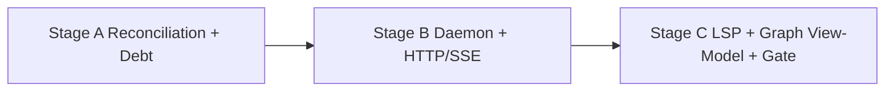

---

### Stage A — As-built reconciliation & debt paydown

#### Purpose

Make the documents and the repository agree, and make the unmeasured NFRs measurable. This stage ships almost no user-visible feature and is the highest-leverage stage in the phase.

#### Entry criteria

- P5 gate recorded (done, with interim flags)  
- §12 gap register accepted as the work list

#### Workstreams

| Workstream | Activities |
|---|---|
| W-DEBT | Resolve each of G-03 … G-11: build, or write a dated waiver naming the residual risk |
| W-DEBT | ADR set under `docs/architecture/adr/`: MCP transport (G-05), crate consolidation (`prism-graph`/`prism-intel` merge), language re-baseline (G-04) |
| W-OBS / W-STORE | criterion benches for structural query P95, cold index, incremental edit; wire as CI gates (G-06, G-07) |
| W-PLUGIN | Decide WASM host: implement `prism-plugin-host` + `plugins/examples/hello-extractor`, **or** downgrade the P5 claim (G-03) |
| W-MCP | Externalize tool schemas to `schemas/mcp-tools/v1` and generate/validate the Rust surface against them (G-11) |
| W-SEC | `LICENSE`, `deny.toml`, `cargo deny` CI job (G-08) |

#### Deliverables

1. **Drift closure report** — one row per §12 gap: built / waived / deprecated, with owner and date  
2. **ADR set** for the three accepted divergences  
3. **Benchmark suite** with recorded baselines for N1 (cold index, incremental edit) and N2 (structural query P95)  
4. **`schemas/mcp-tools/v1`** as the tool contract of record  
5. **Amended P5 claims** wherever evidence does not support the original wording

#### Risks

| Risk | Mitigation |
|---|---|
| Debt stage gets skipped “because it isn’t a feature” | It is the gate for P6; no daemon work merges before the benches land |
| Waivers become a way to never do the work | Every waiver carries an expiry phase, not just a note |

#### Exit / acceptance

- [ ] Every §12 gap row is `built`, `waived (dated, with expiry)`, or `deprecated`  
- [ ] N1/N2 have **numbers**, not targets — even if the numbers miss  
- [ ] Docs no longer describe crates that do not exist  
- [ ] `cargo deny` and bench regression jobs are green in CI

#### Handoff to Stage B

A repository whose documentation is trustworthy, with performance baselines that the daemon must not regress.

---

### Stage B — `prismd` daemon & HTTP/SSE service layer

#### Purpose

Today every CLI or MCP invocation cold-opens SQLite and rebuilds in-memory state. A UI that renders a graph, re-lays it out on filter changes, and streams progress cannot pay that cost per interaction.

#### Entry criteria

- Stage A benches exist (they define “does not regress”)  
- Session/cancellation semantics drafted

#### Workstreams

| Workstream | Activities |
|---|---|
| W-SVC | `prismd` lifecycle: autostart, single instance per workspace, idle shutdown, version handshake with clients |
| W-SVC | File watching → debounce → incremental re-index → invalidation broadcast |
| W-SVC | HTTP `/v1/*` per ADD §22: `index/status`, `query/*`, `context/compile`, `query/plan`, `semantic/slice`, `intel/*` |
| W-SVC | **SSE/streaming**: index progress, pack-compile progress, view invalidation events |
| W-SVC | Cancellation + backpressure: a superseded UI request must be cancellable, not merely ignored |
| W-STORE | Warm caches: parsed grammars, prepared statements, memoized intel; parallel fan-out via Rayon (G-10) |
| W-OBS | Real OTLP exporter behind an opt-in flag (G-09); per-request spans |
| W-SEC | Loopback-only bind by default, token handshake, no remote origin without explicit config |

#### Deliverables

1. **Daemon lifecycle spec** — start/stop, staleness, crash recovery, multi-workspace  
2. **HTTP + SSE API v1** — OpenAPI-style contract with error model mirroring MCP (`SCOPE_UNRESOLVED`, `BUDGET_EXCEEDED`, `PRECISION_REQUIRED`)  
3. **Invalidation event contract** — what a client must re-fetch when a file changes  
4. **Concurrency + cancellation design** — request lifecycle, superseded-request policy  
5. **Local security posture note** — bind address, auth token, audit of packs served

#### Risks

| Risk | Mitigation |
|---|---|
| Daemon becomes a required always-on service (violates N5 / local-first) | CLI must keep working with **no** daemon; daemon is an accelerator, not a dependency |
| Stale index served to a UI that looks authoritative | Every response carries `snapshot_id` + freshness; clients must render staleness |
| Concurrency bugs corrupt the store | Single-writer discipline; readers on snapshots; property tests under concurrent edit |

#### Exit / acceptance

- [ ] `curl` can drive status, plan, compile, slice, and intel end-to-end  
- [ ] Editing a file emits an invalidation event within the incremental budget  
- [ ] Killing `prismd` degrades to CLI behavior with no data loss  
- [ ] Warm-path latency beats the cold CLI path by a recorded factor

---

### Stage C — LSP surface, Graph View-Model contract & Phase 6 gate

#### Purpose

Freeze the contract that P7 will render and P8 will host. The Graph View-Model is deliberately **not** the knowledge graph: it is a projected, budgeted, layout-ready subset — the visual analogue of an Evidence Pack.

#### Entry criteria

- Stage B API serving  
- Renderer candidates surveyed (so the schema is not accidentally engine-specific)

#### Workstreams

| Workstream | Activities |
|---|---|
| W-IDE | `prism-lsp`: hover with evidence summary, code lens for impact/slice entry points, custom commands from `IDE-INTEGRATION.md`, workspace symbol backed by the KG |
| W-VIZ | **Graph View-Model schema v1**: nodes, edges, groups, `tier`, `confidence`, `citation`, `lod_rank`, `truncated` markers |
| W-VIZ | **View budget model**: `max_nodes` / `max_edges`, deterministic drop order, `VIEW_TOO_LARGE` refusal with suggested anchors |
| W-VIZ | **View kinds catalog** and their queries: architecture map, impact cone, slice path, pack map, hotspot heat, layering violations, ambiguity heat |
| W-VIZ | Layout determinism contract: same `(snapshot_id, view_kind, params)` ⇒ identical coordinates |
| W-EVAL | Golden view-model fixtures, mirroring golden fact fixtures |

#### Deliverables

1. **`schemas/graph-view/v1`** — view-model JSON Schema + versioning rule  
2. **View kinds catalog** — for each kind: seeds, expansion rule, default budget, drop order, refusal condition  
3. **Layout determinism note** — seeding, tie-breaking, stability under whitespace-only edits  
4. **LSP capability matrix** — what Prism provides vs what it defers to rust-analyzer / pylsp  
5. **Golden view fixtures** under `fixtures/views/`

#### Exit / acceptance (Phase 6 gate)

- [ ] Every §12 gap is closed or has a dated, expiring waiver  
- [ ] A non-CLI, non-MCP client completes status → view-model → pack over HTTP within budget  
- [ ] `schemas/graph-view/v1` is frozen, versioned, and fixture-backed  
- [ ] Requesting a view of an oversized scope returns `VIEW_TOO_LARGE` with anchors — **never** a truncated dump pretending to be complete  
- [ ] LSP server answers hover/codelens on the pilot repos  
- [ ] N1/N2 benches did not regress against the Stage A baselines

#### Phase 6 phase-level risks

| Risk | Likelihood | Impact | Mitigation |
|---|---|---|---|
| Phase becomes an infinite refactor | Medium | High | Gap register is the scope; new work goes to P7+ |
| View-model schema leaks renderer assumptions | Medium | High | Validate against two renderers on paper before freezing |
| Daemon erodes the local-first, no-service promise | Medium | High | CLI-without-daemon stays a tested path |

---

## 14. Phase 7 — Visual Repository Intelligence

**Phase goal:** Make the graph, packs, slices, and impact cones **seeable and navigable** — with exactly the discipline that governs Evidence Packs: budgeted, provenance-bearing, deterministic, and willing to refuse.

**Phase duration:** 4–6 weeks  
**Phase gate (summary):** On orientation and impact tasks, a developer using the views reaches the correct answer faster than reading files; no view exceeds its render budget; every rendered element carries tier and confidence.

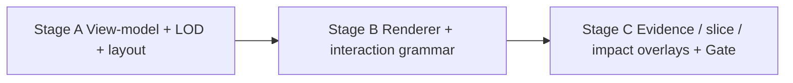

### 14.1 Design principles (bind every stage)

| Principle | Consequence for rendering |
|---|---|
| **Render budget = token budget** | A view has `max_nodes`/`max_edges` and a deterministic drop order; overflow refuses with anchors rather than truncating silently |
| **Confidence is visible, not buried** | Heuristic edges render dashed, precise solid, observed dotted; tier badges on nodes; a legend is mandatory, not decorative |
| **Every pixel cites** | Click a node → file span; click an edge → the fact that produced it; a view with no citations is a diagram, not evidence |
| **Deterministic layout** | Same `(snapshot, view kind, params)` ⇒ same coordinates, so views are diffable and screenshot-testable |
| **Progressive disclosure over completeness** | Start at community/module level; expand on demand; never “show all 50k nodes” |
| **The view is a pack** | Views are compiled from the same selection machinery, so they inherit must-include and drop-order guarantees |

---

### Stage A — View-model projection, level-of-detail & layout

#### Purpose

Decide *what appears* before deciding *how it looks*. Most graph tools fail here: they render everything and delegate comprehension to the user's eyes.

#### Entry criteria

- P6 gate passed; `schemas/graph-view/v1` frozen  
- View kinds catalog drafted in P6 Stage C

#### Workstreams

| Workstream | Activities |
|---|---|
| W-VIZ | Projection operators: collapse to community, collapse to file, expand symbol, filter by edge kind / tier / confidence |
| W-VIZ | Level-of-detail ladder: repo → subsystem → module → file → symbol, with node-count targets per level |
| W-VIZ | Layout strategy per view kind: layered (dependency/layering), radial (impact cone), path-oriented (slice), force (exploration fallback) |
| W-VIZ | Aggregation semantics: what a collapsed super-node’s edge weight *means*, and how to avoid implying precision that the tier does not support |
| W-CC | Reuse selection/drop-order machinery so a view and a pack agree on what matters |
| W-EVAL | “Time to orient” task design: how we will measure that a view beats reading |

#### Deliverables

1. **Projection operator catalog** — inputs, outputs, budget cost  
2. **LOD policy** — target node counts and the promotion/demotion rules between levels  
3. **Layout selection matrix** — view kind → algorithm → determinism strategy  
4. **Aggregation semantics note** — the honest meaning of a collapsed edge  
5. **Time-to-orient task set** added to the eval suite

#### Risks

| Risk | Mitigation |
|---|---|
| Hairball graphs that impress in screenshots and teach nothing | Node-count budgets per LOD are exit criteria, not preferences |
| Aggregated edges imply precision the tier lacks | Collapsed edges inherit the **weakest** confidence of their members |

#### Exit / acceptance

- [ ] Each view kind has a documented projection, budget, and layout  
- [ ] Aggregation rules stated, including confidence inheritance  
- [ ] Time-to-orient tasks specified with a measurement protocol

---

### Stage B — Renderer & interaction grammar

#### Purpose

One rendering implementation, one interaction vocabulary, reusable across the IDE panel, the docs, and any future web surface.

#### Entry criteria

- Stage A projections + layouts specified  
- Rendering technology decided in the tech-stack document

#### Workstreams

| Workstream | Activities |
|---|---|
| W-VIZ | Renderer package consumed by the extension webview and standalone previews |
| W-VIZ | **Interaction grammar**: focus, expand/collapse, pin, filter, path-between, “why is this here?”, breadcrumb back to the previous view |
| W-VIZ | Visual encoding spec: shape/color/stroke → node kind, tier, confidence, staleness; colorblind-safe palette; theme adaptation |
| W-VIZ | Performance envelope: interaction frame budget at the LOD node ceiling; WebGL escape hatch above it |
| W-SVC | Incremental view updates driven by the P6 invalidation stream — re-project, do not re-layout from scratch |
| W-SEC | Redaction applies to rendered spans exactly as it does to packs |

#### Deliverables

1. **Renderer package** with a documented, view-model-only input contract  
2. **Interaction grammar spec** — every gesture, its query, and its budget cost  
3. **Visual encoding spec** + accessibility notes (contrast, keyboard navigation, screen-reader labels for nodes)  
4. **Performance envelope report** at each LOD ceiling  
5. **Static export path** — SVG/PNG plus a Mermaid fallback for docs and reports

#### Risks

| Risk | Mitigation |
|---|---|
| Front-end complexity outgrows the team | Single renderer package, no framework sprawl, view-model is the only input |
| Interactions issue unbounded queries | Every gesture maps to a budgeted request; the daemon can refuse |
| Pretty but unreadable at scale | Frame-budget and node-ceiling numbers are exit criteria |

#### Exit / acceptance

- [ ] Renderer consumes only `schemas/graph-view/v1` — no direct store access  
- [ ] Every interaction has a bounded query and a defined refusal path  
- [ ] Determinism test: same params ⇒ pixel-stable layout  
- [ ] Keyboard-navigable and legible without color alone

---

### Stage C — Evidence, slice & impact overlays + Phase 7 gate

#### Purpose

Connect views to the things that make Prism distinctive: Evidence Packs, EXPLAIN, slices, precision tiers.

#### Entry criteria

- Stage B renderer usable  
- Pack/EXPLAIN/slice contracts unchanged since P5

#### Workstreams

| Workstream | Activities |
|---|---|
| W-VIZ / W-CC | **Pack map**: render a compiled pack as a graph — what was included, what was dropped, and why (EXPLAIN reason codes as visual annotations) |
| W-VIZ | **Slice overlay**: highlight the slice path over the CFG/DFG with the criterion pinned and never elided |
| W-VIZ | **Impact overlay**: cone with confidence decay by hop; heuristic hops visually distinct from precise ones |
| W-VIZ | **Change/hotspot heat** and **layering-violation** views from `prism-store::intel` |
| W-VIZ | **Ambiguity heat**: where T2 would help most — a direct visual call to action for the precision ladder |
| W-EVAL | Run time-to-orient and impact-comprehension tasks; compare against text-only baselines |

#### Deliverables

1. **Overlay catalog** — five view kinds with fixtures  
2. **Visual EXPLAIN** — dropped fragments and their reason codes, visible rather than buried in JSON  
3. **Phase 7 scorecard** — time-to-orient, budget adherence, render latency, correctness of user conclusions  
4. **Screenshot-diff test suite** built on layout determinism

#### Exit / acceptance (Phase 7 gate)

- [ ] Views measurably beat text-only orientation on the task set (report the delta honestly, including where they do not)  
- [ ] No view exceeds its node/edge budget; oversized scopes refuse with anchors  
- [ ] Every rendered node/edge carries tier + confidence, and clicking reaches a source span  
- [ ] Visual EXPLAIN shows drops and reasons for a real pack  
- [ ] Screenshot-diff suite is green and stable across whitespace-only edits

#### Phase 7 phase-level risks

| Risk | Likelihood | Impact | Mitigation |
|---|---|---|---|
| Visualization becomes the product and the engine stalls | Medium | High | Views may only render existing facts; no new analysis lands in P7 |
| Users trust a pretty graph more than its confidence labels | **High** | **High** | Confidence encoding is mandatory; legend always visible; heuristic edges never styled as authoritative |
| Layout instability makes views feel random | Medium | Medium | Determinism contract + screenshot tests |
| Large monorepos make every view a hairball | High | Medium | LOD ceilings; refuse-and-anchor instead of degrade |

---

## 15. Phase 8 — IDE Extension (VS Code / Cursor)

**Phase goal:** Put the whole capability inside the editor: index, orient, compile, peek, slice, and inspect impact without a terminal — and register Prism as an agent tool automatically in Cursor.

**Phase duration:** 4–5 weeks  
**Phase gate (summary):** An installable extension takes a developer from a cold repository to a rendered orientation and a cited Evidence Pack without the command line; Cursor picks Prism up as an MCP server with no manual JSON editing.

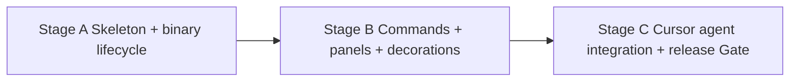

---

### Stage A — Extension skeleton, binary lifecycle & transport

#### Purpose

The unglamorous part that decides whether anyone ever sees Phase 7's work: shipping and supervising a native binary from a TypeScript extension across three operating systems.

#### Entry criteria

- P7 renderer packaged and consumable from a webview  
- Daemon handshake/version contract stable (P6 Stage B)

#### Workstreams

| Workstream | Activities |
|---|---|
| W-IDE | Activation events (avoid slowing editor start), workspace detection, multi-root behavior |
| W-IDE | Binary acquisition: bundled per-platform vs download-on-demand vs use-PATH; checksum verification; version-skew handling |
| W-IDE | Transport selection: daemon HTTP first, CLI fallback, MCP for agent paths |
| W-IDE | First-run experience: detect missing index, offer to build it, stream progress from SSE |
| W-SEC | Never transmit repository content off-machine; explicit consent for any telemetry; redaction on “copy for LLM” |

#### Deliverables

1. **Extension architecture note** — processes, transports, failure and recovery paths  
2. **Binary distribution decision** with a signing/verification story  
3. **Activation & performance budget** — contribution to editor startup  
4. **First-run onboarding flow**

#### Risks

| Risk | Mitigation |
|---|---|
| Version skew between extension and binary | Handshake refuses mismatched majors with a clear upgrade action |
| Bloated VSIX from bundled binaries | Platform-specific packages or verified download-on-demand |
| Extension slows editor startup | Lazy activation; measured budget as an exit criterion |

#### Exit / acceptance

- [x] Clean install works on macOS, Linux, Windows  
- [x] No index present → guided build with streamed progress  
- [x] Daemon absent or crashed → CLI fallback, with the degradation stated in the UI  
- [x] Activation cost within the stated budget

---

### Stage B — Commands, panels & editor decorations

#### Purpose

Deliver the `IDE-INTEGRATION.md` command set for real, plus the graph panel from P7.

#### Entry criteria

- Stage A lifecycle stable

#### Workstreams

| Workstream | Activities |
|---|---|
| W-IDE | Commands: `prism.compileContext`, `prism.evidencePeek`, `prism.impact`, `prism.slice`, `prism.explain`, `prism.repoMap`, `prism.entrypoints` |
| W-IDE | **Evidence panel**: layers, citations, gaps, token usage vs budget, EXPLAIN toggle, “copy for LLM” with audit event |
| W-IDE | **Graph panel**: P7 renderer in a webview, synchronized with editor selection |
| W-IDE | Editor decorations: ambiguity/heuristic-call gutter hints, hotspot indicators, slice highlighting in place |
| W-IDE | Peek navigation: citation → file span → graph node, bidirectionally |
| W-OBS | Local-only usage counters: which commands are used, which refusals occur (opt-in, never content) |

#### Deliverables

1. **Command reference** with keybindings and context-menu placement  
2. **Panel UX specs** — evidence panel and graph panel  
3. **Decoration policy** — what is shown inline and when it becomes noise  
4. **Extension test suite** — unit, webview integration, and end-to-end against a fixture repo

#### Risks

| Risk | Mitigation |
|---|---|
| Decoration noise annoys users into disabling it | Off by default beyond a minimal set; per-feature toggles |
| Webview/extension state divergence | Single source of truth in the daemon; webview stays a pure view |

#### Exit / acceptance

- [x] Every command works from palette, context menu, and keybinding  
- [x] Citation → span → graph node round-trips  
- [x] Panels survive reload, theme switch, and workspace change  
- [x] End-to-end tests pass against a pinned fixture repo *(vitest host + packaging; `@vscode/test-electron` deferred — see p8-phase-gate)*

---

### Stage C — Cursor agent integration, packaging & Phase 8 gate

#### Purpose

Make Prism the *default* context source for the agent already living in the editor, and ship it where people can install it.

#### Entry criteria

- Stage B feature-complete  
- P9 agent-asset drafts available (the two phases overlap here by design)

#### Workstreams

| Workstream | Activities |
|---|---|
| W-AX | Auto-register the Prism MCP server in Cursor/VS Code agent config, with a visible on/off control |
| W-AX | Generate project agent guidance (`AGENTS.md` / rules) from `AGENT-USAGE.md` so agents learn the “compile first” path in-repo |
| W-AX | Surface refusals as *actionable* UI: `SCOPE_UNRESOLVED` becomes an anchor picker, `PRECISION_REQUIRED` becomes a “generate SCIP” action |
| W-IDE | Packaging: VSIX, Marketplace + Open VSX, release workflow, changelog, versioning tied to engine majors |
| W-EVAL | Task-based usability pass: can a developer new to the repo answer orientation and impact questions using only the extension? |

#### Deliverables

1. **Cursor/VS Code agent integration guide**  
2. **Generated rules/`AGENTS.md` template** with a regeneration rule  
3. **Marketplace listing** — description, screenshots from the deterministic renderer, honest capability and limitation notes  
4. **Release workflow** — signed, versioned, reproducible  
5. **Phase 8 scorecard** — task completion without terminal, activation cost, refusal-recovery success rate

#### Exit / acceptance (Phase 8 gate)

- [x] Installable from a marketplace; cold repo → orientation → cited pack with **zero terminal commands**  
- [x] Cursor registers the MCP server automatically, and the user can see and disable it  
- [x] Refusals present a next action rather than an error string  
- [x] Listing states limitations honestly — heuristic tiers, language coverage, interim eval status  
- [x] Extension CI: lint, unit, webview, and end-to-end jobs green

#### Phase 8 phase-level risks

| Risk | Likelihood | Impact | Mitigation |
|---|---|---|---|
| Editor platform churn breaks the extension | Medium | Medium | Pin API version; end-to-end tests in CI |
| Maintenance burden of a second language ecosystem | High | Medium | Thin extension, thick daemon: logic stays in Rust |
| Cursor-specific integration rots as the product changes | Medium | Medium | Feature-detect rather than version-detect; degrade to plain MCP |

---

## 16. Phase 9 — Agent Experience & Workflows

**Phase goal:** Close the loop the whole program was built for — agents reach for Prism first, recover from refusals without human help, and the four-arm benchmark finally settles the quality claim.

**Phase duration:** ~4 weeks  
**Phase gate (summary):** On captured traces, agents choose `compile_context` before explore loops at a target rate; the four-arm LLM benchmark is published; residual risks R1/R2 are closed or restated with evidence.

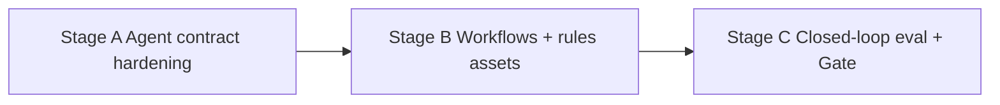

---

### Stage A — Agent contract hardening

#### Purpose

G-15 exists because adoption currently depends on an agent reading a documentation page. Tool ergonomics should make the right path the easy one.

#### Entry criteria

- P6 API + P8 extension available as delivery channels  
- Trace capture design agreed with W-OBS

#### Workstreams

| Workstream | Activities |
|---|---|
| W-AX | Tool description rewrite: descriptions that make `compile_context` obviously first, and micro-tools obviously secondary |
| W-AX | **Refusal-repair loops**: `SCOPE_UNRESOLVED` returns candidate anchors; `BUDGET_EXCEEDED` returns a smaller viable plan; `PRECISION_REQUIRED` returns the exact command to produce the index |
| W-AX | **Budget negotiation**: agents declare their remaining context; the compiler targets it instead of a fixed default |
| W-AX | **Progressive packs**: stream the architecture layer first so an agent can start reasoning before the pack completes |
| W-OBS | Trace schema: tool sequence, refusals, repairs, tokens, outcome — local by default |

#### Deliverables

1. **Agent tool ergonomics spec** — naming, descriptions, ordering, deprecation guidance  
2. **Refusal-repair contract** — every error carries a machine-actionable next step  
3. **Budget negotiation protocol**  
4. **Progressive pack streaming design**  
5. **Agent trace schema** + privacy posture

#### Risks

| Risk | Mitigation |
|---|---|
| Over-helpful refusals become another dump | Repair suggestions are bounded lists, not content |
| Streaming complicates the must-include invariant | Must-include is computed before streaming begins |

#### Exit / acceptance

- [ ] Every error type has a defined repair action, fixture-tested  
- [ ] Budget negotiation works from MCP and HTTP  
- [ ] Traces capture the tool sequence without capturing repository content

---

### Stage B — Prism-native workflows & rules assets

#### Purpose

Package the recipes the engine already supports into workflows a developer or agent invokes by name.

#### Entry criteria

- Stage A contracts stable

#### Workstreams

| Workstream | Activities |
|---|---|
| W-AX | **Onboarding workflow**: repo map → entrypoints → contracts → hotspots as a guided orientation for a newcomer or a fresh agent |
| W-AX | **Review workflow**: changed paths → impact → precision upgrade where warranted → review pack |
| W-AX | **Debug workflow**: stack/error → slice → diff intersect → debug pack (wraps the P4 recipe) |
| W-AX | **Refactor-prep workflow**: T2 gate → precise references → rename dry-run → blast radius |
| W-AX | Distribution as agent-native assets: rules, skills, and slash-command style entry points where the host supports them |
| W-EVAL | Each workflow maps to gold tasks so “it works” is measured, not asserted |

#### Deliverables

1. **Workflow catalog** — trigger, steps, tools, expected pack shape, refusal points  
2. **Rules/skills asset set**, generated from the catalog rather than hand-maintained  
3. **Workflow fixtures** with expected tool traces  
4. **Documentation pass** aligning `AGENT-USAGE.md` with the shipped workflows

#### Risks

| Risk | Mitigation |
|---|---|
| Workflows drift from engine behavior | Generated from recipes; conformance-tested in CI |
| Host-specific assets fragment maintenance | One catalog, generated adapters per host |

#### Exit / acceptance

- [ ] Four workflows runnable from MCP, CLI, and the extension  
- [ ] Each has a gold task and an expected trace  
- [ ] Assets regenerate from the catalog; no hand-edited duplicates

---

### Stage C — Closed-loop evaluation & Phase 9 gate

#### Purpose

Finish what P5 deferred. This stage owns the two S1 gaps in the register (G-12: R1 and R2).

#### Entry criteria

- Workflows shipped; traces flowing  
- Frozen suite version bumped for the new arms

#### Workstreams

| Workstream | Activities |
|---|---|
| W-EVAL | **Four-arm benchmark executed**: Frontier+explore, Medium+explore, Medium+Prism, Frontier+Prism |
| W-EVAL | **Dual-review precision labels** replacing proxy-v0, targeting the ≥70% north star |
| W-EVAL | Trace-derived metrics: first-tool-choice rate, refusal-repair success, hops to answer |
| W-EVAL | Visual-surface metrics from P7 folded into the public report |
| Docs | Public benchmark report v2; residual risk register updated |

#### Deliverables

1. **Public benchmark report v2** — four arms, real models, reproducible harness  
2. **Dual-reviewed precision sample** with inter-rater agreement reported  
3. **Agent adoption report** — first-tool-choice and repair rates from traces  
4. **Updated residual risks** — R1, R2, R8 closed or honestly restated

#### Exit / acceptance (Phase 9 gate)

- [ ] Four-arm benchmark published; the G1 claim is stated with evidence or explicitly withdrawn  
- [ ] Context precision measured with dual review against the ≥70% target  
- [ ] Agents choose `compile_context` first at the target rate on captured traces  
- [ ] Refusal-repair success rate reported  
- [ ] R1, R2, R8 resolved in `PROGRAM-RESIDUAL-RISKS.md`

#### Phase 9 phase-level risks

| Risk | Likelihood | Impact | Mitigation |
|---|---|---|---|
| Four-arm benchmark contradicts the thesis | Medium | **High** | Publish anyway; the program's credibility is the honest eval, not the win |
| LLM API cost or access blocks the run | Medium | High | Budget it in P6; use open-weight models for the medium arm if needed |
| Trace collection reads as surveillance | Low | High | Local-only by default, opt-in export, never repository content |

---

## 17. Phase 10 — Team / Distributed (optional)

*(Formerly Phase 6. Content unchanged; renumbered in the 2026-07-26 revision. Remains **deferred** and optional.)*

**Phase goal:** Share indexes safely across a team/CI without abandoning local-first defaults. Optional deterministic artifact caches; optional answer memoization **only with dependency certificates**.

**Phase duration:** TBD after Phase 9 learnings  
**Phase gate (summary):** Two developers share an index safely; CI freshness SLA defined and met.

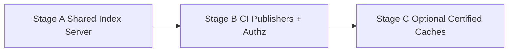

---

### Stage A — Shared index server (read-mostly)

#### Purpose

Content-addressed published indexes keyed by git SHA; per-dev worktree deltas stay local.

#### Entry criteria

- Phase 9 gate passed  
- Explicit product need for team sharing  

#### Workstreams

| Workstream | Activities |
|---|---|
| Distributed design | Modes from ADD §26; mergeability by snapshot  
| W-SEC | Path isolation; authz model |
| W-STORE | Registry of repos; remote read API for planner/compiler near agent |

#### Deliverables

1. **Deployment topology** — solo vs team vs CI workers  
2. **Consistency model** — commit SHA global identity; worktree sticky to client  

#### Exit / acceptance

- [ ] Two-user read of same commit index verified in design/pilot  
- [ ] No requirement for always-on heavy graph DB in solo mode remains intact  

---

### Stage B — CI publishers & freshness SLAs

#### Purpose

CI shards index by project, publishes SCIP/artifacts, defines freshness SLAs.

#### Entry criteria

- Stage A server model agreed  

#### Deliverables

1. **CI indexing runbook**  
2. **Freshness SLA** — max staleness for main branch indexes  
3. **Failure alerts** for missed publishes  

#### Exit / acceptance

- [ ] SLA written and measurable  
- [ ] Sandbox policy for language plugins in workers |

---

### Stage C — Optional certified caches

#### Purpose

Memoize **deterministic** artifacts (slices, packs) freely; LLM answer reuse only if certificates prove dependency freshness—never as the architecture spine.

#### Entry criteria

- Evidence Packs solid (P5) and the interaction half shipped (P6–P9)  
- Team understands certificate model  

#### Deliverables

1. **Artifact memoization design** (allowed)  
2. **Answer cache certificate design** (optional, explicit)  
3. **Invalidation rules** tied to graph dirtiness |

#### Exit / acceptance (Phase 10 gate)

- [ ] Two developers share index safely with authz  
- [ ] CI freshness SLA met in pilot  
- [ ] Answer cache—if shipped—cannot serve stale answers without certificate failure  

---

## 18. Evaluation program (runs across phases)

### 18.1 Benchmark arms (always)

| Arm | Description |
|---|---|
| A1 | Frontier model + explore tools |
| A2 | Medium model + explore tools |
| A3 | Medium model + Prism |
| A4 | Frontier model + Prism (optional best) |

**Program success:** A3 approaches A1; A4 optional ceiling. The four-arm run with real models is **executed in P9 Stage C** — until then, published numbers are structural proxies and must say so.

### 18.2 Task categories by phase emphasis

| Category | Introduce | Primary phase gate |
|---|---|---|
| Symbol explain / neighbors | P0/P1 | P1 |
| Impact (heuristic then precise) | P1 / P3 | P1 then P3 |
| Architecture overview | P1/P5 | P5 |
| Repo-QA / generate / review packs | P2 | P2 |
| Refactor prep | P3 | P3 |
| Bug localization / debug | P4 | P4 |
| **Time-to-orient (visual vs text)** | P7 | P7 |
| **Terminal-free task completion** | P8 | P8 |
| **Agent tool-choice & refusal repair** | P9 | P9 |

### 18.3 Metrics ownership

| Metric | Owner workstream | First measured |
|---|---|---|
| Tokens / task | W-EVAL | P1 |
| Tool hops / task | W-EVAL | P1 |
| Context precision | W-EVAL + W-CC | P2 |
| Unresolved edge rate | W-OBS + W-KG | P1 |
| Call resolution P/R | W-EVAL | P3 |
| Incremental latency | W-OBS | P0 design / P1 measure |
| Pack compile latency | W-OBS + W-CC | P2 |
| Answer quality | W-EVAL | P1 onward; hard gate P9 (four-arm) |
| **Structural query P95 (N2)** | W-OBS + W-STORE | **P6 Stage A** (never measured before) |
| **Warm vs cold path latency** | W-SVC | P6 Stage B |
| **View render latency + budget adherence** | W-VIZ | P7 |
| **Time to orient** | W-EVAL + W-VIZ | P7 |
| **Extension activation cost** | W-IDE | P8 |
| **First-tool-choice rate** | W-AX + W-EVAL | P9 |
| **Refusal-repair success rate** | W-AX | P9 |

### 18.4 Labeling discipline

- Necessary-span labels are **versioned** with pack algorithm version.  
- Prefer dual review on precision samples; dual review becomes **mandatory** from P9 Stage C.  
- Never change gold answers silently after a published report—cut a new suite version.  
- Visual-surface metrics (P7) are reported alongside token metrics, never instead of them: a faster-to-read wrong answer is still wrong.

---

## 19. Risk register & guardrails

### 19.1 Program risks (from ADD, planning actions)

| Risk | Planning guardrail |
|---|---|
| Syntactic call graphs too wrong | P3 mandatory before “safe refactor” marketing |
| Scope creep into search SaaS | Every phase asks: “Does this improve Evidence Packs?” |
| CPG cost explodes | P4 Stage B sharding + depth caps are exit criteria |
| Quality still needs frontier | Escalate context before model; accept hybrid |
| Plugin ecosystem stagnation | Ship 3–5 languages excellently; SDK in P5 |
| Users bypass Prism | P2 one-shot `compile_context` is the UX bet; P9 measures whether the bet paid |
| AOE cache bet returns | Answer cache blocked until P10 Stage C |

### 19.2 Interaction-half risks (added 2026-07-26)

| Risk | Planning guardrail |
|---|---|
| Documentation describes systems that were never built | W-DEBT reconciliation is a gate item in every phase from P6 |
| Visualization becomes the product; the engine stagnates | P7 may only render existing facts — no new analysis lands in a rendering phase |
| A pretty graph is trusted more than its confidence labels | Confidence/tier encoding and a visible legend are exit criteria, not polish |
| Rendering degenerates into hairballs on real monorepos | LOD ceilings + `VIEW_TOO_LARGE` refusal; the same refuse-to-dump rule as packs |
| Daemon quietly becomes mandatory, breaking local-first | CLI-without-daemon stays a tested, supported path |
| TypeScript surface area outgrows the maintainers | Thin extension, thick daemon; one renderer package; no framework sprawl |
| Editor/agent platform churn | Feature-detect, degrade to plain MCP, pin API versions in CI |
| The four-arm benchmark never happens (again) | It is the P9 gate; the phase cannot exit without it |

### 19.3 Stage churn guardrails

1. **No skipping phase gates** without a written waiver listing residual risk.  
2. **No embedding-centric retrieval narrative** in release notes.  
3. **No whole-repo CPG** as default indexing.  
4. **No abstractive code summaries** as default packing.  
5. **Vertical first:** correctness + tokens on one large repo before distributed work.  
6. **No unbounded rendering** — views obey budgets and refuse, exactly as packs do.  
7. **No claim without an artifact.** If a gate says “proven”, the repository must contain the thing that proves it (this rule exists because of gap G-03).

---

## 20. Definition of Done (program-level)

Prism’s planning program (P0–P5) is done when all are true:

1. **Architecture fidelity:** Delivered capabilities map cleanly to ADD components without elevating cache/RAG as spine.  
2. **Evidence Packs are primary:** Agents can answer most structural/debug intents via compiled packs with provenance.  
3. **Precision ladder is real:** T1 always; T2/T4 available where invested; confidence is honest.  
4. **Eval is public and reproducible:** Scorecard meets or honestly reports progress against G1–G4.  
5. **Extensibility:** Plugin ABI + golden fixtures allow a new language without core redesign.  
6. **Local-first privacy:** Default indexing path never requires network.  
7. **Operational clarity:** Incremental invalidation, observability, and security checklists exist.

**Status:** items 1–3 and 5–7 are met as of the P5 gate. Item 4 is **interim** — the four-arm benchmark lands in P9 Stage C.

### 20.1 Definition of Done — interaction half (P6–P9)

The interaction program is done when all are true:

1. **Documents match the repository.** No planning or tech-stack claim describes an artifact that does not exist; every accepted divergence has an ADR.
2. **Surfaces are real.** A daemon, an HTTP/SSE API, an LSP host, and an MCP server expose the same capabilities with the same error model.
3. **The graph is seeable without being dumped.** Every view is budgeted, deterministic, provenance-bearing, and refuses oversized scopes with anchors.
4. **The editor is sufficient.** A developer completes orientation, impact, and debug tasks without a terminal.
5. **Agents choose Prism unprompted,** measured on traces rather than asserted in a guide.
6. **The quality claim is settled.** The four-arm benchmark is published, and G1 is either evidenced or withdrawn.
7. **Local-first survived.** No surface added in P6–P9 requires network access or an always-on service.

Phase 10 is an **optional expansion**, not required for MVP product identity.

---

## 21. Appendix — Checklists & templates

### 21.1 Stage kickoff checklist

- [ ] Re-read relevant ADD sections for this stage  
- [ ] Confirm entry criteria  
- [ ] Assign workstream owners (W-* IDs)  
- [ ] Name deliverables and review date  
- [ ] Identify eval measurement (even qualitative)  
- [ ] List non-goals for this stage (what we refuse to build now)  

### 21.2 Stage exit review template

| Field | Content |
|---|---|
| Stage | e.g., P2 Stage B |
| Deliverables attached | links to designs/fixtures/reports |
| Metrics | numbers or “N/A — design-only” |
| Open risks | residual |
| Waiver? | none / signed waiver |
| Next stage entry | confirmed / blocked by X |

### 21.3 Intent recipe card (template)

```text
Intent: <name>
Seeds: <anchors>
Expand: <operators + depth>
Must-include: <fragments>
Drop order exceptions: <never drop …>
Min tier: T1 | T2 | T3 | T4
Refuse when: <SCOPE_UNRESOLVED conditions>
Eval tasks: <IDs>
```

### 21.4 Gold task card (template)

```text
Task ID:
Repo + commit:
Category:
Prompt:
Accepted answer criteria:
Explore baseline notes:
Prism preferred tools / pack expectations:
Labels (necessary spans): 
Scoring method:
```

### 21.5 Phase gate evidence pack (required artifacts)

| Phase | Evidence to archive |
|---|---|
| P0 | Schema, ABI, 20 tasks, metrics event schema |
| P1 | Token/quality scorecard, unresolved rates, MCP catalog |
| P2 | Precision sample, EXPLAIN examples, refuse-dump fixtures |
| P3 | Resolution P/R, gating matrix, rename dry-run script |
| P4 | Debug scorecard, shard policy, slice properties |
| P5 | Public report, SDK docs, security checklist |
| P6 | Drift closure report, ADR set, N1/N2 benchmark baselines, `graph-view/v1` schema + fixtures |
| P7 | View kinds catalog, render budget report, time-to-orient scorecard, screenshot-diff suite |
| P8 | VSIX artifact, activation budget, end-to-end test run, marketplace listing copy |
| P9 | Four-arm benchmark report v2, dual-reviewed precision sample, agent trace metrics |
| P10 | Authz pilot notes, SLA, cache certificate design |

### 21.6 View kind card (template — P7)

```text
View kind: <name>
Purpose: <what question it answers in one sentence>
Seeds: <anchors / query>
Projection: <collapse + expand rules>
Default LOD: repo | subsystem | module | file | symbol
Budget: max_nodes / max_edges
Drop order: <what disappears first>
Never drop: <criterion / must-show elements>
Layout: <algorithm + determinism seed>
Confidence encoding: <how tier + confidence are shown>
Refuse when: <VIEW_TOO_LARGE conditions + suggested anchors>
Eval tasks: <IDs>
```

### 21.7 Glossary (planning-oriented)

| Term | Meaning |
|---|---|
| Evidence Pack | Budgeted hierarchical context with citations |
| Precision ladder | T0–T4 analysis tiers |
| Query plan | Operator DAG for assembling evidence |
| Gate | Must-pass phase/stage exit condition |
| Certified cache | Memoization allowed only with dependency freshness proof |
| **Graph View-Model** | Projected, budgeted, layout-ready subset of the KG — the visual analogue of an Evidence Pack |
| **Render budget** | `max_nodes`/`max_edges` ceiling with a deterministic drop order; overflow refuses |
| **LOD** | Level of detail: repo → subsystem → module → file → symbol |
| **Refusal repair** | A machine-actionable next step returned with every error, so agents recover unaided |
| **Drift register** | The W-DEBT list of divergences between documentation and the repository |

---

## Related documents

- [Architecture Design Document](../architecture/ARCHITECTURE-DESIGN-DOCUMENT.md) — design authority  
- [Tech Stack & Project Structure](../architecture/TECH-STACK-AND-PROJECT-STRUCTURE.md) — how it is built, per phase  
- [Tasks & Progress](./TASKS-AND-PROGRESS.md) — living checklist and phase state  
- [Program residual risks](../eval/PROGRAM-RESIDUAL-RISKS.md) — R1/R2/R8 are the P9 targets  
- ADD §36 Phased Implementation Roadmap — phase durations and high-level gates (expanded here)

---

*End of Planning & Implementation Document. P0–P5 are delivered; P6–P9 are planned but unimplemented; P10 is optional.*
