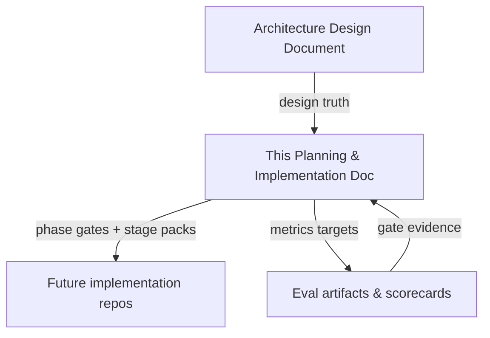
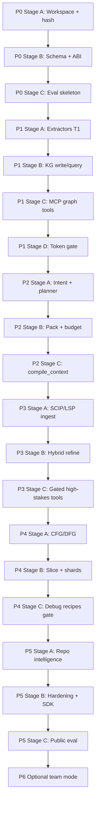
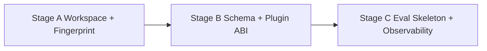
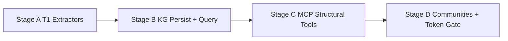
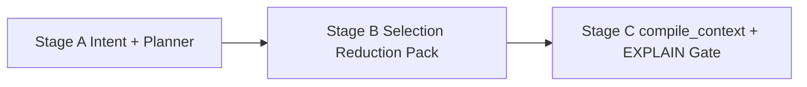
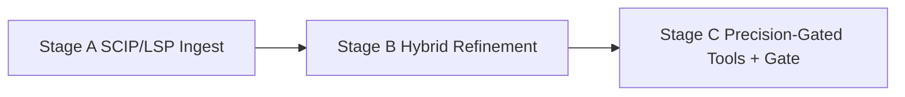
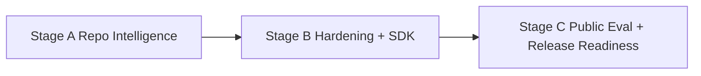
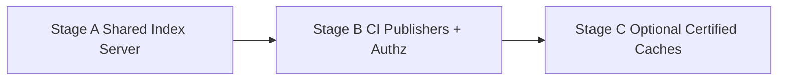

# Prism — Planning & Implementation Document

**Project working name:** Prism — Repository Intelligence Platform  
**Document type:** Detailed Planning & Implementation Guide (phase → stage)  
**Status:** Planning only — no codebase deliverable  
**Date:** 2026-07-19  
**Governs:** Execution of the [Architecture Design Document](../architecture/ARCHITECTURE-DESIGN-DOCUMENT.md)  
**Audience:** Project leads, architects, implementers, evaluators, open-source contributors  

---

## How to use this document

This document turns the ADD’s high-level roadmap into an executable plan. It does **not** invent new architecture. Where this plan and the ADD conflict, the **ADD wins** on design; this document wins on **sequence, gates, and work packaging**.

| Concept | Meaning in this plan |
|---|---|
| **Phase** | A major product capability boundary with a named exit gate |
| **Stage** | A sequenced work package inside a phase; each has entry/exit criteria |
| **Workstream** | Parallel concern inside a stage (e.g., storage vs. extractors vs. eval) |
| **Deliverable** | Concrete artifact (schema, tool surface, harness, report) — not source trees |
| **Gate** | Must-pass checks before the next stage or phase may start |

**Out of scope for this document:** writing application code, scaffolding repositories, or choosing a specific language/runtime for the binary. Technology choices remain guidance until an implementation kickoff decides them.

---

## Table of Contents

1. [Document map & relationships](#1-document-map--relationships)
2. [Product thesis (planning brief)](#2-product-thesis-planning-brief)
3. [Program overview](#3-program-overview)
4. [Cross-cutting workstreams](#4-cross-cutting-workstreams)
5. [Master timeline & dependencies](#5-master-timeline--dependencies)
6. [Phase 0 — Foundations](#6-phase-0--foundations)
7. [Phase 1 — Syntactic Knowledge Graph + MCP](#7-phase-1--syntactic-knowledge-graph--mcp)
8. [Phase 2 — Context Compiler](#8-phase-2--context-compiler)
9. [Phase 3 — Precise Tier](#9-phase-3--precise-tier)
10. [Phase 4 — Semantic Slicing](#10-phase-4--semantic-slicing)
11. [Phase 5 — Repository Intelligence + Hardening](#11-phase-5--repository-intelligence--hardening)
12. [Phase 6 — Team / Distributed (optional)](#12-phase-6--team--distributed-optional)
13. [Evaluation program (runs across phases)](#13-evaluation-program-runs-across-phases)
14. [Risk register & guardrails](#14-risk-register--guardrails)
15. [Definition of Done (program-level)](#15-definition-of-done-program-level)
16. [Appendix — Checklists & templates](#16-appendix--checklists--templates)

---

## 1. Document map & relationships



| Document | Role |
|---|---|
| `docs/architecture/ARCHITECTURE-DESIGN-DOCUMENT.md` | **What** to build and **why** (components, IR, pipelines, NFRs) |
| This document | **When / in what order / how we know a stage is done** |
| Future eval reports | **Evidence** against gates (tokens, quality, latency) |

**Supersession rule:** Prior AOE cache-first planning ideas remain historical notes. Prism’s spine is **pre-LLM repository understanding + context compilation**. Answer caches, if any, appear only in Phase 6 as optional memoization with certificates.

---

## 2. Product thesis (planning brief)

### 2.1 One-sentence bet

Frontier-model accuracy on large codebases is mostly a **context quality** problem; Prism compiles minimum sufficient, provenance-bearing evidence so **medium models** can approach frontier quality at a fraction of the token cost.

### 2.2 What every phase must protect

| Principle | Planning implication |
|---|---|
| Understand before prompting | No phase ships “LLM-first” without indexing + KG behind it |
| Structure before similarity | Embeddings are last-resort; never the retrieval spine |
| Cache is memoization only | Do not plan answer-cache work before Evidence Packs are solid |
| Progressive precision | T1 everywhere first; pay for T2/T4 only when plans need them |
| Provenance always | Schema and APIs must carry source range, tier, confidence from Day 1 of packing |
| Refuse unbounded dumps | Scope-unresolved is a valid product behavior, not a failure |

### 2.3 Success north star (12 months)

Align with ADD Goals G1–G9:

| ID | Target |
|---|---|
| G1 | Medium + Prism ≥ frontier + naive explore within ≤3 pts answer quality |
| G2 | ≥10× fewer input tokens (structural); ≥5× (debug/refactor) |
| G3 | ≥70% context precision on labeled samples |
| G4 | Typical edit re-index <2s with dirty-set invalidation |
| G5 | Every fragment has provenance |
| G6 | New language = grammar + extractor plugin |
| G7 | MCP/LSP first-class; one-shot structural answers |
| G8 | Local-first; indexing does not require network |
| G9 | Clear IR schemas, plugin contracts, reproducible eval |

---

## 3. Program overview

### 3.1 Phase sequence


| Phase | Intent | Duration (calendar) | Primary user-visible outcome |
|---|---|---|---|
| **P0** | Substrate that makes later phases measurable and safe | 2–3 weeks | Workspace identity, hash index, schema draft, eval skeleton |
| **P1** | Agents can query structure without grepping | 4–6 weeks | Syntactic KG + MCP tools; impact/heuristic neighbors |
| **P2** | Agents stop multi-hop explore for most tasks | 3–5 weeks | `compile_context` Evidence Packs with budgets + EXPLAIN |
| **P3** | High-stakes nav/refactor becomes trustworthy | 4–6 weeks | SCIP/LSP hybrid resolution; precision-gated tools |
| **P4** | Debug/security packs become slice-minimal | 5–8 weeks | CFG/DFG/CPG shards + slice operator + debug recipes |
| **P5** | Product hardening + published proof | ~4 weeks | Repo intelligence + public eval; plugin SDK polish |
| **P6** | Team/CI scale (optional) | TBD | Shared index, authz, optional certified caches |

### 3.2 Capability maturity ladder

| Capability | P0 | P1 | P2 | P3 | P4 | P5 | P6 |
|---|---|---|---|---|---|---|---|
| Content-hash incremental store | ● | ● | ● | ● | ● | ● | ● |
| Syntactic facts (T1) | ○ | ● | ● | ● | ● | ● | ● |
| MCP graph tools | ○ | ● | ● | ● | ● | ● | ● |
| Query plan + Evidence Pack | ○ | ○ | ● | ● | ● | ● | ● |
| Precise symbol (T2) | ○ | ○ | ○ | ● | ● | ● | ● |
| Semantic slice (T3/T4) | ○ | ○ | ○ | ○ | ● | ● | ● |
| Architecture intelligence | ○ | ◐ | ◐ | ◐ | ◐ | ● | ● |
| Team/shared index | ○ | ○ | ○ | ○ | ○ | ○ | ● |

● = required deliverable · ◐ = partial / heuristic · ○ = not yet

### 3.3 What “implementation” means here

Each stage specifies:

1. **Purpose** — why this stage exists  
2. **Entry criteria** — what must already be true  
3. **Workstreams** — parallel tracks  
4. **Deliverables** — documents, schemas, contracts, harnesses, runbooks  
5. **Dependencies** — upstream stages / external systems  
6. **Risks** — local to the stage  
7. **Exit / acceptance** — measurable checks  
8. **Handoff** — what the next stage inherits  

No stage requires creating application source trees as part of *this planning effort*.

---

## 4. Cross-cutting workstreams

These run in every phase. Stage plans reference them by ID.

| ID | Workstream | Owns | Never owns |
|---|---|---|---|
| **W-STORE** | Storage & identity | `.prism` layout, SQLite schemas, snapshot IDs, transactions | Prompt formatting |
| **W-PLUGIN** | Plugin ABI | Extractor/resolver/semantic contracts, versioning, golden fixtures | Product UX |
| **W-KG** | Knowledge graph service | Node/edge kinds, query API shape, confidence tagging | LLM calls |
| **W-PLAN** | Query planning | Intent recipes, operator DAG, cost model | Indexing |
| **W-CC** | Context compiler | Selection, reduction, budgets, Evidence Pack IR, EXPLAIN | Full-repo CPG |
| **W-MCP** | Agent surface | MCP tool contracts, safety rules, one-shot guidance | Graph algorithms |
| **W-IDE** | IDE/LSP | Commands, peek UX, edit-time incremental policy | Replacing language servers |
| **W-EVAL** | Evaluation | Gold tasks, baselines, scorecard automation | Feature shipping |
| **W-OBS** | Observability | Metrics, traces, audit logs of packs sent to LLMs | Business logic |
| **W-SEC** | Security & privacy | Local default, secret redaction, plugin sandbox policy | Multi-tenant SaaS (until P6) |

**Planning rule:** Every phase exit must update W-EVAL and W-OBS, even if the product surface barely changed.

---

## 5. Master timeline & dependencies

### 5.1 Critical path



### 5.2 Hard dependency rules

1. **No MCP “explore replacement” claims** before P1 Stage D gate.  
2. **No `compile_context` as primary tool** before P2 Stage C gate.  
3. **No safe rename / precise impact claims** before P3 Stage C gate.  
4. **No “slice-based debug” claims** before P4 Stage C gate.  
5. **No shared index / answer cache** before P5 Stage C succeeds.  
6. **Embedding work** may appear as a tiny fallback prototype in P2+, but must be flagged `low_confidence` and excluded from success narratives.

### 5.3 Approximate effort envelope

| Phase | Weeks | Relative effort |
|---|---|---|
| P0 | 2–3 | Foundation (small but blocking) |
| P1 | 4–6 | Largest early build |
| P2 | 3–5 | Highest product leverage |
| P3 | 4–6 | Integration-heavy |
| P4 | 5–8 | Deepest analysis risk |
| P5 | ~4 | Proof + polish |
| P6 | optional | Ops/product expansion |

Total critical path (P0–P5): roughly **22–36 weeks**, depending on language count, fixture quality, and eval labeling bandwidth.

---

## 6. Phase 0 — Foundations

**Phase goal:** Make repository identity, incremental hashing, durable schemas, plugin contracts, and evaluation measurable *before* inventing intelligence features.

**Phase duration:** 2–3 weeks  
**Phase gate (summary):** Incremental re-index path is designed and prototype-validatable; metrics pipeline exists for later phases.



---

### Stage A — Workspace identity & content fingerprinting

#### Purpose

Define how Prism knows *which repository, which snapshot, which files changed*, without depending on language analysis.

#### Entry criteria

- ADD §12 (indexing pipeline) and §21 (storage layout) accepted as design baseline  
- Target pilot repos identified (1–2 real codebases for later gold tasks)

#### Workstreams

| Workstream | Activities |
|---|---|
| W-STORE | Specify workspace roots, ignore rules (`.gitignore` + vendoring heuristics), content hash per file, Merkle/dir fingerprint for skip |
| W-OBS | Define counters: files discovered, files skipped unchanged, indexing wall time |
| W-SEC | Specify secret-sensitive path defaults (e.g., never index `.env` by default) |

#### Deliverables

1. **Workspace Manager specification** — roots, VCS identity (git commit SHA + dirty stamp), ignore policy  
2. **Fingerprint algorithm note** — file hash, tree Merkle, “unchanged subtree skip” contract  
3. **`.prism/` layout draft** — folders for meta, graph, blobs, logs (names freezeable in Stage B)  
4. **Incremental invalidation design** — unit of change = file subgraph (+ later reverse deps)

#### Dependencies

- None technical beyond access to pilot repos and git metadata conventions

#### Risks

| Risk | Mitigation |
|---|---|
| Over-engineering distributed identity | Stay solo-local; git SHA + worktree stamp only |
| Ignore rules miss huge vendor trees | Explicit vendoring heuristics; measure index size early |

#### Exit / acceptance

- [ ] Documented algorithm can classify a file edit as changed/unchanged given hashes  
- [ ] Dirty worktree vs clean commit identities are distinguishable  
- [ ] Ignore policy review checklist exists  
- [ ] Pilot repos listed with approximate LOC and languages

#### Handoff to Stage B

Stable definitions of `Repository`, `Snapshot`, `File` identity fields.

---

### Stage B — Durable schema & plugin ABI draft

#### Purpose

Lock the *shapes* of facts and plugins so Phase 1 extractors do not thrash the store.

#### Entry criteria

- Stage A exit complete  
- Node/edge kinds from ADD §11 agreed at least for T1 subset

#### Workstreams

| Workstream | Activities |
|---|---|
| W-STORE | Draft `meta.sqlite` tables (snapshots, files, hashes, jobs); draft graph tables or embedded-graph mapping |
| W-PLUGIN | Draft `LanguageExtractor` contract: bytes → versioned facts; declare confidence enums |
| W-KG | Freeze T1 node/edge subset for P1 (File, Symbol, IMPORTS, CALLS heuristic, CONTAINS, etc.) |
| W-SEC | Policy stub for plugin side effects / sandbox expectations |

#### Deliverables

1. **Schema v0 document** — tables/collections, indexes, transaction boundary (“replace file subgraph”)  
2. **Fact schema v0** — attributes required for symbols, spans, edges, confidence, analyzer, tier  
3. **Plugin ABI draft** — input/output, versioning, pure-transform rule, golden-fixture expectation  
4. **IR layer cheat-sheet** — L0–L5 from ADD §9.3, what P0/P1 populate now vs later  

#### Dependencies

- Stage A identities  
- ADD precision ladder (tiers labeled even if only T1 implemented later)

#### Risks

| Risk | Mitigation |
|---|---|
| Schema trying to encode T4 CPG early | Explicit “semantic layer lazy / separate artifacts” |
| Opaque integer IDs (LSIF trap) | Prefer readable SCIP-compatible or deterministic syntactic IDs |

#### Exit / acceptance

- [ ] Schema review signed by architect: crash-safe write strategy chosen (e.g., SQLite WAL transactional replaces)  
- [ ] Confidence values include at least `extracted` / `heuristic` / `precise` / `observed` (observed may be unused until later)  
- [ ] Plugin ABI reviewable by a future language contributor without reading the whole ADD  
- [ ] Migration policy: “breaking fact schema bumps major version”

#### Handoff to Stage C

Stable IDs and schemas that eval fixtures will cite.

---

### Stage C — Evaluation skeleton & observability baseline

#### Purpose

Ensure **every later gate has a measurement path**. Without this, P1/P2 “token wins” become anecdotes.

#### Entry criteria

- Stage B schema/ABI drafts accepted  
- Pilot repos frozen enough to attach gold tasks

#### Workstreams

| Workstream | Activities |
|---|---|
| W-EVAL | Define 20 gold tasks across 1–2 repos; task types: symbol explain, impact, architecture orientation (debug/refactor can be stubs) |
| W-EVAL | Specify baseline protocols: frontier+explore, medium+explore (explore = grep/read/glob loops) |
| W-OBS | Metrics pipeline design: index latency, query latency placeholders, tokens/task, tool calls/task |
| W-MCP | Note which future tools each gold task will prefer (for later checklists) |

#### Deliverables

1. **Eval harness design** — inputs, outputs, judges (human and/or LLM-judge with fixed rubric), reproducibility (pinned snapshots)  
2. **Gold task pack v0** — ≥20 tasks with gold hints / answers / necessary-span notes where known  
3. **Scorecard template** — columns aligned to ADD §32  
4. **Baseline measurement runbook** — how to measure explore-token usage without Prism  

#### Dependencies

- Pilot repo snapshots (content-addressed)  
- Access assumptions for hosted/local judges documented (privacy)

#### Risks

| Risk | Mitigation |
|---|---|
| Tasks too vague to score | Every task needs accepted answer criteria or graded checklist |
| Eval becomes blocked on LLM API | Allow offline structural metrics first (tokens to pack; hop counts) |

#### Exit / acceptance (Phase 0 gate)

- [ ] Incremental re-index path is specified end-to-end (discover → hash → parse-hook → txn → invalidate) even if parsers are stubs  
- [ ] Metrics pipeline exists on paper with named event schema  
- [ ] ≥20 gold tasks versioned and tied to commit SHAs  
- [ ] Team can answer: “How will we know P1 saved tokens?” with a written procedure  

#### Phase 0 phase-level risks

| Risk | Likelihood | Impact | Mitigation |
|---|---|---|---|
| Building code before contracts | High | High | Treat Stage B/C as blockers |
| Eval forever “coming later” | High | High | No Phase 1 gate without harness design |

---

## 7. Phase 1 — Syntactic Knowledge Graph + MCP

**Phase goal:** Index repositories into a durable syntactic knowledge graph and expose agent-usable structural tools, proving large token reduction on structural tasks *without* a full context compiler yet.

**Phase duration:** 4–6 weeks  
**Languages (recommended):** start with 2–3 (e.g., Python, TypeScript/JavaScript, Go)  
**Phase gate (summary):** ≥5× token reduction on structural tasks vs explore; quality within ~10 pts of explore on the gold subset that structural tools can answer.



---

### Stage A — Language extractors (T1)

#### Purpose

Turn source files into **typed facts** with honest confidence labels using tree-sitter (or equivalent) CST/AST extraction.

#### Entry criteria

- Phase 0 complete  
- Plugin ABI draft frozen enough for first languages  
- Language priority list agreed

#### Workstreams

| Workstream | Activities |
|---|---|
| W-PLUGIN | Per-language extractor design: symbols, imports, call sites, inheritance/implements where cheap, routes/tests heuristics |
| W-KG | Map extractor outputs to edges: `CONTAINS`, `IMPORTS`, `CALLS` (heuristic), `EXTENDS`/`IMPLEMENTS` (best-effort) |
| W-EVAL | Golden fixture files per language (small repos or snippets) with expected fact dumps |
| W-OBS | Unresolved call rate metric definition |

#### Deliverables

1. **Extractor design docs** (one per language) — what is extracted, what is explicitly *not* claimed precise  
2. **Golden fact fixtures** — deterministic expected outputs for conformance  
3. **Resolution-cheap policy** — same-file + import-graph heuristics only; label unresolved  

#### Dependencies

- Schema v0  
- Tree-sitter grammars availability for chosen languages  

#### Risks

| Risk | Mitigation |
|---|---|
| Pretending textual calls are precise | Mandatory `heuristic` / `best_effort` tags |
| Too many languages at once | Cap at 2–3 until fixtures green |

#### Exit / acceptance

- [ ] Each language has golden fixtures passing the *design* of conformance tests  
- [ ] Unresolved edges are first-class, not silent deletes  
- [ ] Extractor docs state known failure modes (dynamic imports, macros, generics)

#### Handoff

Fact producers ready for Stage B persistence contracts.

---

### Stage B — Knowledge graph persistence & query API

#### Purpose

Make facts durable, incrementally replaceable, and queryable with low latency targets in mind (local P95 structural queries &lt;50ms as *design* NFR).

#### Entry criteria

- Stage A extractor contracts + fixtures exist  
- Transaction model from P0 Stage B agreed

#### Workstreams

| Workstream | Activities |
|---|---|
| W-STORE | Specify per-file subgraph replace; reverse dependency dirty lists; snapshot isolation |
| W-KG | Query shapes: resolve by name/path, neighbors by edge type, depth-limited expansion |
| W-OBS | Index files/s and incremental latency measurement plan against NFR N1 |
| W-SEC | Path isolation; no unexpected blob retention of secrets |

#### Deliverables

1. **KG query API contract** (CLI/HTTP conceptual — ADD §22 subset needed for P1)  
2. **Incremental update sequence diagram** — edit → dirty set → rebuild dependents (communities may be deferred to Stage D)  
3. **Index size budget note** — aim ~3–10% of source for syntactic index (N3)  
4. **Failure modes** — crash mid-txn recovery expectations |

#### Dependencies

- Extractor fact schema  
- Fingerprint invalidation from P0  

#### Risks

| Risk | Mitigation |
|---|---|
| In-memory-only graph (NetworkX trap) | Persist from day one of Stage B |
| Whole-repo rewrite on any edit | File subgraph replace + reverse dep propagation |

#### Exit / acceptance

- [ ] Documented that a single-file edit does not require full rebuild  
- [ ] Query API can express: symbol lookup, 1-hop neighbors, depth-limited impact candidates  
- [ ] Latency/size NFRs are tracked (even if not yet met)

---

### Stage C — MCP structural tool surface

#### Purpose

Give agents first-class tools so they stop rediscovering structure via grep/read. This is **not** yet the full context compiler; it is the structural substrate MCP (GitNexus/Graphify lesson).

#### Entry criteria

- Stage B query API contract stable  
- Safety defaults for local MCP agreed (W-SEC)

#### Workstreams

| Workstream | Activities |
|---|---|
| W-MCP | Specify tools: `index_status`, `resolve_symbol`, `neighbors`, `impact` (heuristic), `repo_map` stub if communities not ready |
| W-OBS | Tool-call auditing; optional “pack sent to LLM” log stub |
| W-EVAL | Map gold structural tasks to tool traces (expected fewer hops) |
| W-SEC | Allowlist; citation + confidence in returns; no write/rename tools yet |

#### Deliverables

1. **MCP tool catalog v1** — inputs, outputs, errors, confidence fields  
2. **Agent usage guide draft** — prefer structural tools over read/grep loops  
3. **Error model draft** — at least `SCOPE_UNRESOLVED` placeholder behavior  

#### Dependencies

- KG query API  
- Index freshness (`index_status`)

#### Risks

| Risk | Mitigation |
|---|---|
| Too many micro-tools → agent still thrash | Keep surface small; prepare for P2 one-shot |
| Overclaiming impact accuracy | Label impact confidence; depth caps |

#### Exit / acceptance

- [ ] Tool catalog reviewed against ADD §25 subset for P1  
- [ ] Every tool return includes provenance/confidence or explicitly marks heuristics  
- [ ] Eval harness can record tool hops per task |

---

### Stage D — Communities, orientation & Phase 1 gate

#### Purpose

Add lightweight architecture orientation (communities/hubs) and **prove** the token thesis on structural tasks.

#### Entry criteria

- Stages A–C complete  
- Gold structural subset ready for scoring  

#### Workstreams

| Workstream | Activities |
|---|---|
| W-KG / Architecture miner | Leiden/Louvain (or similar) on import+call graph; path-prefix labels first |
| W-MCP | Flesh out `repo_map` / hubs exposure |
| W-EVAL | Run explore vs Prism structural comparison; compute token and quality deltas |
| W-OBS | Unresolved call rate dashboards per language |

#### Deliverables

1. **Community detection design** — algorithm, refresh triggers, labeling policy  
2. **Phase 1 scorecard report** — tokens/task, quality vs explore, unresolved edge rates  
3. **Known limitations register** — what wrong callees do to impact answers  

#### Exit / acceptance (Phase 1 gate)

- [ ] ≥5× token reduction on **structural** gold tasks vs explore baseline  
- [ ] Quality within ~10 points of explore on those tasks (not debug-hard tasks)  
- [ ] Incremental edit path demonstrated on a fixture scenario (&lt;2s as stretch target; must at least show no full rebuild)  
- [ ] No narrative claiming precise refactor safety yet  

#### Phase 1 phase-level risks

| Risk | Likelihood | Impact | Mitigation |
|---|---|---|---|
| Heuristic CALLS poison impact | High | High | Confidence + depth caps; escalate to P3 |
| Scope creep into search UI | Medium | High | MCP tools only; context compiler deferred to P2 |
| Quality gap vs explore ≥10 pts | Medium | High | Improve recipes and resolution; delay P2 marketing claims |

---

## 8. Phase 2 — Context Compiler

**Phase goal:** Make **context compilation** the product: intent → query plan → Evidence Pack under token budget, with EXPLAIN and refuse-to-dump behavior. Elevate `compile_context` to the primary agent tool.

**Phase duration:** 3–5 weeks  
**Phase gate (summary):** Context precision ≥60% on labeled sample; unresolved scopes refuse unbounded dumps; pack compile latency design targets P95 &lt;300ms excluding LLM.



---

### Stage A — Intent classification & query planner v1

#### Purpose

Turn natural-language / agent intents into an **operator DAG** instead of ad-hoc tool chains.

#### Entry criteria

- Phase 1 gate passed  
- Operator catalog from ADD §19 accepted as v1 scope  

#### Workstreams

| Workstream | Activities |
|---|---|
| W-PLAN | Intent set: repo-QA, debug (lightweight), impact, refactor (warn if no T2), generate, review, architecture |
| W-PLAN | Recipes: seed rules + expand rules per intent (ADD §17) |
| W-PLAN | Cost model sketch: prefer cheap T1 ops; insert `UpgradePrecision` only as placeholder until P3 |
| W-EVAL | Intent fixtures → expected operator shapes |

#### Deliverables

1. **Intent recipe catalog v1** — seeds, expands, must-include, drop priorities  
2. **Planner design** — plan IR JSON/YAML shape; operator list for v1  
3. **Example plans** — at least debug/impact/repo-QA walkthroughs  

#### Dependencies

- P1 graph operators (`Resolve`, `Expand`, `Impact`)  
- Diff/worktree detection design (can be shallow in v1)

#### Risks

| Risk | Mitigation |
|---|---|
| Planner becomes another LLM prompt | Keep deterministic recipes first; LLM optional for intent only if needed |
| Debug recipes overpromise before slicer | Mark debug plans as “best-effort until P4” |

#### Exit / acceptance

- [ ] For each intent, a recipe produces a plan without executing LLM  
- [ ] Fixtures cover ambiguous queries → `SCOPE_UNRESOLVED` paths  
- [ ] Plan-only API (`/query/plan`) contract documented  

---

### Stage B — Selection, reduction & Evidence Pack IR

#### Purpose

Implement (as design + contracts) the compiler backend: materialize fragments, rank, budget, never drop must-includes.

#### Entry criteria

- Stage A recipes stable  
- Evidence fragment schema (ADD §11.4) accepted  

#### Workstreams

| Workstream | Activities |
|---|---|
| W-CC | Hierarchical pack layout: arch → module signatures → core slices → neighbor signatures → diffs → optional run |
| W-CC | Drop order under budget (ADD §18.1)  
| W-CC | Extractive default for code; abstractive only for docs/ADR with links  
| W-EVAL | Start labeling necessary vs unnecessary fragments on a sample of packs |
| W-OBS | Drop counts, tokens/pack, reason codes |

#### Deliverables

1. **Evidence Pack schema v1** — meta, hierarchy, citations, gaps  
2. **Selection priority document** — deterministic ordering  
3. **Reduction techniques catalog** — when to use signature skeleton vs span slice  
4. **Quality gates** — must-include checks; `BUDGET_EXCEEDED` behavior  

#### Dependencies

- Planner plan IR  
- Source span materialization rules (line/byte ranges)

#### Risks

| Risk | Mitigation |
|---|---|
| LLM summaries as default | Ban abstractive code summaries in v1 |
| Soft budgets silently truncate truth | Hard refuse if must-include cannot fit |

#### Exit / acceptance

- [ ] Pack schema round-trips through an example EXPLAIN report  
- [ ] Written proof that must-include cannot be budget-evicted  
- [ ] Labeled sample process documented (≥N packs for precision measurement) |

---

### Stage C — `compile_context` as primary tool + Phase 2 gate

#### Purpose

Ship the agent UX change: **one** high-value call returns the substrate for answering; EXPLAIN enables trust/debugging.

#### Entry criteria

- Stages A–B complete  
- MCP catalog ready to promote `compile_context`

#### Workstreams

| Workstream | Activities |
|---|---|
| W-MCP | Specify `compile_context` inputs (question, repo ref, budget, hints); deprecate multi-hop as primary guidance |
| W-CC | EXPLAIN CONTEXT — per-fragment `why_included` reason codes |
| W-IDE | Optional: `prism.compileContext` / evidence peek design (can be stub UX) |
| W-EVAL | Measure context precision ≥60%; token and hop reductions vs P1 multi-tool baseline |

#### Deliverables

1. **MCP primary-path guide** — “call `compile_context` first”  
2. **EXPLAIN report format**  
3. **Phase 2 scorecard** — precision, tokens, hops, refuse-dump cases  
4. **Gap communication** — pack `gaps` for missing precise tier / unresolved symbols |

#### Exit / acceptance (Phase 2 gate)

- [ ] Context precision ≥60% on labeled sample  
- [ ] Unresolved scope → refuse unbounded dump (ask for anchors) demonstrated in fixtures  
- [ ] `compile_context` documented as preferred tool over ten reads  
- [ ] Pack compile latency budget tracked toward &lt;300ms P95 (excluding LLM)  
- [ ] Provenance present on every fragment |

#### Phase 2 phase-level risks

| Risk | Likelihood | Impact | Mitigation |
|---|---|---|---|
| Agents ignore one-shot tool | Medium | High | IDE/MCP guidance; hooks where available |
| Precision &lt;60% | Medium | High | Tighten recipes; improve must-include labeling |
| Feature creep into answer cache | Medium | Medium | Explicit non-goal until P6 |

---

## 9. Phase 3 — Precise Tier

**Phase goal:** Overlay compiler-grade or LSP-grade symbol intelligence (SCIP import and/or Hybrid LSP resolvers) so high-stakes impact/refactor paths stop trusting heuristic `CALLS` when better data exists.

**Phase duration:** 4–6 weeks  
**Phase gate (summary):** Call resolution precision materially improves on fixtures; safe rename dry-run demo exists; tools require T2 when available for refactor/impact accuracy claims.



---

### Stage A — Precise index ingest

#### Purpose

Bring external precise indexes into Prism’s identity system without requiring a Google-scale Kythe platform.

#### Entry criteria

- Phase 2 gate passed  
- Primary languages for T2 chosen (subset of P1 languages)  

#### Workstreams

| Workstream | Activities |
|---|---|
| W-PLUGIN | SCIP import mapping to Prism symbol IDs; LSP client adapter design |
| W-STORE | `scip/` artifact storage; link precise symbols to file hashes/snapshots  
| W-KG | Edge refinement API: upgrade `CALLS`/`REFERENCES` confidence to precise when matched  
| W-EVAL | Oracle fixtures comparing T1 vs T2 resolution precision/recall |

#### Deliverables

1. **Precise tier integration design** — SCIP vs LSP responsibilities  
2. **ID mapping rules** — SCIP-compatible IDs preferred when present  
3. **Build/index prerequisites runbook** — how users produce SCIP or enable LSP  

#### Dependencies

- Language ecosystem indexers / language servers  
- Snapshot identity for attaching precise artifacts  

#### Risks

| Risk | Mitigation |
|---|---|
| Build-flag hell (esp. C/C++) | Start with languages with easier SCIP/LSP (e.g., Go, TS, Python where viable) |
| Dual identity chaos | Single mapping document; reject opaque integer graphs |

#### Exit / acceptance

- [ ] Import path can attach precise defs/refs for at least one language end-to-end in design  
- [ ] Fixtures define precision/recall measurement vs oracle  
- [ ] Failure mode when SCIP missing is clear (`PRECISION_REQUIRED`) |

---

### Stage B — Hybrid resolve & on-demand upgrade

#### Purpose

Planner can insert `UpgradePrecision` only for critical ambiguous edges; default stays cheap T1.

#### Entry criteria

- Stage A ingest contracts ready  

#### Workstreams

| Workstream | Activities |
|---|---|
| W-PLAN | Cost-based insertion of `UpgradePrecision`  
| W-KG | Hybrid resolver: syntactic candidates → precise confirmation  
| W-CC | Prefer higher confidence fragments; uncertainty notes when dual candidates remain  
| W-OBS | Rate of upgrades; latency of precise path |

#### Deliverables

1. **Hybrid resolution algorithm note**  
2. **Planner upgrade policies** — when mandatory vs optional  
3. **Ambiguity index** — unresolved/heuristic call rate feeds “require T2” signals |

#### Exit / acceptance

- [ ] Documented policy: high-stakes intents prefer T2 on critical path  
- [ ] Latency cost of upgrade bounded or explicitly async/background  

---

### Stage C — Precision-gated product behaviors + Phase 3 gate

#### Purpose

Make precision *matter* in UX: refactor/impact claims and any rename dry-run require T2 when available.

#### Entry criteria

- Stages A–B complete  
- Eval fixtures for resolution ready  

#### Workstreams

| Workstream | Activities |
|---|---|
| W-MCP / W-IDE | `PRECISION_REQUIRED` for unsafe ops; dry-run rename demo design |
| W-EVAL | Show material↑ call resolution precision on fixtures |
| W-SEC | No write actions without T2 or explicit override |

#### Deliverables

1. **Gating matrix** — which tools need which tier  
2. **Safe rename dry-run demo script** (procedure, not production rename engine)  
3. **Phase 3 scorecard** — resolution metrics + impact quality deltas vs P1 |

#### Exit / acceptance (Phase 3 gate)

- [ ] Call resolution precision **materially improves** vs T1-only on fixtures (define threshold in eval pack, e.g., +X pp precision)  
- [ ] Refactor/impact paths document T2 requirement when available  
- [ ] Dry-run rename demo exists with precise references  
- [ ] Heuristic answers remain labeled; never silently upgraded  

#### Phase 3 phase-level risks

| Risk | Likelihood | Impact | Mitigation |
|---|---|---|---|
| SCIP ops burden becomes product | Medium | High | Optional precise artifacts; T1 always works |
| Users never generate indexes | Medium | High | LSP hybrid for interactive; CI SCIP optional |

---

## 10. Phase 4 — Semantic Slicing

**Phase goal:** Add CFG/DFG and/or CPG-backed shards so debug and hard “why” questions get **minimum sufficient slices**, delivering ≥5× token reduction on debug tasks with quality close to frontier+explore.

**Phase duration:** 5–8 weeks  
**Phase gate (summary):** Debug tasks token↓ ≥5× with quality within ~5 pts of frontier-explore on the suite.


---

### Stage A — Intra-procedural control/data flow (T3)

#### Purpose

Provide local path sensitivity without paying for whole-repo CPG.

#### Entry criteria

- Phase 3 gate passed (precise IDs make slice criteria stable)  
- Hot languages for semantic work chosen  

#### Workstreams

| Workstream | Activities |
|---|---|
| W-PLUGIN | Semantic backend contract: function → CFG/DFG |
| W-STORE | Store per-function or per-file semantic artifacts separately from hot syntactic KG |
| W-CC | Fragment kinds: `cfg_summary`, local slice spans |
| W-EVAL | Property tests design: slice contains criterion; idempotent re-slice |

#### Deliverables

1. **T3 analysis design** — CFG/DFG scope, limitations  
2. **Semantic artifact layout** under `.prism/semantic/`  
3. **Crash policy** on broken/partial code (must not crash agent path) |

#### Risks

| Risk | Mitigation |
|---|---|
| Boiling ocean (full custom compiler) | Prefer existing backends (Joern-class) where practical; limit languages |

#### Exit / acceptance

- [ ] Local slice operator specified for “symbol/line” criteria  
- [ ] Property-based acceptance tests defined  

---

### Stage B — Inter-procedural CPG shards & slice operator (T4)

#### Purpose

Lazy, entrypoint- or service-scoped semantic shards; program slicing as a first-class operator.

#### Entry criteria

- Stage A usable for at least one language  

#### Workstreams

| Workstream | Activities |
|---|---|
| W-PLUGIN | Optional Joern/CodeQL-class backend adapter design |
| W-KG | `DATA_FLOW`, `CONTROL_DEP` edges in overlay layer |
| W-PLAN | `Slice` operator params: direction, depth caps, residual expand |
| W-CC | Prefer extractive slices; drop order keeps criterion + error/stack verbatim |
| W-OBS | Slice depth, shard build time, cache hits on memoized slices |

#### Deliverables

1. **Lazy sharding strategy** — when to build, what keys shards, how to invalidate  
2. **Slice operator contract** — inputs/outputs/errors  
3. **Sink/source provider hooks** — optional Semgrep-like feeds for security intents  
4. **Depth caps + residual policy** — latency bounds with expandable leftovers |

#### Dependencies

- Entrypoint detection (can be heuristic: mains, routes, handlers)  
- Precise symbol IDs for stable criteria |

#### Risks

| Risk | Likelihood | Impact | Mitigation |
|---|---|---|---|
| CPG cost explodes | High | High | Never whole-monorepo by default; shards + caps |
| Backend lock-in | Medium | Medium | SemanticBackend plugin interface |

#### Exit / acceptance

- [ ] Shard rebuild is on-demand / dirty subsets only  
- [ ] Slice returns minimal spans with provenance  
- [ ] Memoization keys include `(snapshot_id, algorithm_version, params_hash)` |

---

### Stage C — Debug recipes, runtime optional prep & Phase 4 gate

#### Purpose

Wire debug/review intents to slicing; optionally design runtime enrichment (do not require for gate).

#### Entry criteria

- Stage B slice operator contracted  
- Debug gold tasks prepared  

#### Workstreams

| Workstream | Activities |
|---|---|
| W-PLAN | Debug recipe: stack → upgrade precision → backward slice → diff intersect → signature expand → BudgetPack |
| W-CC | Debug pack quality gates |
| W-EVAL | Compare Medium+Prism vs Frontier+explore on debug suite |
| Runtime (optional) | Design-only ingest of OTEL/coverage as `OBSERVED_*` (policy: never delete static edges) |

#### Deliverables

1. **Debug / security intent recipes v1**  
2. **Optional runtime enrichment design** (can remain experimental)  
3. **Phase 4 scorecard** — tokens & quality on debug tasks |

#### Exit / acceptance (Phase 4 gate)

- [ ] Debug tasks: ≥5× token reduction vs explore  
- [ ] Quality within ~5 pts of frontier-explore on that suite  
- [ ] Slice + stack/error verbatim never dropped under budget pressure  
- [ ] Runtime not required to pass the gate |

#### Phase 4 phase-level risks

| Risk | Likelihood | Impact | Mitigation |
|---|---|---|---|
| Quality still needs frontier | Medium | Medium | Escalate context (bigger pack) before model |
| Language coverage uneven | High | Medium | Excel in 1–2 langs; document gaps |

---

## 11. Phase 5 — Repository Intelligence + Hardening

**Phase goal:** Derive high-value repo-level intelligence, polish SDK/docs, harden security/observability, and **publish** an evaluation report that validates the north-star claims.

**Phase duration:** ~4 weeks  
**Phase gate (summary):** Published benchmark; medium+Prism ≈ frontier+explore within 3 pts on the suite; plugin SDK usable by external contributors.



---

### Stage A — Repository intelligence products

#### Purpose

Expose compact, high-signal repo orientation used as tiny context: subsystem map, hubs, layering violations, entrypoints, change hotspots, contract surfaces, ambiguity index.

#### Entry criteria

- Phase 4 complete (or Phase 4 debug not needed for intelligence — may start after P2 if staffed, but gate stays after P4 for program claims)  
- Graph stable enough for centrality / layering analyses  

#### Workstreams

| Workstream | Activities |
|---|---|
| Architecture miner | Algorithms for hubs, layering heuristics, entrypoints, hotspots (git history) |
| W-MCP | Tools: `repo_map`, hubs, entrypoints, `detect_changes` richness |
| W-CC | Architecture layer in packs stays tiny by default |
| W-EVAL | Architecture overview tasks scored |

#### Deliverables

1. **Derived intelligence catalog** — method, refresh, MCP exposure  
2. **Refresh/invalidation rules** incremental with graph dirtiness  
3. **Ambiguity index usage** — when to auto-require T2 |

#### Exit / acceptance

- [ ] Each derived product has method + confidence notes  
- [ ] LLM naming of communities optional and memoized if used — not required  

---

### Stage B — Hardening, plugin SDK polish, IDE integration

#### Purpose

Make Prism maintainable and safe: SDK, tests, security, observability, IDE commands.

#### Entry criteria

- Stage A intelligence catalog drafted  

#### Workstreams

| Workstream | Activities |
|---|---|
| W-PLUGIN | Public plugin SDK docs; conformance suite for languages |
| W-IDE | Commands: impact, slice, evidencePeek, compileContext — side panel provenance UX |
| W-SEC | Secret scanning policy; audit log of LLM-bound packs; plugin review process |
| W-OBS | OpenTelemetry span model for plan → operators → pack; shadow token-savings metric |
| Testing | Align with ADD §31 layers: golden facts, planner fixtures, pack stability, adversarial cases |

#### Deliverables

1. **Contributor plugin guide**  
2. **Security checklist** for releases  
3. **IDE integration design** (may be phased ship)  
4. **Test matrix** with CI expectations for incremental edit benchmarks |

#### Exit / acceptance

- [ ] External contributor can add a language using ABI + golden fixtures without core engine changes (documented path)  
- [ ] Audit + redaction policies written  
- [ ] Pack stability property (whitespace-only change) specified and tested in design |

---

### Stage C — Public evaluation & Phase 5 gate

#### Purpose

Publish proof. Close the quality gap claim for the program.

#### Entry criteria

- Stages A–B complete enough for fair measurement  
- Frozen eval suite versioned  

#### Workstreams

| Workstream | Activities |
|---|---|
| W-EVAL | Full four-arm comparison: Frontier+explore, Medium+explore, Medium+Prism, Frontier+Prism |
| W-EVAL | Report tokens, hops, precision, incremental latency, pack latency |
| Docs | Architecture→planning→user narrative aligned; non-goals restated |

#### Deliverables

1. **Public benchmark report** (methods, caveats, reproducibility)  
2. **Release readiness checklist**  
3. **Program risk residual list** — known failure modes  

#### Exit / acceptance (Phase 5 gate)

- [ ] Medium + Prism approaches Frontier + explore within **≤3 pts** on the suite  
- [ ] Token targets: ≥10× structural; ≥5× debug (from earlier phases, reconfirmed)  
- [ ] Context precision ≥70% (north star) or honest interim with plan to close  
- [ ] Published report + plugin SDK documentation ready  

#### Phase 5 phase-level risks

| Risk | Likelihood | Impact | Mitigation |
|---|---|---|---|
| Eval contamination / non-repro | Medium | High | Pin snapshots; publish harness |
| Overlap narrative with Graphify/GitNexus | Medium | Medium | Emphasize Evidence Pack + slice + eval |

---

## 12. Phase 6 — Team / Distributed (optional)

**Phase goal:** Share indexes safely across a team/CI without abandoning local-first defaults. Optional deterministic artifact caches; optional answer memoization **only with dependency certificates**.

**Phase duration:** TBD after Phase 5 learnings  
**Phase gate (summary):** Two developers share an index safely; CI freshness SLA defined and met.



---

### Stage A — Shared index server (read-mostly)

#### Purpose

Content-addressed published indexes keyed by git SHA; per-dev worktree deltas stay local.

#### Entry criteria

- Phase 5 gate passed  
- Explicit product need for team sharing  

#### Workstreams

| Workstream | Activities |
|---|---|
| Distributed design | Modes from ADD §26; mergeability by snapshot  
| W-SEC | Path isolation; authz model |
| W-STORE | Registry of repos; remote read API for planner/compiler near agent |

#### Deliverables

1. **Deployment topology** — solo vs team vs CI workers  
2. **Consistency model** — commit SHA global identity; worktree sticky to client  

#### Exit / acceptance

- [ ] Two-user read of same commit index verified in design/pilot  
- [ ] No requirement for always-on heavy graph DB in solo mode remains intact  

---

### Stage B — CI publishers & freshness SLAs

#### Purpose

CI shards index by project, publishes SCIP/artifacts, defines freshness SLAs.

#### Entry criteria

- Stage A server model agreed  

#### Deliverables

1. **CI indexing runbook**  
2. **Freshness SLA** — max staleness for main branch indexes  
3. **Failure alerts** for missed publishes  

#### Exit / acceptance

- [ ] SLA written and measurable  
- [ ] Sandbox policy for language plugins in workers |

---

### Stage C — Optional certified caches

#### Purpose

Memoize **deterministic** artifacts (slices, packs) freely; LLM answer reuse only if certificates prove dependency freshness—never as the architecture spine.

#### Entry criteria

- Evidence Packs solid (P5)  
- Team understands certificate model  

#### Deliverables

1. **Artifact memoization design** (allowed)  
2. **Answer cache certificate design** (optional, explicit)  
3. **Invalidation rules** tied to graph dirtiness |

#### Exit / acceptance (Phase 6 gate)

- [ ] Two developers share index safely with authz  
- [ ] CI freshness SLA met in pilot  
- [ ] Answer cache—if shipped—cannot serve stale answers without certificate failure  

---

## 13. Evaluation program (runs across phases)

### 13.1 Benchmark arms (always)

| Arm | Description |
|---|---|
| A1 | Frontier model + explore tools |
| A2 | Medium model + explore tools |
| A3 | Medium model + Prism |
| A4 | Frontier model + Prism (optional best) |

**Program success:** A3 approaches A1; A4 optional ceiling.

### 13.2 Task categories by phase emphasis

| Category | Introduce | Primary phase gate |
|---|---|---|
| Symbol explain / neighbors | P0/P1 | P1 |
| Impact (heuristic then precise) | P1 / P3 | P1 then P3 |
| Architecture overview | P1/P5 | P5 |
| Repo-QA / generate / review packs | P2 | P2 |
| Refactor prep | P3 | P3 |
| Bug localization / debug | P4 | P4 |

### 13.3 Metrics ownership

| Metric | Owner workstream | First measured |
|---|---|---|
| Tokens / task | W-EVAL | P1 |
| Tool hops / task | W-EVAL | P1 |
| Context precision | W-EVAL + W-CC | P2 |
| Unresolved edge rate | W-OBS + W-KG | P1 |
| Call resolution P/R | W-EVAL | P3 |
| Incremental latency | W-OBS | P0 design / P1 measure |
| Pack compile latency | W-OBS + W-CC | P2 |
| Answer quality | W-EVAL | P1 onward; hard gate P5 |

### 13.4 Labeling discipline

- Necessary-span labels are **versioned** with pack algorithm version.  
- Prefer dual review on precision samples.  
- Never change gold answers silently after a published report—cut a new suite version.

---

## 14. Risk register & guardrails

### 14.1 Program risks (from ADD, planning actions)

| Risk | Planning guardrail |
|---|---|
| Syntactic call graphs too wrong | P3 mandatory before “safe refactor” marketing |
| Scope creep into search SaaS | Every phase asks: “Does this improve Evidence Packs?” |
| CPG cost explodes | P4 Stage B sharding + depth caps are exit criteria |
| Quality still needs frontier | Escalate context before model; accept hybrid |
| Plugin ecosystem stagnation | Ship 3–5 languages excellently; SDK in P5 |
| Users bypass Prism | P2 one-shot `compile_context` is the UX bet |
| AOE cache bet returns | Answer cache blocked until P6 Stage C |

### 14.2 Stage churn guardrails

1. **No skipping phase gates** without a written waiver listing residual risk.  
2. **No embedding-centric retrieval narrative** in release notes.  
3. **No whole-repo CPG** as default indexing.  
4. **No abstractive code summaries** as default packing.  
5. **Vertical first:** correctness + tokens on one large repo before distributed work.

---

## 15. Definition of Done (program-level)

Prism’s planning program (P0–P5) is done when all are true:

1. **Architecture fidelity:** Delivered capabilities map cleanly to ADD components without elevating cache/RAG as spine.  
2. **Evidence Packs are primary:** Agents can answer most structural/debug intents via compiled packs with provenance.  
3. **Precision ladder is real:** T1 always; T2/T4 available where invested; confidence is honest.  
4. **Eval is public and reproducible:** Scorecard meets or honestly reports progress against G1–G4.  
5. **Extensibility:** Plugin ABI + golden fixtures allow a new language without core redesign.  
6. **Local-first privacy:** Default indexing path never requires network.  
7. **Operational clarity:** Incremental invalidation, observability, and security checklists exist.

Phase 6 is an **optional expansion**, not required for MVP product identity.

---

## 16. Appendix — Checklists & templates

### 16.1 Stage kickoff checklist

- [ ] Re-read relevant ADD sections for this stage  
- [ ] Confirm entry criteria  
- [ ] Assign workstream owners (W-* IDs)  
- [ ] Name deliverables and review date  
- [ ] Identify eval measurement (even qualitative)  
- [ ] List non-goals for this stage (what we refuse to build now)  

### 16.2 Stage exit review template

| Field | Content |
|---|---|
| Stage | e.g., P2 Stage B |
| Deliverables attached | links to designs/fixtures/reports |
| Metrics | numbers or “N/A — design-only” |
| Open risks | residual |
| Waiver? | none / signed waiver |
| Next stage entry | confirmed / blocked by X |

### 16.3 Intent recipe card (template)

```text
Intent: <name>
Seeds: <anchors>
Expand: <operators + depth>
Must-include: <fragments>
Drop order exceptions: <never drop …>
Min tier: T1 | T2 | T3 | T4
Refuse when: <SCOPE_UNRESOLVED conditions>
Eval tasks: <IDs>
```

### 16.4 Gold task card (template)

```text
Task ID:
Repo + commit:
Category:
Prompt:
Accepted answer criteria:
Explore baseline notes:
Prism preferred tools / pack expectations:
Labels (necessary spans): 
Scoring method:
```

### 16.5 Phase gate evidence pack (required artifacts)

| Phase | Evidence to archive |
|---|---|
| P0 | Schema, ABI, 20 tasks, metrics event schema |
| P1 | Token/quality scorecard, unresolved rates, MCP catalog |
| P2 | Precision sample, EXPLAIN examples, refuse-dump fixtures |
| P3 | Resolution P/R, gating matrix, rename dry-run script |
| P4 | Debug scorecard, shard policy, slice properties |
| P5 | Public report, SDK docs, security checklist |
| P6 | Authz pilot notes, SLA, cache certificate design |

### 16.6 Glossary (planning-oriented)

| Term | Meaning |
|---|---|
| Evidence Pack | Budgeted hierarchical context with citations |
| Precision ladder | T0–T4 analysis tiers |
| Query plan | Operator DAG for assembling evidence |
| Gate | Must-pass phase/stage exit condition |
| Certified cache | Memoization allowed only with dependency freshness proof |

---

## Related documents

- [Architecture Design Document](../architecture/ARCHITECTURE-DESIGN-DOCUMENT.md) — design authority  
- ADD §36 Phased Implementation Roadmap — phase durations and high-level gates (expanded here)

---

*End of Planning & Implementation Document. No implementation codebase is implied by this plan.*
