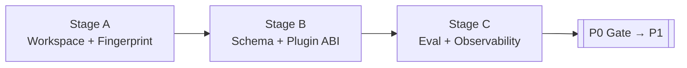

# Prism — Tasks & Progress Board

**Status date:** 2026-07-26  
**Current phase:** **P3 Stage A exited** · Stage B open · LLM quality / dual-review labels still pending  
**Source of truth for design order:** [PLANNING-AND-IMPLEMENTATION.md](./PLANNING-AND-IMPLEMENTATION.md)  
**Source of truth for architecture:** [ARCHITECTURE-DESIGN-DOCUMENT.md](../architecture/ARCHITECTURE-DESIGN-DOCUMENT.md)

Use this file as the living checklist. Update checkbox state and the progress snapshot when a stage exits or a blocker moves.

---

## Progress snapshot

| Phase | Intent | Progress | State |
|---:|---|---:|---|
| **P0** | Foundations (identity, hash, schemas, eval) | ▓▓▓▓▓▓▓▓▓▓ **100%** | ✅ Gate passed 2026-07-25 |
| **P1** | Syntactic KG + MCP | ▓▓▓▓▓▓▓▓▓▓ **100%** | ✅ Gate passed 2026-07-25 (proxies) |
| **P2** | Context Compiler | ▓▓▓▓▓▓▓▓▓▓ **100%** | ✅ Gate passed 2026-07-26 (proxies) |
| **P3** | Precise Tier (T2) | ▓▓▓░░░░░░░ **33%** | 🟡 Stage B open |
| **P4** | Semantic Slicing | ░░░░░░░░░░ **0%** | ⚪ Not started |
| **P5** | Repo Intelligence + Hardening | ░░░░░░░░░░ **0%** | ⚪ Not started |
| **P6** | Team / Distributed (optional) | ░░░░░░░░░░ **0%** | ⚪ Deferred |

**How to read progress:** P3 % ≈ stages done ÷ 3 (A/B/C). Later phases stay at 0% until their entry gate passes.


### Legend

| Mark | Meaning |
|---|---|
| ✅ | Done / accepted |
| 🟡 | In progress / stub exists |
| ⬜ | Not started |
| 🚫 | Blocked (see notes) |
| ⚪ | Phase not open yet |

---

## Capability maturity (today)

| Capability | P0 | P1 | P2 | P3 | P4 | P5 | P6 | Today |
|---|---|---|---|---|---|---|---|---|
| Content-hash incremental store | ● | ● | ● | ● | ● | ● | ● | ✅ live; measured on pilots |
| Syntactic facts (T1) | ○ | ● | ● | ● | ● | ● | ● | ✅ Python + Rust extractors + goldens |
| MCP graph tools | ○ | ● | ● | ● | ● | ● | ● | ✅ prism-mcp stdio tools |
| Query plan + Evidence Pack | ○ | ○ | ● | ● | ● | ● | ● | ✅ plan + pack + EXPLAIN + MCP `compile_context` |
| Precise symbol (T2) | ○ | ○ | ○ | ● | ● | ● | ● | 🟡 Stage A ingest live |
| Semantic slice (T3/T4) | ○ | ○ | ○ | ○ | ● | ● | ● | ⬜ |
| Architecture intelligence | ○ | ◐ | ◐ | ◐ | ◐ | ● | ● | ◐ path-prefix communities + hubs |
| Team/shared index | ○ | ○ | ○ | ○ | ○ | ○ | ● | ⬜ |

● required · ◐ partial · ○ not yet

---

## Open blockers (P0 → P1)

| # | Item | Blocks | Owner / notes |
|---|---|---|---|
| 1 | ~~Freeze pilot repo commit SHAs~~ | — | ✅ 2026-07-25 · httpx `b5addb6`, ripgrep `f9c05a9`; all 22 tasks pinned |
| 2 | ~~Measure index size on pilot repos after cold walk~~ | — | ✅ httpx 124 files / 88K; ripgrep 236 files / 136K (see checklist) |
| 3 | ~~Architect sign-off on schema/ABI~~ | — | ✅ recorded via P0-exit commit review (solo mode) |
| 4 | Fill gold hints / necessary spans on tasks | Eval scoring quality (non-blocking) | 🟡 first batch T001–T011 filled; T012–T022 remain |

---

## Phase 0 — Foundations (detailed)

**Goal:** Workspace identity, incremental hashing, durable schemas, plugin contracts, and a measurable eval path — *before* intelligence features.  
**Duration:** 2–3 weeks  
**Phase gate:** Incremental re-index path prototype-validatable; metrics pipeline exists; ≥20 gold tasks versioned to commit SHAs.



| Stage | Focus | Progress | State |
|---|---|---:|---|
| **A** | Workspace identity & fingerprinting | 100% | ✅ Exited 2026-07-25 |
| **B** | Durable schema & plugin ABI | 100% | ✅ Exited 2026-07-25 |
| **C** | Eval skeleton & observability | 100% | ✅ Exited 2026-07-25 |

### Stage A — Workspace identity & content fingerprinting

#### Deliverables

- [x] Workspace Manager (`crates/prism-core` / `workspace.rs`) — roots, git SHA, dirty stamp
- [x] Fingerprint algorithm note — [FINGERPRINT.md](../architecture/FINGERPRINT.md) (XXH3-128 + tree Merkle)
- [x] `.prism/` layout (meta, graph, blobs, logs) created by indexer
- [x] Incremental invalidation design (per-file skip when hash matches)
- [x] Ignore + secret policy (`ignore_policy.rs`) + [IGNORE-POLICY-CHECKLIST.md](../architecture/IGNORE-POLICY-CHECKLIST.md)
- [x] Pilot repos listed — [fixtures/repos/README.md](../../fixtures/repos/README.md) (httpx, ripgrep)
- [x] CLI `doctor` + `index` / `index --dry-run`

#### Exit / acceptance

- [x] Documented algorithm classifies edit as changed/unchanged given hashes
- [x] Dirty worktree vs clean commit identities distinguishable
- [x] Ignore policy review checklist exists
- [x] Pilot repos listed with approx LOC and languages
- [x] Ignore checklist fully ticked (index size measured on pilots 2026-07-25)

#### Key code / docs

| Artifact | Path |
|---|---|
| Workspace + identity | `crates/prism-core/src/workspace.rs` |
| Fingerprint | `crates/prism-core/src/fingerprint.rs` |
| Ignore / secrets | `crates/prism-core/src/ignore_policy.rs` |
| CLI | `crates/prism-cli/src/main.rs` |

---

### Stage B — Durable schema & plugin ABI draft

#### Deliverables

- [x] Schema v0 — `schemas/meta/v0/meta.schema.json`
- [x] Fact schema v0 — `schemas/fact-schema/v0/fact.schema.json`
- [x] Events schema v0 — `schemas/events/v0/events.schema.json`
- [x] Plugin ABI draft — `schemas/plugins/LanguageExtractor.md`
- [x] IR types — confidence, IDs, schema version constants (`prism-ir`)
- [x] `meta.sqlite` store (WAL upsert / skip-unchanged) — `prism-store`
- [x] `graph.sqlite` adjacency stub + replace/invalidate — `prism-store`
- [x] Formal architect “schema review signed” note — recorded in P0-exit commit (solo mode)

#### Exit / acceptance

- [x] Crash-safe write strategy chosen (SQLite WAL transactional replaces) — implemented + unit tested
- [x] Confidence values include `extracted` / `heuristic` / `precise` / `observed`
- [x] Plugin ABI reviewable without reading the whole ADD
- [x] Migration policy: breaking fact schema bumps major version (documented in schemas / IR versions)
- [x] Explicit sign-off recorded (P0-exit commit, 2026-07-25)

#### Key code / docs

| Artifact | Path |
|---|---|
| Meta store | `crates/prism-store/src/meta.rs` |
| KG stub | `crates/prism-store/src/kg.rs` |
| Confidence / IDs | `crates/prism-ir/src/` |
| Plugin contract | `schemas/plugins/LanguageExtractor.md` |

---

### Stage C — Evaluation skeleton & observability baseline

#### Deliverables

- [x] Eval harness package — `eval/` (`uv` + `prism-eval smoke`)
- [x] Gold task pack v0 — **22** tasks in `eval/tasks/T001.json` … `T022.json` (≥20 required)
- [x] Scorecard template — `eval/scorecards/templates/scorecard.md`
- [x] Baseline runbook notes — `eval/baselines/` + eval README (“How we know P1 saved tokens”)
- [x] Named event schema + emit path — `prism-obs` + `schemas/events/v0`
- [x] Incremental path end-to-end stub: discover → hash → parse-hook → txn → invalidate
- [x] Pilot SHAs frozen — httpx `b5addb64…`, ripgrep `f9c05a94…` (all 22 tasks)
- [x] Gold hints first batch (T001–T011) filled from frozen snapshots · 🟡 T012–T022 pending (non-blocking)

#### Exit / acceptance (Phase 0 gate)

- [x] Incremental re-index path specified & implemented end-to-end (parsers stubbed)
- [x] Metrics pipeline exists with named event schema
- [x] ≥20 gold tasks versioned (files present)
- [x] Tasks tied to **real** commit SHAs (pinned 2026-07-25)
- [x] Written procedure for “How will we know P1 saved tokens?” — `eval/README.md`

#### Key code / docs

| Artifact | Path |
|---|---|
| Incremental indexer | `crates/prism-core/src/incremental.rs` |
| Index events | `crates/prism-obs/src/events.rs` |
| Harness | `eval/harness/runner.py` |
| Tasks | `eval/tasks/` |
| Fixtures | `fixtures/repos/` |

---

### Phase 0 — punch list (✅ completed 2026-07-25)

1. [x] Clone httpx + ripgrep at known-good commits; SHA/date/license recorded in `fixtures/repos/*.md` (snapshots gitignored, reproducible by SHA)
2. [x] Replace `PIN_ME` across `eval/tasks/*.json` (22/22 pinned)
3. [x] Cold-walk pilots — httpx 124 files 91ms/88K; ripgrep 236 files 110ms/136K; warm walk skips 100%
4. [x] [IGNORE-POLICY-CHECKLIST.md](../architecture/IGNORE-POLICY-CHECKLIST.md) fully ticked with measurements
5. [x] Gold hints first batch T001–T011 (real symbols/spans from frozen SHAs; T008 question corrected `GrepWalker` → ignore crate `Walk`/`WalkBuilder`)
6. [x] Stage A/B/C exits marked; Phase 1 Stage A opened below

**Suggested P0 exit command smoke:**

```bash
cargo test --workspace
cargo run -p prism-cli -- doctor .
cargo run -p prism-cli -- index . --dry-run
cd eval && uv sync && uv run prism-eval smoke
```

---

## Phase 1 — Syntactic Knowledge Graph + MCP

**State:** ✅ **Gate passed 2026-07-25** (structural hop/token proxies; LLM quality pending)  
**Duration:** 4–6 weeks · **Languages:** Python + Rust  
**Gate evidence:** [eval/scorecards/p1-phase-gate.md](../../eval/scorecards/p1-phase-gate.md)

| Stage | Tasks (summary) | Status |
|---|---|---|
| **A — T1 extractors** | Per-language design docs; symbols/imports/heuristic CALLS; golden fact fixtures; unresolved edges first-class | ✅ exited 2026-07-25 |
| **B — KG persist + query** | Fact persist; neighbors/resolve/impact API; reverse-dep dirty lists; size budget + failure docs | ✅ exited 2026-07-25 |
| **C — MCP tools** | `index_status`, `resolve_symbol`, `neighbors`, `impact`, `repo_map`; safety + error model | ✅ exited 2026-07-25 |
| **D — Communities + gate** | Path-prefix communities/hubs; Phase 1 scorecard; limitations register | ✅ exited 2026-07-25 |

**Phase 1 kickoff checklist:**

- [x] Freeze LanguageExtractor ABI + fact schema versions used by extractors (ABI frozen; `FACT_SCHEMA_VERSION` 0.0.1)
- [x] Pick first 2 languages + fixture repos — **Python (httpx `b5addb6`) + Rust (ripgrep `f9c05a9`)**
- [x] Stand up golden-fixture conformance harness (`fixtures/languages/` + crate tests)
- [x] Define MCP tool JSON schemas + refusal behaviors (Stage C)

### Stage A — Language extractors (T1) ✅

#### Deliverables

- [x] Extractor design docs — [python.md](../architecture/extractors/python.md), [rust.md](../architecture/extractors/rust.md)
- [x] Golden fact fixtures — `fixtures/languages/python/`, `fixtures/languages/rust/`
- [x] Resolution-cheap policy — same-file + unresolved first-class (ABI + extractors)
- [x] Crates — `prism-extract`, `prism-extract-python`, `prism-extract-rust`
- [x] Fact IR — `prism-ir::facts` (`FactBundle`, kinds, spans)
- [x] Indexer wired — parse-hook → extract → `KgStore::insert_facts` + `FileExtracted` events

#### Exit / acceptance

- [x] Each language has golden fixtures passing conformance tests
- [x] Unresolved edges are first-class, not silent deletes
- [x] Extractor docs state known failure modes (dynamic imports, macros, generics)

#### Handoff to Stage B

Fact producers live; Stage B owns query API (`neighbors` / `resolve`), reverse-dep dirty lists, and index-size budget note. Thin persist already writes nodes/edges during replace.

### Stage B — KG persistence & query API ✅

#### Deliverables

- [x] KG query API — [KG-QUERY-API.md](../architecture/KG-QUERY-API.md); `resolve` / `neighbors` / `impact` / `dirty` in `prism-store` + CLI
- [x] Incremental update sequence — [INCREMENTAL-UPDATE.md](../architecture/INCREMENTAL-UPDATE.md)
- [x] Index size budget note — [INDEX-SIZE-BUDGET.md](../architecture/INDEX-SIZE-BUDGET.md); `prism index-status`
- [x] Failure modes — [KG-FAILURE-MODES.md](../architecture/KG-FAILURE-MODES.md)
- [x] Reverse-dep dirty lists — `SqliteKgStore::reverse_dep_files` / `dirty_set_for_paths`
- [x] Query latency tracking — `query_finished` obs event

#### Exit / acceptance

- [x] Documented that a single-file edit does not require full rebuild
- [x] Query API can express: symbol lookup, 1-hop neighbors, depth-limited impact candidates
- [x] Latency/size NFRs are tracked (even if not yet met)

#### Handoff to Stage C

CLI query surface is the contract MCP tools should mirror (`index_status`, `resolve_symbol`, `neighbors`, `impact`). Bind via MCP stdio next; keep confidence fields and heuristic labeling.

### Stage C — MCP structural tools ✅

#### Deliverables

- [x] MCP tool catalog — [MCP-TOOL-CATALOG.md](../architecture/MCP-TOOL-CATALOG.md)
- [x] Agent usage guide — [AGENT-USAGE.md](../architecture/AGENT-USAGE.md)
- [x] Error model — [MCP-ERROR-MODEL.md](../architecture/MCP-ERROR-MODEL.md) (`SCOPE_UNRESOLVED`)
- [x] Crate `prism-mcp` + CLI `prism mcp` (stdio JSON-RPC)
- [x] Tools: `index_status`, `resolve_symbol`, `neighbors`, `impact`, `repo_map`
- [x] Eval tool-hop recording — `prism-eval tool-hops`

#### Exit / acceptance

- [x] Tool catalog reviewed against ADD §25 subset for P1
- [x] Every tool return includes provenance/confidence or marks heuristics
- [x] Eval harness can record tool hops per task

### Stage D — Communities + Phase 1 gate ✅

#### Deliverables

- [x] Community design — [COMMUNITIES.md](../architecture/COMMUNITIES.md) (path-prefix + degree hubs)
- [x] Phase 1 scorecard — [p1-phase-gate.md](../../eval/scorecards/p1-phase-gate.md)
- [x] Known limitations — [P1-KNOWN-LIMITATIONS.md](../architecture/P1-KNOWN-LIMITATIONS.md)
- [x] `repo_map` MCP/CLI wired to communities

#### Exit / acceptance (Phase 1 gate)

- [x] ≥5× token reduction on structural subset (**proxy** 21.7×; replace with live baselines when ready)
- [x] ≥5× hop reduction proxy (5.42×)
- [ ] Quality within ~10 pts of explore — **PENDING** LLM explore baselines
- [x] Incremental edit path demonstrated (hash skip + file subgraph replace; unit-tested)
- [x] No narrative claiming precise refactor safety

#### Handoff to Phase 2

MCP structural tools are live. Next: intent recipes + `compile_context` Evidence Packs (P2). Treat quality gate as open until measured LLM scorecards land.

---

## Phase 2 — Context Compiler

**State:** ✅ **Gate passed 2026-07-26** (precision proxies; dual-review labels pending)  
**Duration:** 3–5 weeks  
**Gate evidence:** [eval/scorecards/p2-phase-gate.md](../../eval/scorecards/p2-phase-gate.md)

| Stage | Tasks (summary) | Status |
|---|---|---|
| **A — Intent + planner** | Intent recipes; operator DAG; cost model v1; plan-only API | ✅ exited 2026-07-26 |
| **B — Pack + budget** | Selection/reduction; Evidence Pack IR; EXPLAIN; `BUDGET_EXCEEDED` | ✅ exited 2026-07-26 |
| **C — `compile_context`** | Primary MCP tool; Phase 2 scorecard (precision, tokens, hops, refuse-dump) | ✅ exited 2026-07-26 |

### Stage A — Intent classification & query planner ✅

#### Deliverables

- [x] Intent recipe catalog v1 — [INTENT-RECIPES.md](../architecture/INTENT-RECIPES.md) + `schemas/plugins/IntentRecipe.md`
- [x] Planner design — [QUERY-PLANNER.md](../architecture/QUERY-PLANNER.md); operator catalog + cost sketch
- [x] Plan IR schema — `schemas/plan/v0/plan.schema.json` + `PLAN_SCHEMA_VERSION`
- [x] Crate `prism-plan` — classify → recipe → `Plan` / `SCOPE_UNRESOLVED` (no LLM)
- [x] Example plans — fixtures `fixtures/plans/{debug,impact,repo_qa,…}/`
- [x] Plan-only API — CLI `prism query plan` (HTTP `POST /v1/query/plan` contracted)

#### Exit / acceptance

- [x] For each intent, a recipe produces a plan without executing LLM
- [x] Fixtures cover ambiguous queries → `SCOPE_UNRESOLVED`
- [x] Plan-only API (`/query/plan`) contract documented

#### Handoff to Stage B

Plans are stable JSON. Stage B owns Evidence Pack IR, must-include enforcement under budget, reduction techniques, and EXPLAIN reason codes. Do not promote `compile_context` MCP until Stage C.

### Stage B — Selection, reduction & Evidence Pack ✅

#### Deliverables

- [x] Evidence Pack schema v0 — `schemas/evidence-pack/v0` + [EVIDENCE-PACK.md](../architecture/EVIDENCE-PACK.md)
- [x] Selection priority — [SELECTION-PRIORITY.md](../architecture/SELECTION-PRIORITY.md)
- [x] Reduction catalog — [REDUCTION.md](../architecture/REDUCTION.md)
- [x] Crate `prism-compile` — select → budget pack → EXPLAIN; `BUDGET_EXCEEDED`
- [x] Must-include invariant tests + `fixtures/packs/`
- [x] Labeling process — [eval/labeling/README.md](../../eval/labeling/README.md)
- [x] CLI `prism compile` (+ `--synthetic`)

#### Exit / acceptance

- [x] Pack schema round-trips through EXPLAIN report
- [x] Written proof must-include cannot be budget-evicted (test + budget_drop fixture)
- [x] Labeled sample process documented

#### Handoff to Stage C

`prism compile` produces packs. Stage C promotes MCP `compile_context`, agent guidance (“call compile first”), Phase 2 scorecard (precision ≥60%, refuse-dump, latency tracking).

### Stage C — `compile_context` primary + Phase 2 gate ✅

#### Deliverables

- [x] MCP `compile_context` + `query_plan` — `prism-mcp` allowlist; server instructions
- [x] Primary-path guide — [AGENT-USAGE.md](../architecture/AGENT-USAGE.md)
- [x] EXPLAIN format — [EXPLAIN.md](../architecture/EXPLAIN.md)
- [x] IDE peek stub — [IDE-EVIDENCE-PEEK.md](../architecture/IDE-EVIDENCE-PEEK.md)
- [x] Phase 2 scorecard — [p2-phase-gate.md](../../eval/scorecards/p2-phase-gate.md) + `prism-eval p2-scorecard`
- [x] Refuse-dump fixture — `fixtures/packs/refuse-dump/`
- [x] Precision sample labels — `eval/labeling/packs/` (proxy-v0)
- [x] `BUDGET_EXCEEDED` in MCP error model

#### Exit / acceptance (Phase 2 gate)

- [x] Context precision ≥60% on labeled sample (**proxy** labels; dual review pending)
- [x] Unresolved scope → refuse unbounded dump (fixtures + MCP test)
- [x] `compile_context` documented as preferred tool over ten reads
- [x] Pack compile latency budget tracked toward &lt;300ms P95 (`mcp:compile_context` / `compile` events)
- [x] Provenance present on every fragment (enforced in MCP tool)

#### Handoff to Phase 3

Evidence Packs are the primary agent path. Next: precise tier (SCIP/LSP) so high-stakes impact/refactor can upgrade heuristic `CALLS`. Treat precision gate as open until dual-reviewed labels land.

---

## Phase 3 — Precise Tier

**State:** 🟡 Stage B open (Stage A exited 2026-07-26)  
**Duration:** 4–6 weeks  
**Gate:** Call-resolution precision improves on fixtures; safe-rename dry-run demo; tools require T2 when available for accuracy claims.

| Stage | Tasks (summary) | Status |
|---|---|---|
| **A — Precise ingest** | SCIP/PreciseIndex import; tier-tagged edges; oracle P/R; `PRECISION_REQUIRED` | ✅ exited 2026-07-26 |
| **B — Hybrid resolve** | Prefer T2 over heuristic CALLS; on-demand upgrade | 🟡 open |
| **C — Product behaviors** | Precision-gated impact/rename; Phase 3 scorecard | ⬜ |

### Stage A — Precise index ingest ✅

#### Deliverables

- [x] Precise tier integration design — [PRECISE-TIER.md](../architecture/PRECISE-TIER.md)
- [x] ID mapping rules — [ID-MAPPING.md](../architecture/ID-MAPPING.md)
- [x] Build/index prerequisites runbook — [SCIP-RUNBOOK.md](../architecture/SCIP-RUNBOOK.md) + `scripts/scip/`
- [x] PreciseIndex schema v0 — `schemas/precise-index/v0` + plugin card `PreciseImporter.md`
- [x] Crate `prism-precise` — import → T2 facts → edge refine → P/R score
- [x] Store overlay upserts — `upsert_overlay_*` / refine heuristic CALLS
- [x] CLI `prism precise import|status|score`
- [x] Oracle fixtures — `fixtures/precise/oracle/python/` (T2 precision↑ vs T1)
- [x] `PRECISION_REQUIRED` — MCP error model + `precise status`

#### Exit / acceptance

- [x] Import path attaches precise defs/refs for Python end-to-end (PreciseIndex → KG)
- [x] Fixtures define precision/recall measurement vs oracle
- [x] Failure mode when SCIP/overlay missing is clear (`PRECISION_REQUIRED`)

#### Handoff to Stage B

Precise overlays attach optionally under `.prism/scip/`. Next: hybrid resolver + planner `UpgradePrecision` so high-stakes intents prefer T2 on critical edges without always paying for full indexes.

---

## Phase 4 — Semantic Slicing (outline)

**State:** ⚪ Not started (entry: P3 gate)  
**Duration:** 5–8 weeks  
**Gate:** Debug tasks token↓ ≥5× with quality within ~5 pts of frontier-explore.

| Stage | Tasks (summary) | Status |
|---|---|---|
| **A — Intra-procedural (T3)** | CFG/DFG shards; criteria for local slices | ⬜ |
| **B — Inter-procedural (T4)** | CPG shards; slice operator; shard budgets | ⬜ |
| **C — Debug recipes + gate** | Wire debug intents; optional runtime enrichment; Phase 4 scorecard | ⬜ |

---

## Phase 5 — Repository Intelligence + Hardening (outline)

**State:** ⚪ Not started  
**Duration:** ~4 weeks  
**Gate:** Published benchmark; medium+Prism ≈ frontier+explore within 3 pts; external plugin SDK usable.

| Stage | Tasks (summary) | Status |
|---|---|---|
| **A — Repo intelligence** | Architecture maps, communities productized, orientation answers | ⬜ |
| **B — Hardening + SDK + IDE** | Security checklist, plugin SDK polish, LSP/IDE commands | ⬜ |
| **C — Public eval** | Published scorecard; release readiness | ⬜ |

---

## Phase 6 — Team / Distributed — optional (outline)

**State:** ⚪ Deferred  
**Gate:** Two developers share an index safely; CI freshness SLA defined and met.

| Stage | Tasks (summary) | Status |
|---|---|---|
| **A — Shared index server** | Read-mostly shared store; authz baseline | ⬜ |
| **B — CI publishers** | Freshness SLAs; publish jobs | ⬜ |
| **C — Certified caches** | Optional memoization **with** dependency certificates only | ⬜ |

---

## Cross-cutting workstreams (always on)

Track these every phase; each phase exit must refresh **W-EVAL** and **W-OBS**.

| ID | Workstream | P3 Stage A exit status |
|---|---|---|
| **W-STORE** | Storage & identity | ✅ + `.prism/scip/` overlay |
| **W-PLUGIN** | Plugin ABI | ✅ + PreciseImporter card |
| **W-KG** | Knowledge graph | ✅ + T2 edge refine |
| **W-PLAN** | Query planning | ✅ (UpgradePrecision → Stage B) |
| **W-CC** | Context compiler | ✅ (prefer precise → Stage B) |
| **W-MCP** | Agent surface | ✅ + `PRECISION_REQUIRED` |
| **W-IDE** | IDE/LSP | 🟡 evidence-peek stub; LSP hybrid → Stage B |
| **W-EVAL** | Evaluation | ✅ P2 scorecard + P3 oracle P/R fixture |
| **W-OBS** | Observability | ✅ (upgrade-rate metrics → Stage B) |
| **W-SEC** | Security & privacy | 🟡 allowlisted read-only MCP tools |

---

## Definition of Done reminders

**Stage exit:** entry criteria met, deliverables reviewed, exit checkboxes ticked, handoff written in this file.  
**Phase exit:** phase gate metrics measured (or design-validated for P0), risks waived in writing if skipped.  
**Program (P0–P5):** north-star claims G1–G9 evidenced; see planning doc §15.

---

## Changelog (keep short)

| Date | Change |
|---|---|
| 2026-07-19 | Initial board created from plan + repo inventory; P0 ~85% |
| 2026-07-25 | P0 punch list completed: SHAs frozen (httpx `b5addb6`, ripgrep `f9c05a9`), pilots cold-walked, checklist ticked, gold hints T001–T011. **P0 gate passed**; P1 Stage A opened (Python + Rust extractors) |
| 2026-07-25 | **P1 Stage A exited:** Fact IR, tree-sitter Python/Rust extractors, golden fixtures, design docs, indexer extract path + `insert_facts`. Stage B opened |
| 2026-07-25 | **P1 Stage B exited:** KG query API (resolve/neighbors/impact/dirty), `index-status`, reverse-dep lists, size/failure docs, `query_finished` metrics. Stage C opened |
| 2026-07-25 | **P1 Stages C+D exited / gate passed (proxies):** `prism-mcp` tools, communities/`repo_map`, scorecard ≥5× hop+token proxies; quality LLM baseline still pending. **P2 Stage A opened** |
| 2026-07-26 | **P2 Stage A exited:** `prism-plan` intent recipes + plan IR, `SCOPE_UNRESOLVED` fixtures, `prism query plan`, QUERY-PLANNER / INTENT-RECIPES docs. **Stage B opened** (Evidence Pack + budget) |
| 2026-07-26 | **P2 Stage B exited:** `prism-compile` Evidence Pack IR, must-include budget invariant, EXPLAIN, `BUDGET_EXCEEDED`, `prism compile`, labeling process. **Stage C opened** (`compile_context` MCP + scorecard) |
| 2026-07-26 | **P2 Stage C exited / gate passed (proxies):** MCP `compile_context` + `query_plan`, AGENT-USAGE primary path, precision ≥60% proxy labels, refuse-dump fixture, p2-scorecard. **P3 Stage A opened** |
| 2026-07-26 | **P3 Stage A exited:** PreciseIndex ingest (`prism-precise`), ID mapping + SCIP runbook, oracle P/R fixtures (Python), `PRECISION_REQUIRED`, CLI `prism precise`. **Stage B opened** (hybrid resolve) |
