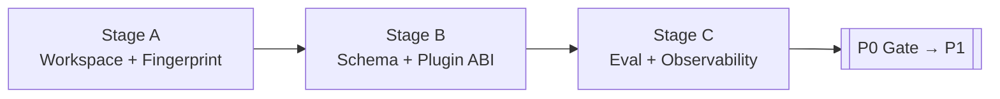

# Prism — Tasks & Progress Board

**Status date:** 2026-07-19  
**Current phase:** **P0 — Foundations** (in progress · ~85%)  
**Source of truth for design order:** [PLANNING-AND-IMPLEMENTATION.md](./PLANNING-AND-IMPLEMENTATION.md)  
**Source of truth for architecture:** [ARCHITECTURE-DESIGN-DOCUMENT.md](../architecture/ARCHITECTURE-DESIGN-DOCUMENT.md)

Use this file as the living checklist. Update checkbox state and the progress snapshot when a stage exits or a blocker moves.

---

## Progress snapshot

| Phase | Intent | Progress | State |
|---:|---|---:|---|
| **P0** | Foundations (identity, hash, schemas, eval) | ▓▓▓▓▓▓▓▓▓░ **~85%** | 🟡 In progress |
| **P1** | Syntactic KG + MCP | ░░░░░░░░░░ **0%** | ⚪ Not started |
| **P2** | Context Compiler | ░░░░░░░░░░ **0%** | ⚪ Not started |
| **P3** | Precise Tier (T2) | ░░░░░░░░░░ **0%** | ⚪ Not started |
| **P4** | Semantic Slicing | ░░░░░░░░░░ **0%** | ⚪ Not started |
| **P5** | Repo Intelligence + Hardening | ░░░░░░░░░░ **0%** | ⚪ Not started |
| **P6** | Team / Distributed (optional) | ░░░░░░░░░░ **0%** | ⚪ Deferred |

**How to read progress:** P0 % is estimated from stage checklists below (done ÷ total). Later phases stay at 0% until their entry gate passes.

```mermaid
flowchart LR
    P0[P0 Foundations<br/>~85%] --> P1[P1 Syntactic KG + MCP]
    P1 --> P2[P2 Context Compiler]
    P2 --> P3[P3 Precise Tier]
    P3 --> P4[P4 Semantic Slicing]
    P4 --> P5[P5 Intelligence + Eval]
    P5 --> P6[P6 Distributed / Team<br/>optional]

    style P0 fill:#f6e58d,stroke:#f9ca24,color:#000
    style P1 fill:#dfe6e9,stroke:#b2bec3,color:#000
    style P2 fill:#dfe6e9,stroke:#b2bec3,color:#000
    style P3 fill:#dfe6e9,stroke:#b2bec3,color:#000
    style P4 fill:#dfe6e9,stroke:#b2bec3,color:#000
    style P5 fill:#dfe6e9,stroke:#b2bec3,color:#000
    style P6 fill:#dfe6e9,stroke:#b2bec3,color:#000
```



### Legend

| Mark | Meaning |
|---|---|
| ✅ | Done / accepted |
| 🟡 | In progress / stub exists |
| ⬜ | Not started |
| 🚫 | Blocked (see notes) |
| ⚪ | Phase not open yet |

---

## Capability maturity (today)

| Capability | P0 | P1 | P2 | P3 | P4 | P5 | P6 | Today |
|---|---|---|---|---|---|---|---|---|
| Content-hash incremental store | ● | ● | ● | ● | ● | ● | ● | 🟡 stub path live |
| Syntactic facts (T1) | ○ | ● | ● | ● | ● | ● | ● | ⬜ parse-hook stub only |
| MCP graph tools | ○ | ● | ● | ● | ● | ● | ● | ⬜ |
| Query plan + Evidence Pack | ○ | ○ | ● | ● | ● | ● | ● | ⬜ |
| Precise symbol (T2) | ○ | ○ | ○ | ● | ● | ● | ● | ⬜ |
| Semantic slice (T3/T4) | ○ | ○ | ○ | ○ | ● | ● | ● | ⬜ |
| Architecture intelligence | ○ | ◐ | ◐ | ◐ | ◐ | ● | ● | ⬜ |
| Team/shared index | ○ | ○ | ○ | ○ | ○ | ○ | ● | ⬜ |

● required · ◐ partial · ○ not yet

---

## Open blockers (P0 → P1)

| # | Item | Blocks | Owner / notes |
|---|---|---|---|
| 1 | Freeze pilot repo commit SHAs (`PIN_ME` → real SHA) | P0 Stage C gate, all gold tasks | Replace in `fixtures/repos/*.md` + `eval/tasks/*.json` |
| 2 | Measure index size on pilot repos after cold walk | Ignore-policy checklist | Run `prism index` on frozen httpx / ripgrep |
| 3 | Architect sign-off on schema/ABI “review done” | Formal Stage B exit | Schemas + code exist; checklist remains open |
| 4 | Fill gold hints / necessary spans on tasks | Eval scoring quality | 22 task stubs exist; content still placeholder |

---

## Phase 0 — Foundations (detailed)

**Goal:** Workspace identity, incremental hashing, durable schemas, plugin contracts, and a measurable eval path — *before* intelligence features.  
**Duration:** 2–3 weeks  
**Phase gate:** Incremental re-index path prototype-validatable; metrics pipeline exists; ≥20 gold tasks versioned to commit SHAs.



| Stage | Focus | Progress | State |
|---|---|---:|---|
| **A** | Workspace identity & fingerprinting | ~90% | 🟡 Nearly done |
| **B** | Durable schema & plugin ABI | ~85% | 🟡 Nearly done |
| **C** | Eval skeleton & observability | ~75% | 🟡 Open gaps on SHA freeze |

### Stage A — Workspace identity & content fingerprinting

#### Deliverables

- [x] Workspace Manager (`crates/prism-core` / `workspace.rs`) — roots, git SHA, dirty stamp
- [x] Fingerprint algorithm note — [FINGERPRINT.md](../architecture/FINGERPRINT.md) (XXH3-128 + tree Merkle)
- [x] `.prism/` layout (meta, graph, blobs, logs) created by indexer
- [x] Incremental invalidation design (per-file skip when hash matches)
- [x] Ignore + secret policy (`ignore_policy.rs`) + [IGNORE-POLICY-CHECKLIST.md](../architecture/IGNORE-POLICY-CHECKLIST.md)
- [x] Pilot repos listed — [fixtures/repos/README.md](../../fixtures/repos/README.md) (httpx, ripgrep)
- [x] CLI `doctor` + `index` / `index --dry-run`

#### Exit / acceptance

- [x] Documented algorithm classifies edit as changed/unchanged given hashes
- [x] Dirty worktree vs clean commit identities distinguishable
- [x] Ignore policy review checklist exists
- [x] Pilot repos listed with approx LOC and languages
- [ ] Ignore checklist fully ticked (index-size measured on pilots still open)

#### Key code / docs

| Artifact | Path |
|---|---|
| Workspace + identity | `crates/prism-core/src/workspace.rs` |
| Fingerprint | `crates/prism-core/src/fingerprint.rs` |
| Ignore / secrets | `crates/prism-core/src/ignore_policy.rs` |
| CLI | `crates/prism-cli/src/main.rs` |

---

### Stage B — Durable schema & plugin ABI draft

#### Deliverables

- [x] Schema v0 — `schemas/meta/v0/meta.schema.json`
- [x] Fact schema v0 — `schemas/fact-schema/v0/fact.schema.json`
- [x] Events schema v0 — `schemas/events/v0/events.schema.json`
- [x] Plugin ABI draft — `schemas/plugins/LanguageExtractor.md`
- [x] IR types — confidence, IDs, schema version constants (`prism-ir`)
- [x] `meta.sqlite` store (WAL upsert / skip-unchanged) — `prism-store`
- [x] `graph.sqlite` adjacency stub + replace/invalidate — `prism-store`
- [ ] Formal architect “schema review signed” note (process, not code)

#### Exit / acceptance

- [x] Crash-safe write strategy chosen (SQLite WAL transactional replaces) — implemented + unit tested
- [x] Confidence values include `extracted` / `heuristic` / `precise` / `observed`
- [x] Plugin ABI reviewable without reading the whole ADD
- [x] Migration policy: breaking fact schema bumps major version (documented in schemas / IR versions)
- [ ] Explicit sign-off recorded (optional checklist item for team process)

#### Key code / docs

| Artifact | Path |
|---|---|
| Meta store | `crates/prism-store/src/meta.rs` |
| KG stub | `crates/prism-store/src/kg.rs` |
| Confidence / IDs | `crates/prism-ir/src/` |
| Plugin contract | `schemas/plugins/LanguageExtractor.md` |

---

### Stage C — Evaluation skeleton & observability baseline

#### Deliverables

- [x] Eval harness package — `eval/` (`uv` + `prism-eval smoke`)
- [x] Gold task pack v0 — **22** tasks in `eval/tasks/T001.json` … `T022.json` (≥20 required)
- [x] Scorecard template — `eval/scorecards/templates/scorecard.md`
- [x] Baseline runbook notes — `eval/baselines/` + eval README (“How we know P1 saved tokens”)
- [x] Named event schema + emit path — `prism-obs` + `schemas/events/v0`
- [x] Incremental path end-to-end stub: discover → hash → parse-hook → txn → invalidate
- [ ] Pilot SHAs frozen (`commit_sha: "PIN_ME"` still present)
- [ ] Gold hints / necessary spans filled after SHA freeze

#### Exit / acceptance (Phase 0 gate)

- [x] Incremental re-index path specified & implemented end-to-end (parsers stubbed)
- [x] Metrics pipeline exists with named event schema
- [x] ≥20 gold tasks versioned (files present)
- [ ] Tasks tied to **real** commit SHAs (currently `PIN_ME`)
- [x] Written procedure for “How will we know P1 saved tokens?” — `eval/README.md`

#### Key code / docs

| Artifact | Path |
|---|---|
| Incremental indexer | `crates/prism-core/src/incremental.rs` |
| Index events | `crates/prism-obs/src/events.rs` |
| Harness | `eval/harness/runner.py` |
| Tasks | `eval/tasks/` |
| Fixtures | `fixtures/repos/` |

---

### Phase 0 — remaining punch list (do these next)

1. [ ] Clone httpx + ripgrep at known-good commits; record SHA/date/license in `fixtures/repos/*.md`
2. [ ] Replace `PIN_ME` across `eval/tasks/*.json`
3. [ ] Cold-walk pilots with `cargo run -p prism-cli -- index <path>`; note discovered/hashed/skipped + on-disk `.prism` size
4. [ ] Tick remaining items on [IGNORE-POLICY-CHECKLIST.md](../architecture/IGNORE-POLICY-CHECKLIST.md)
5. [ ] Fill a first batch of gold hints (structural tasks T001+) for frozen SHAs
6. [ ] Mark Stage A/B/C exit in this file and open Phase 1 Stage A

**Suggested P0 exit command smoke:**

```bash
cargo test --workspace
cargo run -p prism-cli -- doctor .
cargo run -p prism-cli -- index . --dry-run
cd eval && uv sync && uv run prism-eval smoke
```

---

## Phase 1 — Syntactic Knowledge Graph + MCP (outline)

**State:** ⚪ Not started (entry: P0 gate)  
**Duration:** 4–6 weeks · **Languages (target):** 2–3 (e.g. Python, TS/JS, Go)  
**Gate:** ≥5× token reduction on structural tasks vs explore; quality within ~10 pts of explore on structural gold subset.

| Stage | Tasks (summary) | Status |
|---|---|---|
| **A — T1 extractors** | Per-language design docs; symbols/imports/heuristic CALLS; golden fact fixtures; unresolved edges first-class | ⬜ |
| **B — KG persist + query** | Real fact write path (replace P0 stub); neighbors/resolve API; reverse-dep dirty lists; index size budget note | ⬜ |
| **C — MCP tools** | `index_status`, `resolve_symbol`, `neighbors`, `impact` (heuristic), safety rules | ⬜ |
| **D — Communities + gate** | Repo orientation / communities stub; Phase 1 scorecard run; pass token gate | ⬜ |

**Phase 1 kickoff checklist (when P0 closes):**

- [ ] Freeze LanguageExtractor ABI + fact schema versions used by extractors
- [ ] Pick first 2 languages + fixture repos
- [ ] Stand up golden-fixture conformance harness
- [ ] Define MCP tool JSON schemas + refusal behaviors

---

## Phase 2 — Context Compiler (outline)

**State:** ⚪ Not started (entry: P1 gate)  
**Duration:** 3–5 weeks  
**Gate:** Context precision ≥60% on labeled sample; refuse unbounded dumps; pack compile P95 design target &lt;300ms (excl. LLM).

| Stage | Tasks (summary) | Status |
|---|---|---|
| **A — Intent + planner** | Intent recipes; operator DAG; cost model v1 | ⬜ |
| **B — Pack + budget** | Selection/reduction; Evidence Pack IR; EXPLAIN; `BUDGET_EXCEEDED` | ⬜ |
| **C — `compile_context`** | Primary MCP tool; Phase 2 scorecard (precision, tokens, hops, refuse-dump) | ⬜ |

---

## Phase 3 — Precise Tier (outline)

**State:** ⚪ Not started (entry: P2 gate)  
**Duration:** 4–6 weeks  
**Gate:** Call-resolution precision improves on fixtures; safe-rename dry-run demo; tools require T2 when available for accuracy claims.

| Stage | Tasks (summary) | Status |
|---|---|---|
| **A — Precise ingest** | SCIP and/or LSP index import path; tier-tagged edges | ⬜ |
| **B — Hybrid resolve** | Prefer T2 over heuristic CALLS; on-demand upgrade | ⬜ |
| **C — Product behaviors** | Precision-gated impact/rename; Phase 3 scorecard | ⬜ |

---

## Phase 4 — Semantic Slicing (outline)

**State:** ⚪ Not started (entry: P3 gate)  
**Duration:** 5–8 weeks  
**Gate:** Debug tasks token↓ ≥5× with quality within ~5 pts of frontier-explore.

| Stage | Tasks (summary) | Status |
|---|---|---|
| **A — Intra-procedural (T3)** | CFG/DFG shards; criteria for local slices | ⬜ |
| **B — Inter-procedural (T4)** | CPG shards; slice operator; shard budgets | ⬜ |
| **C — Debug recipes + gate** | Wire debug intents; optional runtime enrichment; Phase 4 scorecard | ⬜ |

---

## Phase 5 — Repository Intelligence + Hardening (outline)

**State:** ⚪ Not started  
**Duration:** ~4 weeks  
**Gate:** Published benchmark; medium+Prism ≈ frontier+explore within 3 pts; external plugin SDK usable.

| Stage | Tasks (summary) | Status |
|---|---|---|
| **A — Repo intelligence** | Architecture maps, communities productized, orientation answers | ⬜ |
| **B — Hardening + SDK + IDE** | Security checklist, plugin SDK polish, LSP/IDE commands | ⬜ |
| **C — Public eval** | Published scorecard; release readiness | ⬜ |

---

## Phase 6 — Team / Distributed — optional (outline)

**State:** ⚪ Deferred  
**Gate:** Two developers share an index safely; CI freshness SLA defined and met.

| Stage | Tasks (summary) | Status |
|---|---|---|
| **A — Shared index server** | Read-mostly shared store; authz baseline | ⬜ |
| **B — CI publishers** | Freshness SLAs; publish jobs | ⬜ |
| **C — Certified caches** | Optional memoization **with** dependency certificates only | ⬜ |

---

## Cross-cutting workstreams (always on)

Track these every phase; each phase exit must refresh **W-EVAL** and **W-OBS**.

| ID | Workstream | P0 status |
|---|---|---|
| **W-STORE** | Storage & identity | 🟡 meta/graph stubs live |
| **W-PLUGIN** | Plugin ABI | 🟡 draft doc; no real extractors |
| **W-KG** | Knowledge graph | 🟡 adjacency stub only |
| **W-PLAN** | Query planning | ⬜ |
| **W-CC** | Context compiler | ⬜ |
| **W-MCP** | Agent surface | ⬜ (CLI only today) |
| **W-IDE** | IDE/LSP | ⬜ |
| **W-EVAL** | Evaluation | 🟡 skeleton + 22 tasks |
| **W-OBS** | Observability | 🟡 index events schema |
| **W-SEC** | Security & privacy | 🟡 secret skip defaults |

---

## Definition of Done reminders

**Stage exit:** entry criteria met, deliverables reviewed, exit checkboxes ticked, handoff written in this file.  
**Phase exit:** phase gate metrics measured (or design-validated for P0), risks waived in writing if skipped.  
**Program (P0–P5):** north-star claims G1–G9 evidenced; see planning doc §15.

---

## Changelog (keep short)

| Date | Change |
|---|---|
| 2026-07-19 | Initial board created from plan + repo inventory; P0 ~85% |
